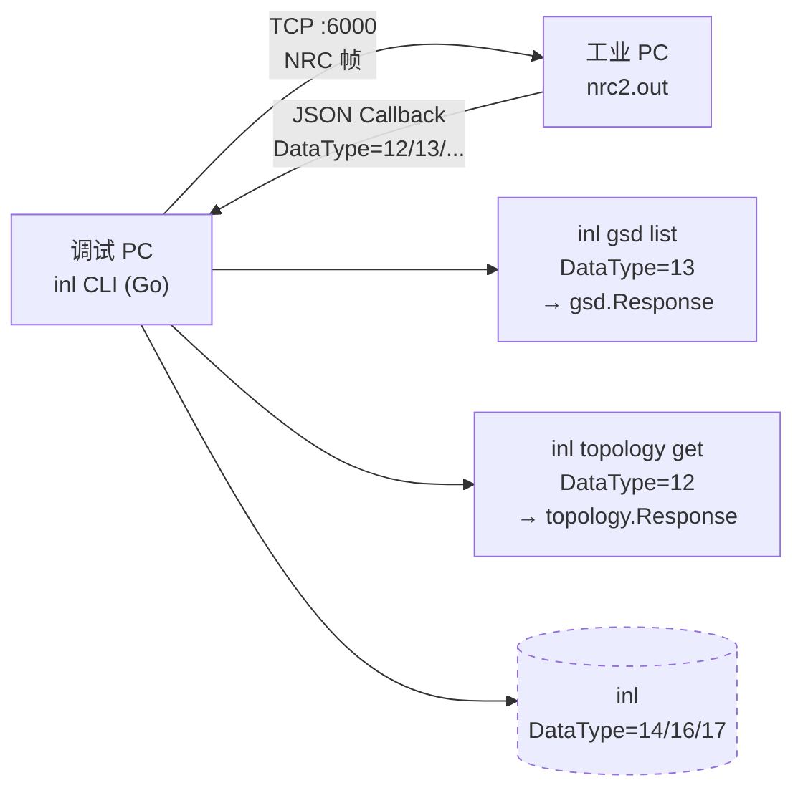

# inl — 第 2 步：命令元数据层 + 第 2 个命令开发计划

## 目标

完成 inl 从"单文件单命令"到"命令树"的跃迁，引入 **Cobra 三层命令结构** 与 **命令元数据集中层**，并新增第 2 个命令 **`inl topology get`**（DataType=12，读取 PROFINET 当前拓扑）。

完成后 inl 的命令形态：

```bash
$ inl --target 192.168.3.15 gsd list
🔌 已连接 192.168.3.15:6000
📤 发送 DataType=13 (gsd-list)
📥 收到 7 个设备驱动（raw 已保存到 gsd_response_20260601_143022.json）
{
  "DataType": 13,
  "Device": [ ... ]
}

$ inl --target 192.168.3.15 topology get
🔌 已连接 192.168.3.15:6000
📤 发送 DataType=12 (topology-get)
📥 收到拓扑结构（raw 已保存到 topology_response_20260601_143055.json）
{
  "DataType": 12,
  ...
}

$ inl --help
inl — 工业 PC NRC Socket 协议 CLI 工具

USAGE:
  inl <command> [subcommand] [options]

COMMANDS:
  gsd         GSD 设备驱动管理
  topology    PROFINET 拓扑管理
  help        显示帮助

GLOBAL FLAGS:
  --target <IP>     工业 PC IP 地址 (必填)
  --format <fmt>    输出格式: json (默认) | table
  --output <path>   原始响应保存路径
```

**两个核心能力**：
1. 抽出 **`internal/nrc/commands.go`** 作为命令元数据的"唯一权威来源"（Command ↔ DataType ↔ Handler 映射）
2. 引入 **Cobra 三层命令树**（`inl gsd list` / `inl topology get`），main.go 退化为薄 glue

---

## 背景上下文（自包含，无需外部资料）

### 飞书 CLI 借鉴分析

本步骤的设计**主要借鉴**飞书 CLI（`cli/` 目录）的以下模式：

| 飞书 CLI 模式 | 来源 | 为什么 inl 要用 |
|-------------|------|----------------|
| **命令元数据 + Handler 解耦** | `cli/shortcuts/base/base_create.go:12-29` | inl 现在 `main.go:36` 硬编码 `0x9275` + `DataType=13`，加第 2 个命令就开始乱。元数据驱动是规模化的第一道门 |
| **Command 集中注册** — 遍历 registry 动态建 cobra 节点 | `cli/cmd/service/service.go:26-47` | inl 命令会按 `inl gsd list` / `inl topology get` 树状展开 |
| **stdout = 数据 / stderr = 诊断** | `cli/AGENTS.md:69-72` | AI 解析 stdout JSON 做决策，stderr 给可读进度/错误 |
| **结构化错误** — `output.Errorf(code, type, msg, hint)` | `cli/internal/output/errors.go` | 让错误可机读 = 让 AI 自己决策下一步 |
| **Risk 分级** — `Risk: read/write/high-risk-write` | `cli/shortcuts/base/base_create.go:16` | inl 有读（gsd list）和写（topology 推送）两类命令，AI 调度时必须能区分 |

**明确不取**（避免过度工程）：

| 飞书 CLI 模式 | 为什么不取 |
|-------------|----------|
| **Registry 动态加载 from_meta** | inl 是封闭系统，命令集是 Go 编译期定的，硬编码 registry 比 YAML 驱动更可调试 |
| **VFS 抽象 + 注入** | inl 不用持久化大文件，os.* 完全 OK |
| **多 profile + 身份解析链**（`--as user/bot`） | 工业 PC 是单一目标 IP，`--target` 就够 |

### 当前 inl 状态（截至 MVP 完成）

```
inl/
├── AGENTS.md                       ← AI 协作入口
├── main.go                          ← 单文件入口，硬编码 0x9275 + DataType=13
├── go.mod                           ← module github.com/your-org/inl（零依赖）
├── gsd_response_*.json              ← 原始响应样本
└── internal/
    ├── nrc/                         ← 协议层
    │   ├── frame.go / frame_test.go
    │   └── client.go
    └── gsd/                         ← 领域模型层
        ├── types.go
        └── types_test.go
```

**已验证**（来自 MVP 验收）：
- `go build ./...` / `go vet ./...` / `go test ./...` 7/7 PASS
- 实机连接 192.168.3.15:6000 成功，7 设备回包
- 5 条关键发现（CRC 范围、IOData 三态、UseableModules 双模式等）已沉淀到代码注释

### 系统拓扑（本步骤目标态）



### NRC 协议（已知）

| 字段 | 长度 | 字节序 | 说明 |
|------|------|--------|------|
| SyncByte | 2 | Big Endian | 固定 `0x4E66` |
| Length | 2 | Big Endian | `Command(2) + Data(N)` 总和，**不含** SyncByte 和 CRC |
| Command | 2 | Big Endian | 请求用 `0x9275`，响应固定 `0x9271` |
| Data | N | — | JSON 字符串（UTF-8） |
| CRC32 | 4 | Big Endian | IEEE 802.3，**计算范围：Length 之后所有字节**（即 Command + Data） |

**假设**（需实机验证）：DataType=12（topology）的请求 Command 也是 `0x9275`，响应 `0x9271`。与 DataType=13 共享同一"自定义协议回调"，由 DataType 字段分发。

### 期望的 DataType=12 响应（占位结构）

`topology` 响应 JSON 结构**未在 PDF 文档中明确定义**，需通过实机响应归纳。本计划采用两阶段策略：

- **阶段 A**：定义最小可工作的占位类型（`DataType` 字段 + `json.RawMessage` 数组），跑通链路
- **阶段 B**：拿到原始响应后细化领域模型（参照 `internal/gsd/types.go` 的注释密度）

### 输出约定（本步骤新增）

| 流 | 内容 | 示例 |
|---|------|------|
| **stdout** | 数据 / 命令结果（JSON） | `{"ok":true,"data":{...}}` 或 prettified JSON |
| **stderr** | 进度 / 警告 / 结构化错误 | `🔌 连接中...`、`{"ok":false,"error":{...}}` |

**重要**：所有 `🔌 📤 📥 ✅ ❌` emoji 进度行**改走 stderr**。这是借鉴 lark-cli "stdout 是数据" 原则的第一步（完整结构化错误留到下一步）。

### 风险分级（本步骤新增）

每个 `CommandSpec` 必须标注 `RiskLevel`：

| RiskLevel | 含义 | AI 调度行为（未来） |
|-----------|------|-------------------|
| `read` | 只读操作 | 自动放行 |
| `write` | 写配置/控制流 | 需 `--yes` 显式确认 |
| `high-risk-write` | 高危（重启/擦除） | 必须 `--yes` + 二次确认 |

本步骤所有命令均为 `read`，不引入 `--yes`。`write` 留到 topology 写入命令实现时再加。

---

## 文件清单

```
inl/
├── AGENTS.md                        # ← 同步更新: 新增 commands.go / topology/ / Cobra
├── main.go                          # ← 重构: 改用 Cobra 树
├── go.mod / go.sum                  # ← 新增依赖: github.com/spf13/cobra
├── gsd_response_*.json              # (已存在)
├── topology_response_*.json         # ← 新增: 拓扑响应原始样本
└── internal/
    ├── nrc/
    │   ├── frame.go                 # (已存在)
    │   ├── client.go                # (已存在)
    │   ├── commands.go              # ← 新增: 命令元数据集中层
    │   └── commands_test.go         # ← 新增
    ├── gsd/
    │   ├── types.go                 # (已存在)
    │   └── types_test.go            # (已存在)
    └── topology/                    # ← 新增 package
        ├── types.go                 # ← 新增: 拓扑响应领域模型
        └── types_test.go            # ← 新增
```

**新增三方依赖**：`github.com/spf13/cobra`（仅 1 个）。这是 inl 第一个非标准库依赖。

---

## Step 1：`internal/nrc/commands.go` — 命令元数据集中层

### 设计动机

当前 `main.go:36` 直接写 `0x9275` 和 `{"DataType":13}`。这种"硬编码散落"在第 2 个命令出现时就会失控：

- 加 topology：再硬编码一行？写到哪？
- 加 device-dcp：又要硬编码？
- 改 Command 号：全文搜？

**`commands.go` 的职责**：把"inl 支持哪些 NRC 命令"的元数据集中到一处，作为整个 CLI 的命令注册表。

### 文件位置

`inl/internal/nrc/commands.go`

### 公开类型与函数签名

```go
package nrc

// Direction 区分命令是请求侧还是响应侧（用于扩展性）。
type Direction int

const (
    DirectionRequest Direction = iota
    DirectionResponse
)

// RiskLevel 命令的副作用等级，供 AI 调度决策。
type RiskLevel string

const (
    RiskRead           RiskLevel = "read"
    RiskWrite          RiskLevel = "write"
    RiskHighRiskWrite  RiskLevel = "high-risk-write"
)

// ResponseParser 返回响应 JSON 反序列化的目标类型。
// 返回值必须是 *T（如 *gsd.Response），用于在 client 层做统一反序列化。
// 留作 func() any 是为了避免 import cycle（nrc 不应该 import gsd/topology）。
type ResponseParser func() any

// CommandSpec 描述一个 NRC 命令的完整元数据。
// Registry 是 inl 所有命令的"唯一权威来源"，新增命令只需追加一行。
type CommandSpec struct {
    Name        string         // CLI 命令名: "gsd-list" / "topology-get"
    Code        uint16         // 帧级 Command, 请求侧用 0x9275, 响应侧 0x9271
    DataType    int            // JSON body 内的 DataType 字段: 12 / 13 / 14 ...
    Direction   Direction      // Request / Response
    Description string         // 一行说明, 用于 inl <cmd> --help
    Risk        RiskLevel      // read / write / high-risk-write
    Response    ResponseParser // 响应类型工厂, 返回 *T
}

// Registry 命令注册表。inl 启动时遍历它构建 cobra 节点。
var Registry = []CommandSpec{
    {
        Name:        "gsd-list",
        Code:        0x9275,
        DataType:    13,
        Direction:   DirectionRequest,
        Description: "列出工业 PC 上所有 GSDML 设备驱动",
        Risk:        RiskRead,
        Response:    nil, // nil 表示暂不解析, 只输出 raw JSON
    },
    {
        Name:        "topology-get",
        Code:        0x9275, // 假设与 gsd-list 共享请求号, 实机验证
        DataType:    12,
        Direction:   DirectionRequest,
        Description: "读取当前 PROFINET 网络拓扑结构",
        Risk:        RiskRead,
        Response:    nil,
    },
    // 未来追加:
    // DataType=14 (DCP 设备发现), DataType=16 (GSD match), DataType=17 (active topology)
}

// LookupByName 按 Name 查找命令。返回的命令一定是 DirectionRequest。
func LookupByName(name string) (CommandSpec, bool)

// LookupByDataType 按 DataType 查找命令。返回的命令一定是 DirectionRequest。
func LookupByDataType(dt int) (CommandSpec, bool)

// ExpectedResponseCode 给定请求命令, 返回对应的响应 Command 字。
// 当前所有请求都对应响应 0x9271, 但显式写出便于未来扩展（如有命令对应 0x9273）。
func ExpectedResponseCode(req CommandSpec) uint16

// RequestBody 给定命令, 返回要发送的 JSON 字符串。
// 当前所有命令 body 都是 {"DataType":N}, 显式函数化便于未来带参数的命令扩展。
func RequestBody(spec CommandSpec) string
```

### 实现要点

1. **Registry 顺序**：按 DataType 升序排列，方便阅读
2. **Name 唯一性**：在 `init()` 中检查，重复则 panic（编译期可发现）
3. **DataType 唯一性**：同上
4. **Direction 一致性**：Registry 中所有元素都应是 `DirectionRequest`（响应命令无需注册）
5. **Response 字段**：MVP 阶段留 nil，未来在 Step 4 或后续 PR 接入实际反序列化

### 单元测试：`internal/nrc/commands_test.go`

```go
package nrc

import (
    "testing"
)

func TestRegistryHasExpectedEntries(t *testing.T) {
    if len(Registry) < 2 {
        t.Fatalf("Registry 应至少含 2 条 (gsd-list + topology-get), 实际 %d", len(Registry))
    }
}

func TestRegistryNameUnique(t *testing.T) {
    seen := make(map[string]bool)
    for _, s := range Registry {
        if seen[s.Name] {
            t.Errorf("Name 重复: %q", s.Name)
        }
        seen[s.Name] = true
    }
}

func TestRegistryDataTypeUnique(t *testing.T) {
    seen := make(map[int]bool)
    for _, s := range Registry {
        if seen[s.DataType] {
            t.Errorf("DataType 重复: %d", s.DataType)
        }
        seen[s.DataType] = true
    }
}

func TestLookupByName(t *testing.T) {
    spec, ok := LookupByName("gsd-list")
    if !ok {
        t.Fatal("找不到 gsd-list")
    }
    if spec.DataType != 13 {
        t.Errorf("DataType = %d, want 13", spec.DataType)
    }
    if spec.Code != 0x9275 {
        t.Errorf("Code = 0x%04X, want 0x9275", spec.Code)
    }
}

func TestLookupByDataType(t *testing.T) {
    spec, ok := LookupByDataType(12)
    if !ok {
        t.Fatal("找不到 DataType=12")
    }
    if spec.Name != "topology-get" {
        t.Errorf("Name = %q, want topology-get", spec.Name)
    }
}

func TestLookupNotFound(t *testing.T) {
    if _, ok := LookupByName("nonexistent"); ok {
        t.Error("期望 not found")
    }
    if _, ok := LookupByDataType(999); ok {
        t.Error("期望 not found")
    }
}

func TestExpectedResponseCode(t *testing.T) {
    req, _ := LookupByName("gsd-list")
    if got := ExpectedResponseCode(req); got != 0x9271 {
        t.Errorf("ExpectedResponseCode = 0x%04X, want 0x9271", got)
    }
}

func TestRequestBody(t *testing.T) {
    spec, _ := LookupByName("topology-get")
    body := RequestBody(spec)
    want := `{"DataType":12}`
    if body != want {
        t.Errorf("RequestBody = %q, want %q", body, want)
    }
}
```

### Step 1 验收标准

- [ ] `internal/nrc/commands.go` 存在且 `go build` 通过
- [ ] `Registry` 至少 2 条（gsd-list + topology-get）
- [ ] `go test ./internal/nrc/` 通过（含原有 frame_test 3 个 + 新增 commands_test 8 个 = 11 个）
- [ ] 所有 Name 唯一、所有 DataType 唯一
- [ ] `LookupByName` / `LookupByDataType` / `ExpectedResponseCode` / `RequestBody` 行为符合测试

---

## Step 2：`internal/topology/types.go` — 拓扑响应领域模型

### 设计动机

参照 [`internal/gsd/types.go`](/c:/Users/BYD/Documents/trae_projects/feishu_cli/inl/internal/gsd/types.go) 的注释密度和建模风格。**但本阶段拿不到真实响应数据**，所以采用"最小占位 + 实机迭代"策略。

### 文件位置

`inl/internal/topology/types.go`

### 占位类型（阶段 A）

```go
package topology

// Response 是 DataType=12 (topology-get) 响应的顶层结构。
//
// 重要: 本结构处于"最小占位"阶段, 字段细节需要等实机响应回包后再细化。
// 拿到原始 JSON 后, 模仿 internal/gsd/types.go 的注释密度, 拆分:
//
//  Station     — PROFINET 站点 (PLC 自身)
//  Device      — 站点下属设备 (IO 模块 / 驱动器 / 阀岛)
//  Port        — 设备端口
//  Connection  — 端口间连接关系
//
// 预估结构（待实机验证）:
//  type Response struct {
//      DataType int       `json:"DataType"`
//      Stations []Station `json:"Stations"`
//  }
//  type Station struct {
//      Name       string     `json:"Name"`
//      IPAddress  string     `json:"IPAddress"`
//      Devices    []Device   `json:"Devices"`
//  }
//  type Device struct {
//      Name         string       `json:"Name"`
//      VendorName   string       `json:"VendorName"`
//      DeviceID     string       `json:"DeviceID"`
//      Ports        []Port       `json:"Ports"`
//  }
//  type Port struct {
//      PortNumber   int          `json:"PortNumber"`
//      PortName     string       `json:"PortName"`
//      Connection   *Connection  `json:"Connection,omitempty"`
//  }
//  type Connection struct {
//      ToDevice     string `json:"ToDevice"`
//      ToPort       int    `json:"ToPort"`
//  }
type Response struct {
    DataType int             `json:"DataType"`
    Stations []json.RawMessage `json:"Stations,omitempty"`
}
```

### 单元测试：`internal/topology/types_test.go`

```go
package topology

import (
    "encoding/json"
    "testing"
)

func TestResponseRoundTrip(t *testing.T) {
    raw := `{"DataType":12,"Stations":[]}`
    var resp Response
    if err := json.Unmarshal([]byte(raw), &resp); err != nil {
        t.Fatalf("Unmarshal failed: %v", err)
    }
    if resp.DataType != 12 {
        t.Errorf("DataType = %d, want 12", resp.DataType)
    }
    if len(resp.Stations) != 0 {
        t.Errorf("Stations 应为空, got %d", len(resp.Stations))
    }
}

func TestResponseEmptyStations(t *testing.T) {
    raw := `{"DataType":12}`
    var resp Response
    if err := json.Unmarshal([]byte(raw), &resp); err != nil {
        t.Fatalf("Unmarshal failed: %v", err)
    }
    if len(resp.Stations) != 0 {
        t.Errorf("Stations 应为 nil, got %d", len(resp.Stations))
    }
}
```

### Step 2 验收标准

- [ ] `internal/topology/types.go` 存在且 `go build` 通过
- [ ] `Response` struct 含中文注释，说明"占位阶段"+"未来字段预测"
- [ ] `go test ./internal/topology/` 通过
- [ ] **不在此步骤细化字段**（避免无数据空想），留待实机响应后单独 PR

---

## Step 3：main.go 改用 Cobra 三层命令树

### 设计动机

当前 `main.go` 是单文件单命令硬编码。引入 Cobra 后：

- 每个子命令独立 `RunE`，互不污染
- 自动 `--help` / 子命令补全（cobra 内置）
- 全局 flag（`--target` / `--format`）通过 `PersistentFlags` 共享
- **新增命令的边际成本**：在 `Registry` 加一行 + 在 cobra init() 加一个 `AddCommand`

### 文件位置

`inl/main.go`（整体重写）

### 完整实现

```go
package main

import (
    "encoding/json"
    "fmt"
    "os"
    "path/filepath"
    "time"

    "github.com/spf13/cobra"

    "github.com/your-org/inl/internal/nrc"
)

var (
    targetFlag  string
    formatFlag  string
    outputFlag  string
)

func main() {
    rootCmd := &cobra.Command{
        Use:   "inl",
        Short: "工业 PC NRC Socket 协议 CLI 工具",
        Long: `inl — Industrial Netline CLI

通过 TCP:6000 与运行 nrc2.out 的工业 PC 通信, 收发 NRC 帧,
实现 PROFINET GSD 设备列表、拓扑读取等调试能力。`,
        SilenceUsage:  true, // 错误时不打印 usage (避免污染 stderr JSON)
        SilenceErrors: true, // 错误由 main 统一格式化
    }

    rootCmd.PersistentFlags().StringVar(&targetFlag, "target", "",
        "工业 PC IP 地址 (必填)")
    rootCmd.PersistentFlags().StringVar(&formatFlag, "format", "json",
        "输出格式: json (默认) | table")
    rootCmd.PersistentFlags().StringVar(&outputFlag, "output", "",
        "原始响应保存路径 (默认: ./<name>_response_<时间戳>.json)")

    // 注册子命令树
    rootCmd.AddCommand(buildGsdCmd())
    rootCmd.AddCommand(buildTopologyCmd())

    if err := rootCmd.Execute(); err != nil {
        fmt.Fprintln(os.Stderr, err.Error())
        os.Exit(1)
    }
}

// buildGsdCmd 创建 `inl gsd ...` 子命令组
func buildGsdCmd() *cobra.Command {
    gsd := &cobra.Command{
        Use:   "gsd",
        Short: "GSD 设备驱动管理",
    }
    gsd.AddCommand(&cobra.Command{
        Use:        "list",
        Short:      "列出工业 PC 上所有 GSDML 设备驱动",
        Args:       cobra.NoArgs,
        RunE:       runNrcCommand("gsd-list"),
    })
    return gsd
}

// buildTopologyCmd 创建 `inl topology ...` 子命令组
func buildTopologyCmd() *cobra.Command {
    topo := &cobra.Command{
        Use:   "topology",
        Short: "PROFINET 拓扑管理",
    }
    topo.AddCommand(&cobra.Command{
        Use:        "get",
        Short:      "读取当前 PROFINET 网络拓扑结构",
        Args:       cobra.NoArgs,
        RunE:       runNrcCommand("topology-get"),
    })
    return topo
}

// runNrcCommand 返回一个 RunE 函数, 内部按 name 查 Registry 找到 CommandSpec 后执行。
// 抽出来是为了 gsd list / topology get 共享同一份发送/保存/打印逻辑。
func runNrcCommand(name string) func(*cobra.Command, []string) error {
    return func(cmd *cobra.Command, args []string) error {
        if targetFlag == "" {
            return fmt.Errorf("--target 不能为空")
        }
        spec, ok := nrc.LookupByName(name)
        if !ok {
            return fmt.Errorf("命令未注册: %q", name)
        }

        addr := targetFlag + ":6000"
        fmt.Fprintf(os.Stderr, "🔌 连接 %s ...\n", addr)

        client := nrc.NewClient(addr)
        if err := client.Connect(); err != nil {
            return fmt.Errorf("连接失败: %w", err)
        }
        defer client.Close()
        fmt.Fprintln(os.Stderr, "  ✓ 已连接")

        body := nrc.RequestBody(spec)
        fmt.Fprintf(os.Stderr, "📤 发送 %s (DataType=%d)\n", spec.Name, spec.DataType)

        respCmd, data, err := client.SendReceive(spec.Code, body)
        if err != nil {
            return fmt.Errorf("通信失败: %w", err)
        }

        expected := nrc.ExpectedResponseCode(spec)
        if respCmd != expected {
            return fmt.Errorf("意外响应命令字: 0x%04X (期望: 0x%04X)", respCmd, expected)
        }

        // 保存原始响应
        outPath := outputFlag
        if outPath == "" {
            outPath = fmt.Sprintf("%s_response_%s.json",
                spec.Name, time.Now().Format("20060102_150405"))
        }
        // 确保绝对路径 (相对当前工作目录)
        if !filepath.IsAbs(outPath) {
            wd, _ := os.Getwd()
            outPath = filepath.Join(wd, outPath)
        }
        if err := os.WriteFile(outPath, data, 0644); err != nil {
            fmt.Fprintf(os.Stderr, "⚠️  保存原始响应失败: %v\n", err)
        } else {
            fmt.Fprintf(os.Stderr, "💾 原始响应已保存: %s\n", outPath)
        }

        // stdout: prettified JSON
        var pretty bytes.Buffer
        if err := json.Indent(&pretty, data, "", "  "); err != nil {
            // 不是合法 JSON, 退回原始字节
            os.Stdout.Write(data)
            return nil
        }
        pretty.WriteByte('\n')
        os.Stdout.Write(pretty.Bytes())
        return nil
    }
}
```

### 关键设计决策说明

1. **`SilenceUsage: true` + `SilenceErrors: true`**：cobra 默认在错误时打印 usage，污染 stderr。我们用自己的错误包装（借鉴 lark-cli `output.ErrWithHint` 模式，但 MVP 阶段先用简单 `fmt.Errorf`）
2. **进度走 stderr，结果走 stdout**：所有 emoji 进度 / 连接信息 → stderr；JSON 数据 → stdout。这是 lark-cli "stdout 是数据" 原则的落地
3. **`runNrcCommand(name)` 工厂函数**：让 gsd list 和 topology get 共享同一套发送/保存/打印逻辑，新增命令只需在 `buildXxxCmd` 中加一行
4. **outputFlag 默认值**：`<name>_response_<timestamp>.json`（与 MVP 的 `gsd_response_*.json` 命名风格一致）
5. **不引入 `output.ErrWithHint` 完整结构化错误**：留到下一 PR（避免本步骤膨胀）

### Step 3 验收标准

- [ ] `go get github.com/spf13/cobra` 成功
- [ ] `go.mod` / `go.sum` 含 cobra 依赖
- [ ] `go build -o inl.exe` 编译成功
- [ ] `inl --help` 输出根帮助（含子命令列表）
- [ ] `inl gsd --help` 输出 gsd 子命令组帮助
- [ ] `inl topology --help` 输出 topology 子命令组帮助
- [ ] `inl gsd list --target 192.168.3.15` 输出与 MVP 等价的设备列表
- [ ] `inl topology get --target 192.168.3.15` 收到响应（哪怕是 raw JSON）
- [ ] 进度信息（🔌/📤/📥/💾）出现在 **stderr**，响应 JSON 出现在 **stdout**
- [ ] 可执行 `inl gsd list --target 192.168.3.15 > out.json 2> progress.log` 验证分流

---

## Step 4：实机验收

### 环境

- 工业 PC：`192.168.3.15:6000`（nrc2.out 运行中）
- `./communication/Profinet/` 目录下至少有 1 个 GSDML 文件（已验证：7 设备）

### 运行命令

```bash
# 1. gsd list
inl gsd list --target 192.168.3.15

# 2. topology get (新命令, 首次实机)
inl topology get --target 192.168.3.15

# 3. stdout/stderr 分流验证
inl gsd list --target 192.168.3.15 > gsd_stdout.json 2> gsd_stderr.log
diff <(cat gsd_response_*.json | head -100) <(cat gsd_stdout.json) # 应一致

# 4. help 系统
inl --help
inl gsd --help
inl topology get --help
```

### 验收标准

- [ ] Step 4.1: `inl gsd list` 收到 7 设备（与 MVP 等价）
- [ ] Step 4.2: `inl topology get` 收到响应（DataType=12, 非空）
- [ ] Step 4.3: stderr 含 🔌/📤/💾 进度行，stdout 仅含 prettified JSON
- [ ] Step 4.4: `inl --help` / `inl gsd --help` / `inl topology get --help` 全部正常显示
- [ ] `topology_response_*.json` 文件已保存
- [ ] **新发现**: 记录 DataType=12 响应的实际 JSON 结构（用于后续 types.go 细化）

### 故障排查

| 现象 | 可能原因 | 排查步骤 |
|------|---------|---------|
| `inl --help` 找不到子命令 | cobra 未正确 AddCommand | 检查 `buildGsdCmd()` / `buildTopologyCmd()` |
| `DataType=12` 收到 `0x9271` 但 JSON 不是预期结构 | io-controller 的 topology 响应格式不同于 gsd | 保存 raw JSON，对照 PDF 协议规范 |
| `DataType=12` 收到非 0x9271 响应 | topology 命令字不是 0x9275 | 查阅 PDF 找 topology 的 Command 字；更新 Registry |
| `topology get` 收到 `{"DataType":0,"error":"..."}` | nrc2.out 未注册 topology 回调 | 确认工业 PC 端已注册对应 handler |
| stdout 出现 🔌 emoji | emoji 误用了 `fmt.Printf` 而非 `fmt.Fprintf(os.Stderr, ...)` | grep 全文检查 |

---

## 完整验收清单（汇总）

### 离线验收（不需要工业 PC）

#### Step 1 (commands.go)
- [ ] `internal/nrc/commands.go` 存在
- [ ] `go build ./...` 通过
- [ ] `go vet ./...` 无警告
- [ ] `go test ./internal/nrc/` 11/11 通过（原 3 + 新 8）
- [ ] Registry 至少 2 条
- [ ] Name 唯一、DataType 唯一

#### Step 2 (topology/types.go)
- [ ] `internal/topology/types.go` 存在
- [ ] `go build ./...` 通过
- [ ] `go test ./internal/topology/` 2/2 通过
- [ ] 中文注释含"占位阶段"说明 + 未来字段预测

#### Step 3 (Cobra main.go)
- [ ] `go get github.com/spf13/cobra` 成功
- [ ] `go.mod` 含 cobra 依赖
- [ ] `go build -o inl.exe` 成功
- [ ] `inl --help` / `inl gsd --help` / `inl topology --help` 正常显示
- [ ] `--target` 为空时报错（且不打印 usage）

### 实机验收（需要工业 PC 192.168.3.15）

- [ ] `inl gsd list --target 192.168.3.15` 输出 7 设备
- [ ] `inl topology get --target 192.168.3.15` 收到响应
- [ ] stderr 含进度 emoji，stdout 仅含 JSON（`> out 2> err` 分流验证）
- [ ] 原始响应文件保存到 `<name>_response_<时间戳>.json`
- [ ] **记录新发现**: DataType=12 响应的实际 JSON 结构（后续 PR 细化）

### AGENTS.md 同步

- [ ] 更新 `Source Layout` 表: 新增 `internal/nrc/commands.go` / `internal/topology/` / Cobra 入口
- [ ] 更新 `Key Protocol Knowledge` 章节: 新增 "Registry / Direction / RiskLevel" 说明
- [ ] 更新 `Build & Test` 章节: 提示需 `go mod tidy` 安装 cobra
- [ ] 更新 `Run` 章节: 新命令示例

---

## 执行节奏

| Step | 内容 | 预计耗时 |
|------|------|---------|
| Step 1 | `commands.go` + `commands_test.go` | 20 分钟 |
| Step 2 | `topology/types.go` + `types_test.go` | 10 分钟 |
| Step 3 | `main.go` Cobra 改造 + go get cobra | 30 分钟 |
| Step 4 | 实机验证（车间 5 分钟） + AGENTS.md 同步 | 15 分钟 |

**总共约 1 小时代码 + 15 分钟车间**。

---

## 未来 PR 候选（不在本步骤范围）

为避免步骤膨胀，以下改进**留到后续 PR**：

| 改进 | 触发时机 |
|------|---------|
| 引入 `internal/output` 包，实现 `output.Errorf` / `output.ErrWithHint` 结构化错误 | 当第 3 个命令出现时 |
| `ResponseParser` 字段接入实际反序列化（gsd.Response, topology.Response） | 当 topology 实机响应拿到后 |
| `--format table` 实现（人类可读表格） | 当 AI 不再是主要消费者时 |
| `--jq` 过滤（lark-cli 借鉴 #2） | 当命令输出变大、需要过滤时 |
| `RiskWrite` 命令的 `--yes` 确认 | 当 topology-write / config-write 命令出现时 |
| 多 profile / 目标白名单 | 当多台工业 PC 场景出现时 |

---

## 相关文档

- [[inl-architecture]] — 架构设计文档（命令矩阵、io-controller 边界定义）
- [[inl-prd]] — 产品需求文档（产品定位、设计原则）
- [[inl-mvp-plan]] — MVP 计划（已完成，对应本次的"上一阶段"）
- [[cli-architecture-overview]] — lark-cli 架构（取其精华的参考源）
- [[cli-data-flows]] — lark-cli 数据流（stdout/stderr 约定的来源）
