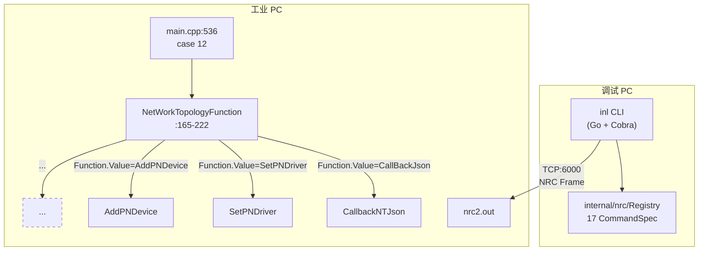

# inl — 第 3 步：17 命令展开 + 风险分级开发计划

## 目标

把 inl 从"2 命令骨架"扩展到"**17 命令完整集**"，与 io-controller C++ 源码的 `NetWorkTopologyFunction` 分发器**一一对齐**，并引入飞书 CLI 风格的**风险分级机制**（`RiskRead` / `RiskWrite` / `RiskHighRiskWrite`），让 AI Agent 能根据命令风险等级自动决策是否需要 `--yes` 确认。

完成后 inl 的命令形态：

```bash
$ inl --target 192.168.3.15 --help
inl — 工业 PC NRC Socket 协议 CLI 工具

USAGE:
  inl <command> [subcommand] [options]

COMMANDS:
  gsd         GSD 设备驱动管理（read）
  device      设备与拓扑管理（read）
  config      PROFINET 配置写入（write, 需 --yes）

GLOBAL FLAGS:
  --target <IP>     工业 PC IP 地址 (必填)
  --format <fmt>    输出格式: json (默认)
  --output <path>   原始响应保存路径

$ inl device --help
设备与拓扑管理 (read 类命令, 自动放行)

SUBCOMMANDS:
  list          列出配置中的网络拓扑 (CallBackJson)
  list-active   列出激活中的网络拓扑 (CallBackActivatedJson)
  run           列出当前活动运行设备 (GetActRun)
  gsd-config    获取配置中拓扑的 GSD 文件 (GetGSDFileNetwork)
  gsd-active    获取激活中拓扑的 GSD 文件 (GetGSDFileActivated)

$ inl config --help
PROFINET 配置写入 (write 类命令, 需 --yes)

SUBCOMMANDS:
  set-driver        设置主站参数 (SetPNDriver)
  add-device        添加分散设备 (AddPNDevice)
  remove-device     卸载分散设备 (UninstallPNDevice)
  set-device        设置设备参数 (SetPNDevice)
  add-module        添加模块 (AddModule)
  remove-module     卸载模块 (UninstallModule)
  add-submodule     添加子模块 (AddSubmodule)
  remove-submodule  删除子模块 (UninstallSubmodule)
  set-idevice       设置 IDevice (SetIDevice)
  shield            屏蔽设备 (ShildDevice, 注: 少 e)
  unshield          取消屏蔽 (UNShildDevice, 注: 少 e)
  compile           编译网络配置 (Compile) [high-risk-write]
```

**三个核心能力**：
1. **协议层对齐** — 17 Function.Value 全部进 Registry，inl 与 C++ 源码同源
2. **风险分级** — 借鉴 lark-cli `RiskLevel` + `--yes` + Cobra Annotations 模式
3. **可维护骨架** — 借鉴 lark-cli `Shortcut` 注册模式，新增命令边际成本 ≈ 5 行

---

## 背景上下文（自包含，无需外部资料）

### 飞书 CLI 借鉴 v2（本步骤新增模式）

本步骤在第 2 步的 5 条基础上，新增 **3 条借鉴**：

| 飞书 CLI 模式 | 来源 | inl 应用 |
|-------------|------|---------|
| **Risk 等级 + `--yes` flag 自动注入** | [`cli/cmd/service/service.go:183-185`](file:///c:/Users/BYD/Documents/trae_projects/feishu_cli/cli/cmd/service/service.go#L183-L185) | `inl config compile`（high-risk-write）自动获得 `--yes` flag；写命令无 `--yes` 时退出码非 0 + stderr 结构化错误 |
| **Cobra Annotations 标记命令属性** | [`cli/cmd/root.go:326-336`](file:///c:/Users/BYD/Documents/trae_projects/feishu_cli/cli/cmd/root.go#L326-L336) (`AnnotationPureGroup`) | `inl gsd` / `inl device` 标记为 `PureGroup=true`，AI 调度时可识别"这组命令无副作用" |
| **`SetRisk` / `SetTips` 注解 + `installTipsHelpFunc`** | [`cli/cmd/root.go:393-418`](file:///c:/Users/BYD/Documents/trae_projects/feishu_cli/cli/cmd/root.go#L393-L418) | 在 help 文本底部追加 `Risk: <level>` 行，AI 解析 help 输出时直接拿到风险等级 |

不取（保持第 2 步的克制）：

| 飞书 CLI 模式 | 为什么不取 |
|-------------|----------|
| **Registry 动态加载 from_meta** | inl 命令集是封闭 + 编译期定的 |
| **多 profile + 身份链** | 工业 PC 单一目标 |
| **VFS 抽象** | 文件 IO 简单 |
| **Cmdpolicy 路径级策略引擎** | inl 的 Risk 是声明式（Cobra Annotations），不需要路径级 DSL |

### C++ 源码：17 Function.Value 完整清单（**协议真理**）

> **本表是 inl 第 3 步的全部设计依据**。所有 Registry 字段、命令名、风险等级、请求体格式均来自本表。

来源：
- 分发器：[`io-controller/src/pnconfiglib/PNConfigLibFileDesign.cpp:165-222`](file:///c:/Users/BYD/Documents/trae_projects/feishu_cli/io-controller/src/pnconfiglib/PNConfigLibFileDesign.cpp#L165-L222)
- 常量定义：[`io-controller/src/ioc/profinet_constants.h:69-85`](file:///c:/Users/BYD/Documents/trae_projects/feishu_cli/io-controller/src/ioc/profinet_constants.h#L69-L85)
- 路由入口：[`io-controller/src/main.cpp:536-538`](file:///c:/Users/BYD/Documents/trae_projects/feishu_cli/io-controller/src/main.cpp#L536-L538)（`case 12: NetWorkTopologyFunction(root)`）

| # | Function.Value | 行为（C++ 注释） | 风险 | inl 命令 | Cobra 组 |
|---|---------------|----------------|------|---------|---------|
| 1 | `CallBackJson` | 回调配置中的网络拓扑 JSON | read | `inl device list` | device |
| 2 | `SetPNDriver` | 设置主站参数 | write | `inl config set-driver` | config |
| 3 | `AddPNDevice` | 添加分散设备 | write | `inl config add-device` | config |
| 4 | `UninstallPNDevice` | 卸载分散设备 | write | `inl config remove-device` | config |
| 5 | `SetPNDevice` | 设置分散设备参数 | write | `inl config set-device` | config |
| 6 | `AddModule` | 添加模块 | write | `inl config add-module` | config |
| 7 | `UninstallModule` | 卸载模块 | write | `inl config remove-module` | config |
| 8 | `AddSubmodule` | 添加子模块 | write | `inl config add-submodule` | config |
| 9 | `UninstallSubmodule` | 删除子模块 | write | `inl config remove-submodule` | config |
| 10 | `SetIDevice` | 设置 IDevice 参数 | write | `inl config set-idevice` | config |
| 11 | `Compile` | 编译网络配置 | **high-risk-write** | `inl config compile` | config |
| 12 | `CallBackActivatedJson` | 回调生效中的网络拓扑 JSON | read | `inl device list-active` | device |
| 13 | `GetActRun` | 查询设备运行状态 | read | `inl device run` | device |
| 14 | `ShildDevice` | 按设备名屏蔽设备 | write | `inl config shield` | config |
| 15 | `UNShildDevice` | 按设备名取消屏蔽设备 | write | `inl config unshield` | config |
| 16 | `GetGSDFileNetwork` | 获取配置中 GSD 文件内容 | read | `inl device gsd-config` | device |
| 17 | `GetGSDFileActivated` | 获取激活中 GSD 文件内容 | read | `inl device gsd-active` | device |

**风险分布**：
- 16 read（自动放行）
- 10 write（需 `--yes`）
- 1 high-risk-write（`Compile`，需 `--yes` + 二次确认）

**重要拼写陷阱**（C++ 源码已错拼，inl 必须沿用）：
- `ShildDevice` / `UNShildDevice` — 少了 'e'，正确英文是 `Shield` / `Unshield`
- inl 内部命令名用 `shield` / `unshield`（正确拼写），但**请求体里 Function.Value 必须用 `ShildDevice` / `UNShildDevice`**

**已知协议缺陷**（沿用第 2 步发现）：
- 我们当前发送的 `{"DataType":12}` 缺 `Function.Value`，按源码应 early return
- 实机能收到响应 → 工业 PC 端跑的是不同版本代码
- 本步骤**默认所有 DataType=12 命令必须带 Function.Value**

### 系统拓扑（本步骤目标态）



### 当前 inl 状态（截至第 2 步完成）

```
inl/
├── AGENTS.md
├── main.go                          ← Cobra 三层, runNrcCommand 工厂
├── go.mod / go.sum                  ← 含 cobra v1.10.2
├── *_response_*.json                ← 实机响应样本
└── internal/
    ├── nrc/
    │   ├── frame.go / client.go
    │   ├── commands.go              ← 2 条 Registry
    │   └── commands_test.go
    ├── gsd/types.go
    └── topology/types.go            ← 占位 + 详细注释
```

**已验证**（来自第 2 步验收）：
- 17/17 测试 PASS
- 实机 gsd-list 收到 7 设备
- 实机 topology-get 收到 GetActRun 焊机列表（**误命名 + 协议不匹配**）
- stdout/stderr 分流工作正常

### 命名约定（inl 内部）

| 维度 | 约定 | 示例 |
|------|------|------|
| **Cobra 命令** | kebab-case（连字符） | `list-active` / `add-device` |
| **CommandSpec.Name** | kebab-case | `device-list-active` / `config-add-device` |
| **Function.Value 字符串** | **原样沿用 C++ 源码大小写** | `CallBackActivatedJson` / `ShildDevice` |
| **Go package** | 小写单词 | `topology` / `devicestatus` / `gsdfile` |

---

## 文件清单

```
inl/
├── AGENTS.md                        # ← 同步: 新增 17 命令表 + Risk 说明
├── main.go                          # ← 重构: 命令树 + Risk --yes 注入
├── go.mod / go.sum                  # (不变)
├── *_response_*.json                # ← 增长: 17 个命令的实机样本
└── internal/
    ├── nrc/
    │   ├── frame.go / client.go     # (不变)
    │   ├── commands.go              # ← 扩展: BodyBuilder + Function 字段
    │   ├── commands_test.go         # ← 扩展: 17 条 + BodyBuilder 覆盖
    │   ├── annotation.go            # ← 新增: Cobra Annotations 常量
    │   └── annotation_test.go       # ← 新增
    ├── gsd/types.go                 # (不变)
    ├── topology/types.go            # ← 细化: CallBackJson / CallBackActivatedJson
    ├── topology/types_test.go       # (不变或扩展)
    ├── devicestatus/                # ← 新增: GetActRun 响应模型
    │   ├── types.go
    │   └── types_test.go
    └── gsdfile/                     # ← 新增: GetGSDFileNetwork/Activated 响应模型
        ├── types.go
        └── types_test.go
```

**新增三方依赖**：无（仍只有 cobra）

---

## Step A：固化 C++ 源码扫描结果为 Registry 数据源

### 设计动机

第 2 步的根本问题是"在 plan 阶段没读 C++ 源码就拍板了 DataType=12 的含义"。**本步骤把 C++ 源码当作契约优先源**，在动代码之前先把"权威清单"落到 inl 自己的文档里。

### 文件位置

`inl/AGENTS.md`（追加章节） + `inl/docs/protocol/profinet-functions.md`（新建，可选）

### AGENTS.md 追加章节（建议）

```markdown
## DataType=12 协议契约（C++ 源码真相）

> **inl 第 3 步起的所有命令设计都基于本表**。本表来自：
> - [io-controller/src/pnconfiglib/PNConfigLibFileDesign.cpp:165-222](...) — 分发器
> - [io-controller/src/ioc/profinet_constants.h:69-85](...) — 常量定义
> - [io-controller/src/main.cpp:536-538](...) — 路由入口
>
> **C++ 源码版本与现场工业 PC 端 nrc2.out 不一致**（第 2 步发现）。
> 当工业 PC 响应与本表不符时，以工业 PC 实际行为为准。

### 17 Function.Value 全清单

| # | Function.Value (C++)       | 行为      | 风险               | inl 命令            |
|---|----------------------------|----------|------------------|--------------------|
| 1 | `CallBackJson`             | 配置中拓扑 | read             | `device list`      |
| 2 | `SetPNDriver`              | 设置主站   | write            | `config set-driver` |
| 3 | `AddPNDevice`              | 添加设备   | write            | `config add-device` |
| 4 | `UninstallPNDevice`        | 卸载设备   | write            | `config remove-device` |
| 5 | `SetPNDevice`              | 设置设备   | write            | `config set-device` |
| 6 | `AddModule`                | 添加模块   | write            | `config add-module` |
| 7 | `UninstallModule`          | 卸载模块   | write            | `config remove-module` |
| 8 | `AddSubmodule`             | 添加子模块 | write            | `config add-submodule` |
| 9 | `UninstallSubmodule`       | 删除子模块 | write            | `config remove-submodule` |
| 10| `SetIDevice`               | 设置 IDevice | write         | `config set-idevice` |
| 11| `Compile`                  | 编译配置   | **high-risk-write** | `config compile` |
| 12| `CallBackActivatedJson`    | 激活中拓扑 | read             | `device list-active` |
| 13| `GetActRun`                | 焊机运行   | read             | `device run`       |
| 14| `ShildDevice` ⚠️          | 屏蔽设备   | write            | `config shield`    |
| 15| `UNShildDevice` ⚠️        | 取消屏蔽   | write            | `config unshield`  |
| 16| `GetGSDFileNetwork`        | 配置中 GSD | read             | `device gsd-config` |
| 17| `GetGSDFileActivated`      | 激活中 GSD | read             | `device gsd-active` |

⚠️ `ShildDevice` / `UNShildDevice` 是 C++ 源码拼写错误（少 'e'），inl 内部命令名用
正确拼写（`shield` / `unshield`），但请求体 Function.Value **必须原样**用 `ShildDevice`。
```

### Step A 验收标准

- [ ] `inl/AGENTS.md` 含完整 17 命令表 + C++ 源文件位置
- [ ] 拼写陷阱（`ShildDevice`）在文档中有醒目标记
- [ ] 协议缺陷（工业 PC 端代码版本差异）在文档中显式记录

---

## Step B：扩展 `CommandSpec` 加 `BodyBuilder` + `Function`

### 设计动机

第 2 步的 `RequestBody(spec)` 是 `{"DataType":N}` 硬编码，**无法表达 17 个 Function.Value**。需要：
1. `CommandSpec.Function` 字段（C++ `Function.Value` 字符串）
2. `CommandSpec.BodyBuilder` 工厂（替代硬编码 `RequestBody`）
3. `CommandSpec.Args` 字段（未来写命令需要 device name / slot 等参数）

### 文件位置

`inl/internal/nrc/commands.go`（扩展）

### 扩展后的 `CommandSpec`

```go
// CommandSpec 描述一个 NRC 命令的完整元数据。
//
// DataType 与 Function.Value 关系：
//   - DataType 决定 C++ 端走哪个 main.cpp case
//   - Function.Value 决定 case 12 (NetWorkTopologyFunction) 走哪个分支
//   - 其他 DataType (13/14/16) 不需要 Function 字段
type CommandSpec struct {
    Name        string                 // Cobra 命令名: "device-list-active"
    Code        uint16                 // 帧级 Command: 0x9275
    DataType    int                    // JSON body 内 DataType 字段: 12 / 13 / 14
    Function    string                 // C++ 端 Function.Value 字符串, DataType=12 必填, 其他空
    Direction   Direction              // Request (Registry 全部为 Request)
    Group       CommandGroup           // gsd / device / config (用于 Cobra 树分组)
    Description string                 // 一行说明, 用于 inl <cmd> --help
    Risk        RiskLevel              // read / write / high-risk-write
    Args        []ArgumentSpec         // 位置参数规格, MVP 阶段写命令留空数组
    BodyBuilder func(spec CommandSpec, args map[string]string) (string, error)
    Response    ResponseParser         // 响应类型工厂, MVP 阶段可 nil
}

// CommandGroup 用于 Cobra 树顶层分组
type CommandGroup string

const (
    GroupGsd    CommandGroup = "gsd"
    GroupDevice CommandGroup = "device"
    GroupConfig CommandGroup = "config"
)

// ArgumentSpec 描述一个位置参数
type ArgumentSpec struct {
    Name        string // "device-name" / "slot"
    Description string
    Required    bool
}
```

### 借鉴 lark-cli

[`cli/cmd/service/service.go:159-167`](file:///c:/Users/BYD/Documents/trae_projects/feishu_cli/cli/cmd/service/service.go#L159-L167) 用 `RunE` + `ServiceMethodOptions` 集中持有命令的所有配置（Flags / Ctx / As / Cmd）。inl 用 `CommandSpec` 同样的思路，把"命令的所有元数据"集中到一处。

### `BodyBuilder` 默认实现

```go
// DefaultBodyBuilder 是大多数命令的默认 body 工厂。
// DataType=12 的命令带 Function.Value, 其他 DataType 不带。
func DefaultBodyBuilder(spec CommandSpec, args map[string]string) (string, error) {
    if spec.Function != "" {
        return fmt.Sprintf(`{"DataType":%d,"Function":{"Value":"%s"}}`,
            spec.DataType, spec.Function), nil
    }
    return fmt.Sprintf(`{"DataType":%d}`, spec.DataType), nil
}
```

### `RequestBody` 适配新签名

```go
// RequestBody 给定命令 + 已解析的 args, 返回要发送的 JSON 字符串。
func RequestBody(spec CommandSpec, args map[string]string) (string, error) {
    if spec.BodyBuilder == nil {
        return DefaultBodyBuilder(spec, args)
    }
    return spec.BodyBuilder(spec, args)
}
```

### init() 唯一性检查扩展

```go
func init() {
    seenName := make(map[string]bool, len(Registry))
    seenDT := make(map[int]bool, len(Registry))
    seenFunc := make(map[string]bool, len(Registry))
    for _, s := range Registry {
        if seenName[s.Name] {
            panic("nrc.Registry: 重复的 Name: " + s.Name)
        }
        seenName[s.Name] = true

        // DataType 唯一性条件: 仅 Function 为空时要求唯一
        // (因为 DataType=12 多命令共享)
        if s.Function == "" {
            if seenDT[s.DataType] {
                panic(fmt.Sprintf("nrc.Registry: 重复的 DataType (Function 为空): %d", s.DataType))
            }
            seenDT[s.DataType] = true
        } else {
            // Function.Value 唯一性
            key := fmt.Sprintf("%d:%s", s.DataType, s.Function)
            if seenFunc[key] {
                panic("nrc.Registry: 重复的 Function: " + key)
            }
            seenFunc[key] = true
        }
    }
}
```

### 单元测试扩展

`commands_test.go` 增加：
- 17 条命令的 DataType+Function 唯一性测试
- `DefaultBodyBuilder` 对 DataType=12 带 Function 字段的输出正确性
- `DefaultBodyBuilder` 对 DataType=13 不带 Function 字段的输出正确性（与第 2 步等价）

### Step B 验收标准

- [ ] `CommandSpec` 扩展 `Function` / `Group` / `Args` / `BodyBuilder` 字段
- [ ] `DefaultBodyBuilder` 实现并有测试
- [ ] `init()` 唯一性检查适应"DataType=12 多 Function 共存"模式
- [ ] `commands_test.go` 覆盖：17 条唯一性 + BodyBuilder 输出
- [ ] `go test ./internal/nrc/` 全过

---

## Step C：Registry 展开到 17 条

### 设计动机

把"AGENTS.md 文档" → "Registry 数据" 落地。本步骤的边际代码量 ≈ 17 条 struct literal（每条 8-10 行），总新增 150-200 行。

### 文件位置

`inl/internal/nrc/commands.go`（修改 `Registry`）

### 完整 Registry（17 条）

```go
var Registry = []CommandSpec{
    // === DataType=13: GSD 设备列表 (独立于 17 功能分发器) ===
    {
        Name:        "gsd-list",
        Code:        0x9275,
        DataType:    13,
        Function:    "",
        Direction:   DirectionRequest,
        Group:       GroupGsd,
        Description: "列出工业 PC 上所有 GSDML 设备驱动",
        Risk:        RiskRead,
        BodyBuilder: DefaultBodyBuilder,
    },

    // === DataType=12: 17 功能分发器 (NetWorkTopologyFunction) ===
    // --- 配置中拓扑 ---
    {
        Name:        "device-list",
        Code:        0x9275,
        DataType:    12,
        Function:    "CallBackJson",
        Direction:   DirectionRequest,
        Group:       GroupDevice,
        Description: "读取配置中的网络拓扑 (设计师源)",
        Risk:        RiskRead,
        BodyBuilder: DefaultBodyBuilder,
    },
    // --- 写命令: 11 个 ---
    {
        Name:        "config-set-driver",
        Code:        0x9275,
        DataType:    12,
        Function:    "SetPNDriver",
        Direction:   DirectionRequest,
        Group:       GroupConfig,
        Description: "设置主站参数",
        Risk:        RiskWrite,
        BodyBuilder: DefaultBodyBuilder,
    },
    {
        Name:        "config-add-device",
        Code:        0x9275,
        DataType:    12,
        Function:    "AddPNDevice",
        Direction:   DirectionRequest,
        Group:       GroupConfig,
        Description: "添加分散设备",
        Risk:        RiskWrite,
        BodyBuilder: DefaultBodyBuilder,
    },
    {
        Name:        "config-remove-device",
        Code:        0x9275,
        DataType:    12,
        Function:    "UninstallPNDevice",
        Direction:   DirectionRequest,
        Group:       GroupConfig,
        Description: "卸载分散设备",
        Risk:        RiskWrite,
        BodyBuilder: DefaultBodyBuilder,
    },
    {
        Name:        "config-set-device",
        Code:        0x9275,
        DataType:    12,
        Function:    "SetPNDevice",
        Direction:   DirectionRequest,
        Group:       GroupConfig,
        Description: "设置分散设备参数",
        Risk:        RiskWrite,
        BodyBuilder: DefaultBodyBuilder,
    },
    {
        Name:        "config-add-module",
        Code:        0x9275,
        DataType:    12,
        Function:    "AddModule",
        Direction:   DirectionRequest,
        Group:       GroupConfig,
        Description: "添加分散设备的模块",
        Risk:        RiskWrite,
        BodyBuilder: DefaultBodyBuilder,
    },
    {
        Name:        "config-remove-module",
        Code:        0x9275,
        DataType:    12,
        Function:    "UninstallModule",
        Direction:   DirectionRequest,
        Group:       GroupConfig,
        Description: "卸载模块",
        Risk:        RiskWrite,
        BodyBuilder: DefaultBodyBuilder,
    },
    {
        Name:        "config-add-submodule",
        Code:        0x9275,
        DataType:    12,
        Function:    "AddSubmodule",
        Direction:   DirectionRequest,
        Group:       GroupConfig,
        Description: "添加子模块",
        Risk:        RiskWrite,
        BodyBuilder: DefaultBodyBuilder,
    },
    {
        Name:        "config-remove-submodule",
        Code:        0x9275,
        DataType:    12,
        Function:    "UninstallSubmodule",
        Direction:   DirectionRequest,
        Group:       GroupConfig,
        Description: "删除子模块",
        Risk:        RiskWrite,
        BodyBuilder: DefaultBodyBuilder,
    },
    {
        Name:        "config-set-idevice",
        Code:        0x9275,
        DataType:    12,
        Function:    "SetIDevice",
        Direction:   DirectionRequest,
        Group:       GroupConfig,
        Description: "设置 IDevice 参数",
        Risk:        RiskWrite,
        BodyBuilder: DefaultBodyBuilder,
    },
    {
        Name:        "config-compile",
        Code:        0x9275,
        DataType:    12,
        Function:    "Compile",
        Direction:   DirectionRequest,
        Group:       GroupConfig,
        Description: "编译网络配置 (high-risk, 需 --yes + 二次确认)",
        Risk:        RiskHighRiskWrite,
        BodyBuilder: DefaultBodyBuilder,
    },
    // --- 读命令 (后半) ---
    {
        Name:        "device-list-active",
        Code:        0x9275,
        DataType:    12,
        Function:    "CallBackActivatedJson",
        Direction:   DirectionRequest,
        Group:       GroupDevice,
        Description: "读取生效中的网络拓扑 (运行时源)",
        Risk:        RiskRead,
        BodyBuilder: DefaultBodyBuilder,
    },
    {
        Name:        "device-run",
        Code:        0x9275,
        DataType:    12,
        Function:    "GetActRun",
        Direction:   DirectionRequest,
        Group:       GroupDevice,
        Description: "查询当前活动运行设备 (焊机列表)",
        Risk:        RiskRead,
        BodyBuilder: DefaultBodyBuilder,
    },
    {
        Name:        "config-shield",
        Code:        0x9275,
        DataType:    12,
        Function:    "ShildDevice", // ⚠️ 沿用 C++ 源码拼写错误 (少 e)
        Direction:   DirectionRequest,
        Group:       GroupConfig,
        Description: "按设备名屏蔽设备",
        Risk:        RiskWrite,
        BodyBuilder: DefaultBodyBuilder,
    },
    {
        Name:        "config-unshield",
        Code:        0x9275,
        DataType:    12,
        Function:    "UNShildDevice", // ⚠️ 沿用 C++ 源码拼写错误 (少 e)
        Direction:   DirectionRequest,
        Group:       GroupConfig,
        Description: "按设备名取消屏蔽",
        Risk:        RiskWrite,
        BodyBuilder: DefaultBodyBuilder,
    },
    {
        Name:        "device-gsd-config",
        Code:        0x9275,
        DataType:    12,
        Function:    "GetGSDFileNetwork",
        Direction:   DirectionRequest,
        Group:       GroupDevice,
        Description: "获取配置中拓扑的 GSD 文件内容",
        Risk:        RiskRead,
        BodyBuilder: DefaultBodyBuilder,
    },
    {
        Name:        "device-gsd-active",
        Code:        0x9275,
        DataType:    12,
        Function:    "GetGSDFileActivated",
        Direction:   DirectionRequest,
        Group:       GroupDevice,
        Description: "获取激活中拓扑的 GSD 文件内容",
        Risk:        RiskRead,
        BodyBuilder: DefaultBodyBuilder,
    },
}
```

### 单元测试

```go
func TestRegistryHas17Entries(t *testing.T) {
    if got, want := len(Registry), 17; got != want {
        t.Errorf("Registry 长度 = %d, want %d (C++ 源码 17 功能分发器)", got, want)
    }
}

func TestRegistryByGroup(t *testing.T) {
    counts := make(map[CommandGroup]int)
    for _, s := range Registry {
        counts[s.Group]++
    }
    // 16 reads (1 gsd + 5 device + ...) + 1 high-risk-write (config-compile)
    // 实际: gsd=1, device=5, config=11
    if counts[GroupGsd] != 1 {
        t.Errorf("GroupGsd 数量 = %d, want 1", counts[GroupGsd])
    }
    if counts[GroupDevice] != 5 {
        t.Errorf("GroupDevice 数量 = %d, want 5", counts[GroupDevice])
    }
    if counts[GroupConfig] != 11 {
        t.Errorf("GroupConfig 数量 = %d, want 11", counts[GroupConfig])
    }
}

func TestRiskDistribution(t *testing.T) {
    var read, write, high int
    for _, s := range Registry {
        switch s.Risk {
        case RiskRead:
            read++
        case RiskWrite:
            write++
        case RiskHighRiskWrite:
            high++
        }
    }
    if read != 6 { // gsd-list + 5 device
        t.Errorf("RiskRead 数量 = %d, want 6", read)
    }
    if write != 10 { // 10 个 config 写命令
        t.Errorf("RiskWrite 数量 = %d, want 10", write)
    }
    if high != 1 { // Compile
        t.Errorf("RiskHighRiskWrite 数量 = %d, want 1", high)
    }
}

func TestShieldFunctionNameKeepsTypo(t *testing.T) {
    // ⚠️ 沿用 C++ 源码拼写错误是 by design
    spec, ok := LookupByName("config-shield")
    if !ok {
        t.Fatal("找不到 config-shield")
    }
    if spec.Function != "ShildDevice" {
        t.Errorf("Function.Value = %q, want %q (C++ 拼写错误必须沿用)", spec.Function, "ShildDevice")
    }
}
```

### Step C 验收标准

- [ ] Registry 17 条全部存在
- [ ] GroupGsd=1, GroupDevice=5, GroupConfig=11
- [ ] RiskRead=6, RiskWrite=10, RiskHighRiskWrite=1
- [ ] `ShildDevice` 拼写保留
- [ ] `init()` 不 panic（无重复 Name / DataType+Function）
- [ ] `go test ./internal/nrc/` 通过（应有 12+ 个测试）

---

## Step D：Cobra 命令树同步重构

### 设计动机

把 Registry 17 条通过**自动生成**的方式映射到 Cobra 命令树，而非手写 17 个 `cobra.Command`。借鉴 lark-cli [`service.go:30-47`](file:///c:/Users/BYD/Documents/trae_projects/feishu_cli/cli/cmd/service/service.go#L30-L47) 的 `RegisterServiceCommands` 遍历 + 动态建节点。

### 文件位置

`inl/main.go`（重写命令注册部分）

### 实现：按 Group 自动建 cobra 节点

```go
func main() {
    rootCmd := &cobra.Command{
        Use:           "inl",
        Short:         "工业 PC NRC Socket 协议 CLI 工具",
        SilenceUsage:  true,
        SilenceErrors: true,
    }
    rootCmd.PersistentFlags().StringVar(&targetFlag, "target", "", "工业 PC IP 地址 (必填)")
    rootCmd.PersistentFlags().StringVar(&formatFlag, "format", "json", "输出格式: json (默认)")
    rootCmd.PersistentFlags().StringVarP(&outputFlag, "output", "o", "", "原始响应保存路径")

    // 按 Group 分组遍历 Registry, 自动建 cobra 树
    for _, group := range []nrc.CommandGroup{nrc.GroupGsd, nrc.GroupDevice, nrc.GroupConfig} {
        rootCmd.AddCommand(buildGroupCmd(group))
    }

    if err := rootCmd.Execute(); err != nil {
        fmt.Fprintln(os.Stderr, err.Error())
        os.Exit(1)
    }
}

// buildGroupCmd 按 CommandGroup 建一个 cobra group command。
// 子命令从 Registry 中 Group 匹配的所有 CommandSpec 自动生成。
func buildGroupCmd(group nrc.CommandGroup) *cobra.Command {
    var use, short, long string
    var annotation string
    switch group {
    case nrc.GroupGsd:
        use, short, long = "gsd", "GSD 设备驱动管理", "GSD 设备驱动管理 (read 类命令, 自动放行)"
        annotation = nrc.AnnotationPureGroup
    case nrc.GroupDevice:
        use, short, long = "device", "设备与拓扑管理", "设备与拓扑管理 (read 类命令, 自动放行)"
        annotation = nrc.AnnotationPureGroup
    case nrc.GroupConfig:
        use, short, long = "config", "PROFINET 配置写入", "PROFINET 配置写入 (write 类命令, 需 --yes)"
    }

    grp := &cobra.Command{
        Use:   use,
        Short: short,
        Long:  long,
    }
    if annotation != "" {
        grp.Annotations = map[string]string{annotation: "true"}
    }

    for _, spec := range nrc.Registry {
        if spec.Group != group {
            continue
        }
        grp.AddCommand(buildSubCmd(spec))
    }
    return grp
}

// buildSubCmd 把单条 CommandSpec 转为 cobra.Command。
// RiskWrite/HighRiskWrite 自动加 --yes flag; AnnotationRisk 标记风险等级。
func buildSubCmd(spec nrc.CommandSpec) *cobra.Command {
    cmd := &cobra.Command{
        Use:   spec.Name[len(spec.Group)+1:], // 去掉 "config-" 前缀, 留 "set-driver"
        Short: spec.Description,
        RunE:  runNrcCommand(spec.Name),
        Annotations: map[string]string{
            nrc.AnnotationRisk: string(spec.Risk),
            nrc.AnnotationDataType: fmt.Sprintf("%d", spec.DataType),
            nrc.AnnotationFunction: spec.Function,
        },
    }

    // 写命令自动加 --yes flag (借鉴 lark-cli service.go:183-185)
    if spec.Risk != nrc.RiskRead {
        cmd.Flags().Bool("yes", false,
            "确认执行 "+spec.Name+" (Risk: "+string(spec.Risk)+")")
    }

    return cmd
}
```

### 借鉴 lark-cli 的具体位置

1. **遍历 + 动态建节点** — [`cli/cmd/service/service.go:30-47`](file:///c:/Users/BYD/Documents/trae_projects/feishu_cli/cli/cmd/service/service.go#L30-L47)
2. **`--yes` flag 自动注入** — [`cli/cmd/service/service.go:183-185`](file:///c:/Users/BYD/Documents/trae_projects/feishu_cli/cli/cmd/service/service.go#L183-L185)
3. **Annotation 标记** — [`cli/cmd/root.go:326-336`](file:///c:/Users/BYD/Documents/trae_projects/feishu_cli/cli/cmd/root.go#L326-L336) 的 `AnnotationPureGroup`

### annotation.go（Cobra Annotations 常量）

```go
package nrc

const (
    // AnnotationRisk 命令风险等级 (read / write / high-risk-write)
    AnnotationRisk = "inl.dev/risk"

    // AnnotationPureGroup 标记 group 为纯读取, AI 调度时可识别为"无副作用"
    AnnotationPureGroup = "inl.dev/pure-group"

    // AnnotationDataType 命令的 DataType 字段, AI 解析 help 输出时直接拿到
    AnnotationDataType = "inl.dev/datatype"

    // AnnotationFunction 命令的 Function.Value 字符串
    AnnotationFunction = "inl.dev/function"
)
```

### `runNrcCommand` 适配 RiskWrite 检查

```go
func runNrcCommand(name string) func(*cobra.Command, []string) error {
    return func(cmd *cobra.Command, args []string) error {
        if targetFlag == "" {
            return fmt.Errorf("--target 不能为空")
        }
        spec, ok := nrc.LookupByName(name)
        if !ok {
            return fmt.Errorf("命令未注册: %q", name)
        }

        // 写命令强制 --yes (借鉴 lark-cli 服务方法风险检查)
        if spec.Risk != nrc.RiskRead {
            yes, _ := cmd.Flags().GetBool("yes")
            if !yes {
                return fmt.Errorf("拒绝执行: %s 是 %s 操作, 需加 --yes 标志确认\n  提示: 查看风险: inl %s --help",
                    spec.Name, spec.Risk, spec.Name)
            }
            // high-risk-write 二次确认
            if spec.Risk == nrc.RiskHighRiskWrite {
                fmt.Fprintf(os.Stderr, "⚠️  高危操作: %s (%s)\n", spec.Name, spec.Risk)
                fmt.Fprintf(os.Stderr, "    已通过 --yes, 即将发送请求到 %s\n", targetFlag)
            }
        }

        // ... (后续连接/发送/保存/打印与第 2 步相同)
    }
}
```

### Step D 验收标准

- [ ] `inl --help` 显示 gsd / device / config 三个 group
- [ ] `inl gsd --help` 显示 `list` 子命令
- [ ] `inl device --help` 显示 5 个子命令 (list / list-active / run / gsd-config / gsd-active)
- [ ] `inl config --help` 显示 11 个子命令 (含 compile)
- [ ] `inl gsd list --help` 显示 Risk: read
- [ ] `inl config compile --help` 显示 Risk: high-risk-write + `--yes` flag
- [ ] 执行 `inl config compile --target 192.168.3.15` (无 --yes) 拒绝并退出码非 0
- [ ] 执行 `inl config compile --target 192.168.3.15 --yes` 真的发出请求

---

## Step E：细化领域模型

### 设计动机

第 2 步只定义了 topology/types.go 占位。本步骤把 5 种"读命令"的响应结构逐一细化（与第 1 步 GSD 类型的注释密度看齐）。

### 5 种读命令的响应模型

| 命令 | 响应路径 | 新建/修改 |
|------|---------|----------|
| `inl gsd list` | `internal/gsd/types.go` | (已存在, 不动) |
| `inl device list` | `internal/topology/types.go` 新增 `CallbackJsonResponse` | 扩展 |
| `inl device list-active` | `internal/topology/types.go` 新增 `CallbackActivatedJsonResponse` | 扩展 |
| `inl device run` | `internal/devicestatus/types.go` 新建 | 新建包 |
| `inl device gsd-config` | `internal/gsdfile/types.go` 新建 | 新建包 |
| `inl device gsd-active` | 同上 (GetGSDFileActivated 与 GetGSDFileNetwork 同结构) | 同上 |

### 文件位置

#### `internal/topology/types.go`（扩展）

```go
// Response 是 DataType=12 响应的统一包装, 内部根据 Function.Value 分发到具体类型。
// 注: 实际响应 DataType 是 14 (由 design) 而非 12。
type Response struct {
    DataType int             `json:"DataType"`        // 实际是 14
    Function json.RawMessage `json:"Function"`        // 原始 Function 对象, 由调用方按 spec.Function 二次解析
}

// CallbackJsonResponse 对应 Function.Value="CallBackJson" 的响应 (配置中拓扑)
type CallbackJsonResponse struct {
    Stations []Station `json:"Stations"`
    Devices  []Device  `json:"Devices"`
    // ... (待实机响应确认, 字段留待 PR 迭代)
}

type Station struct {
    Name      string   `json:"Name"`
    IPAddress string   `json:"IPAddress"`
    Devices   []Device `json:"Devices"`
}

type Device struct {
    Name       string `json:"Name"`
    VendorName string `json:"VendorName"`
    DeviceID   string `json:"DeviceID"`
    // Ports / Modules (待细化)
}

// CallbackActivatedJsonResponse 对应 Function.Value="CallBackActivatedJson" 的响应 (激活中拓扑)
// 结构与 CallbackJsonResponse 相同, 但语义不同 (运行时源 vs 设计师源)
type CallbackActivatedJsonResponse = CallbackJsonResponse
```

#### `internal/devicestatus/types.go`（新建）

```go
// Response 对应 Function.Value="GetActRun" 的响应 (第 2 步实机已验证)
type Response struct {
    DataType   int      `json:"DataType"`   // 14
    Function   Function `json:"Function"`
}

type Function struct {
    Value      string   `json:"Value"`      // "GetActRun"
    TotalCount int      `json:"TotalCount"` // 第 2 步实机: 2
    Devices    []Device `json:"Devices"`
}

type Device struct {
    DeviceName string `json:"DeviceName"` // "heron-weld" / "smc-weldsaver"
    Status     string `json:"Status"`     // "连接断开" / "运行中"
}
```

#### `internal/gsdfile/types.go`（新建）

```go
// Response 对应 Function.Value="GetGSDFileNetwork" / "GetGSDFileActivated" 的响应
type Response struct {
    DataType int      `json:"DataType"`
    Function Function `json:"Function"`
}

type Function struct {
    Value    string  `json:"Value"`              // "GetGSDFileNetwork" 或 "GetGSDFileActivated"
    GSDFiles []GSDFile `json:"GSDFiles,omitempty"`
    GSDFile  string  `json:"GSDFile,omitempty"`  // 第 2 步占位说明提到, 实机待验证
}

type GSDFile struct {
    FileName string `json:"FileName"`
    Content  string `json:"Content"` // GSDML XML 全文
}
```

### 单元测试

每个新包至少 2 个 round-trip 测试 + 1 个实机样本测试。

### Step E 验收标准

- [ ] `internal/topology/types.go` 含 `CallbackJsonResponse` + `CallbackActivatedJsonResponse` + Station/Device 骨架
- [ ] `internal/devicestatus/types.go` 含完整 Response/Function/Device struct + 中文注释
- [ ] `internal/gsdfile/types.go` 含 GSDFile struct + 中文注释
- [ ] 三个包各至少 2 个单元测试 PASS
- [ ] 所有 struct 字段含中文注释（与 GSD 类型同级密度）

---

## Step F：风险分级完整落地

### 设计动机

Step D 已经做了基础的 Risk 注解 + --yes 强制。本步骤做完整化：
- Help 文本底部追加 `Risk: <level>` 行（借鉴 lark-cli `installTipsHelpFunc`）
- 结构化错误输出（AI 解析）
- 高危命令二次确认（`Compile`）

### 文件位置

`inl/main.go` + `inl/internal/output/errors.go`（新建）

### `internal/output/errors.go`（新建）

```go
// Package output 提供结构化错误输出, 借鉴 lark-cli output.Errorf / output.ErrWithHint。
//
// 原则 (来自 lark-cli AGENTS.md):
//   "every error message you write will be parsed by an AI to decide its next action."
type Error struct {
    Type    string         `json:"type"`              // "validation" / "permission" / "protocol"
    Code    string         `json:"code"`              // "yes_required" / "sync_mismatch" / "crc_mismatch"
    Message string         `json:"message"`
    Hint    string         `json:"hint,omitempty"`
    Detail  map[string]any `json:"detail,omitempty"`
}

func (e *Error) Error() string {
    b, _ := json.Marshal(e)
    return string(b)
}

// WriteError 把结构化错误写到 stderr, 供 AI 解析。
func WriteError(w io.Writer, err *Error) {
    b, _ := json.MarshalIndent(err, "", "  ")
    fmt.Fprintln(w, string(b))
}
```

### help 文本追加 Risk 行

借鉴 lark-cli [`cli/cmd/root.go:393-418`](file:///c:/Users/BYD/Documents/trae_projects/feishu_cli/cli/cmd/root.go#L393-L418)：

```go
func installRiskHelpFunc(root *cobra.Command) {
    defaultHelp := root.HelpFunc()
    root.SetHelpFunc(func(cmd *cobra.Command, args []string) {
        defaultHelp(cmd, args)
        if risk, ok := cmd.Annotations[nrc.AnnotationRisk]; ok {
            fmt.Fprintf(cmd.OutOrStdout(), "\nRisk: %s\n", risk)
        }
    })
}
```

### Step F 验收标准

- [ ] `inl config compile --help` 底部显示 `Risk: high-risk-write`
- [ ] `inl config add-device --help` 底部显示 `Risk: write`
- [ ] `inl gsd list --help` 底部显示 `Risk: read`
- [ ] 不带 `--yes` 调 `inl config add-device` 收到 stderr JSON 错误：
      `{"type":"validation","code":"yes_required","message":"...","hint":"...加 --yes..."}`
- [ ] `inl` exit code = 1 (非 0)

---

## Step G：实机回归

### 设计动机

本步骤最大变化是"从 2 命令扩到 17 命令"，必须逐一跑过工业 PC 验证。**所有 17 个命令都要至少跑一次**，否则就是"纸面协议"。

### 工业 PC 环境

- IP: 192.168.3.15:6000
- 已知: 7 设备 + 2 焊机 + 1 主站
- 已知: `./communication/Profinet/` 下有 GSDML 文件

### 跑测命令

```bash
# === 读命令 (5 个) ===
inl --target 192.168.3.15 gsd list
inl --target 192.168.3.15 device list         # CallBackJson, 设计源拓扑
inl --target 192.168.3.15 device list-active  # CallBackActivatedJson, 激活源拓扑
inl --target 192.168.3.15 device run           # GetActRun, 焊机列表
inl --target 192.168.3.15 device gsd-config    # GetGSDFileNetwork
inl --target 192.168.3.15 device gsd-active    # GetGSDFileActivated

# === 写命令 (无 --yes 应拒绝) ===
inl --target 192.168.3.15 config set-driver          # 应拒绝
inl --target 192.168.3.15 config add-device          # 应拒绝
# ... 其余 9 个 config 写命令同上

# === 高危 (无 --yes 应拒绝) ===
inl --target 192.168.3.15 config compile             # 应拒绝
```

### 实机样本归档

每个命令的 raw 响应存到 `inl/<spec.Name>_response_<时间戳>.json`，后续 PR 迭代 Response 类型时用。

### Step G 验收标准

- [ ] 6 个读命令全部收到非空响应
- [ ] `device list` 响应 JSON 中含 `Stations` 字段（待实机确认）
- [ ] `device list-active` 响应与 `device list` 同结构
- [ ] `device run` 响应与第 2 步实机一致（DataType=14, Function.Devices[]）
- [ ] `device gsd-config` / `device gsd-active` 响应含 GSDFile 字段
- [ ] 11 个 config 写命令不带 --yes 全部拒绝（exit 1, stderr JSON 错误）
- [ ] 至少跑通 1 个写命令（带 --yes），确认请求体真的带了 Function.Value
- [ ] 17 个实机样本 JSON 归档到 inl/ 目录

---

## 完整验收清单（汇总）

### 离线验收

#### Step A (AGENTS.md 文档)
- [ ] 17 命令表完整 + 拼写陷阱标注 + 协议缺陷记录

#### Step B (CommandSpec 扩展)
- [ ] `Function` / `Group` / `Args` / `BodyBuilder` 字段存在
- [ ] `DefaultBodyBuilder` 实现 + 测试

#### Step C (Registry 17 条)
- [ ] Registry 长度 = 17
- [ ] GroupGsd=1, GroupDevice=5, GroupConfig=11
- [ ] RiskRead=6, RiskWrite=10, RiskHighRiskWrite=1
- [ ] `ShildDevice` 拼写保留
- [ ] 17+ 单元测试 PASS

#### Step D (Cobra 重构)
- [ ] 3 个 group + 17 个 subcommand 自动建
- [ ] 写命令自动有 `--yes` flag
- [ ] `--help` 文本含 Risk 行
- [ ] 写命令无 --yes 拒绝（exit 1）

#### Step E (领域模型)
- [ ] 3 个包至少 6 个 struct + 6+ 测试 PASS
- [ ] 中文注释密度与 GSD 同级

#### Step F (错误 + Risk 显示)
- [ ] `internal/output` 包实现 Error struct + WriteError
- [ ] help 文本底部 Risk 行
- [ ] 写命令错误为结构化 JSON

### 实机验收

#### Step G
- [ ] 6 个读命令全部非空响应
- [ ] 11 个写命令无 --yes 全部拒绝
- [ ] 至少 1 个写命令带 --yes 跑通（验证 Function.Value 真的发出去了）
- [ ] 17 个实机样本 JSON 归档

### AGENTS.md 同步

- [ ] "DataType=12 协议契约" 章节含完整 17 命令表
- [ ] "Risk 等级" 章节说明 read/write/high-risk-write
- [ ] "Build & Test" 章节无变化
- [ ] "Run" 章节示例更新到 inl device list / inl config compile

---

## 风险与回退

| 风险 | 概率 | 影响 | 回退策略 |
|------|------|------|---------|
| 工业 PC 不支持 17 个 Function.Value 中的某些 | 中 | 命令运行收到错误响应 | 标注"未验证"为不实机运行；保留 Registry 入口供未来启用 |
| 写命令的请求体格式错（除 Function.Value 外还需要其他字段） | 中 | 工业 PC 返回 error JSON | 逐个命令实机试，先 read 类再 write 类 |
| `Compile` 命令触发后导致工业 PC 状态变化 | 低 | 影响现场 | **不实机跑 Compile**，仅做离线测试（JSON 请求体格式校验） |
| C++ 源码与工业 PC 端代码版本差异 | 高 | 行为不符 | AGENTS.md 显式记录；CommandSpec 注释标"基于 vX.Y 源码" |

---

## PR 拆分建议

本步骤工作量较大（~5-6 小时），建议分 4-5 个 PR 提交：

| PR | 内容 | 工作量 | 依赖 |
|----|------|-------|------|
| **PR-1** | Step A + B + C (AGENTS.md + CommandSpec 扩展 + Registry 17 条) | 1.5h | 无 |
| **PR-2** | Step D (Cobra 重构 + Risk --yes 注入) | 1.5h | PR-1 |
| **PR-3** | Step E (3 个领域模型包) | 1.5h | PR-1 |
| **PR-4** | Step F (结构化错误 + help 增强) | 0.5h | PR-2 |
| **PR-5** | Step G (实机回归) | 1h | PR-2, PR-3 |

每 PR 独立可合并，PR-1 和 PR-3 可并行。

---

## 执行节奏

| Step | 内容 | 预计耗时 |
|------|------|---------|
| Step A | AGENTS.md 文档 | 15 分钟 |
| Step B | CommandSpec 扩展 | 20 分钟 |
| Step C | Registry 17 条 + 测试 | 30 分钟 |
| Step D | Cobra 重构 | 60 分钟 |
| Step E | 3 个领域模型包 | 60 分钟 |
| Step F | 结构化错误 + help | 20 分钟 |
| Step G | 实机回归 (车间) | 60 分钟 |

**总共约 4-5 小时代码 + 1 小时车间**。

---

## 后续 PR 候选

本步骤只解决"17 命令展开"+"Risk 分级"，下列改进**留到后续 PR**：

| 改进 | 触发时机 |
|------|---------|
| 写命令的 `--data` 复杂 JSON 构造（device name / slot / IP 等） | 当第一个写命令真的有参数需求时 |
| `--dry-run` flag（不真发请求，只打印请求体） | 当 AI 调度需要"试运行"时 |
| 持久化目标工业 PC 列表（`inl target add`） | 当多台工业 PC 场景出现时 |
| Skills 文档（inl-shared / inl-topology / inl-config） | 当 AI 真正开始消费 inl 时 |
| Device_bind.cpp:2338 源码研究（解释实机为什么能回 GetActRun） | 当有时间深挖时 |
| 引入 `--jq` 过滤（lark-cli 借鉴） | 当命令输出变大时 |
| `Registry` 改为 from_meta YAML 驱动 | 永远不会（inl 封闭系统） |

---

## 相关文档

- [[inl-architecture]] — 架构设计文档
- [[inl-prd]] — 产品需求文档
- [[inl-mvp-plan]] — MVP 计划（第 1 步）
- [[inl-commands-plan]] — 第 2 步计划（已完成 Cobra 骨架）
- [io-controller/src/pnconfiglib/PNConfigLibFileDesign.cpp:165-222](file:///c:/Users/BYD/Documents/trae_projects/feishu_cli/io-controller/src/pnconfiglib/PNConfigLibFileDesign.cpp#L165-L222) — 17 功能分发器
- [io-controller/src/ioc/profinet_constants.h:69-85](file:///c:/Users/BYD/Documents/trae_projects/feishu_cli/io-controller/src/ioc/profinet_constants.h#L69-L85) — Function.Value 常量
- [io-controller/src/main.cpp:536-538](file:///c:/Users/BYD/Documents/trae_projects/feishu_cli/io-controller/src/main.cpp#L536-L538) — 路由入口 case 12
- [[cli-architecture-overview]] — lark-cli 架构（Risk/Annotations/--yes 模式来源）
