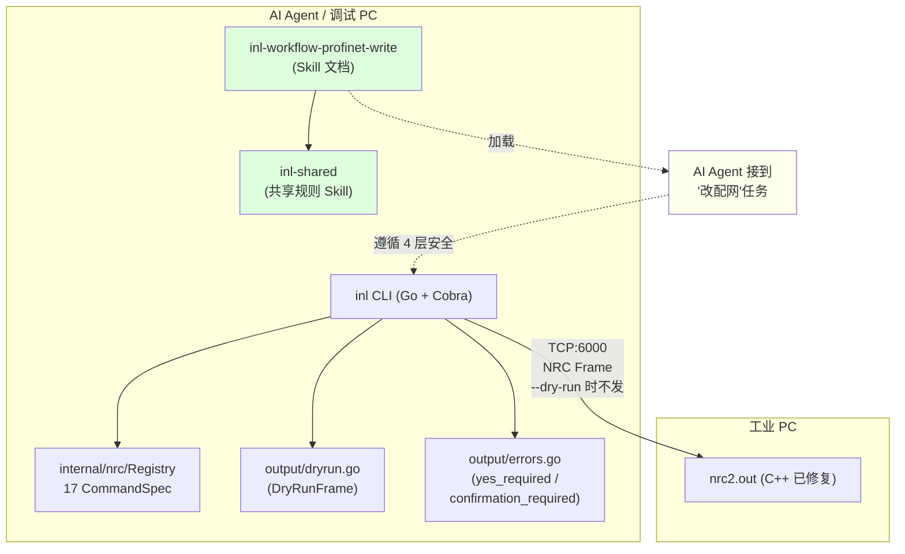

# inl — 第 4 步：写操作工作流 Skills + 客户端能力扩展

## 目标

把第 3 步落地的 17 命令 / Risk 分级 / --yes 机制，**提升到 AI 真正"会用"的程度**。具体三个交付物：

1. **2 个 Skill 文档**（新建）：
   - `inl-shared/SKILL.md` — 共享规则（对标 lark-cli [`lark-shared`](file:///c:/Users/BYD/Documents/trae_projects/feishu_cli/cli/skills/lark-shared/SKILL.md)）
   - `inl-workflow-profinet-write/SKILL.md` — 写操作 4 层安全工作流（对标 [`lark-workflow-meeting-summary`](file:///c:/Users/BYD/Documents/trae_projects/feishu_cli/cli/skills/lark-workflow-meeting-summary/SKILL.md)）
2. **inl 客户端 2 个新能力**（编码）：
   - `--dry-run` 标志 + `internal/output/dryrun.go`（对标 [`cli/internal/cmdutil/dryrun.go`](file:///c:/Users/BYD/Documents/trae_projects/feishu_cli/cli/internal/cmdutil/dryrun.go)）
   - `confirmation_required` 错误码（对标 [`cli/internal/cmdutil/confirm.go`](file:///c:/Users/BYD/Documents/trae_projects/feishu_cli/cli/internal/cmdutil/confirm.go)）
3. **AGENTS.md 同步** — 新增"inl 与 lark-cli 工作流差异"章节

> **`inl-workflow-profinet-config`**（9 步配网业务流）**留到后续 PR**，本步骤不涉及。

完成后 AI Agent 接到"修改工业 PC PROFINET 配置"任务时，能自动加载 `inl-workflow-profinet-write` skill，按 4 层安全流程逐步执行。

---

## 背景上下文（自包含，无需外部资料）

### 飞书 CLI 借鉴清单（本步骤聚焦 3 个模式）

| 飞书 CLI 模式 | 来源文件 | inl 应用 |
|-------------|---------|---------|
| **共享规则 Skill 模式** | [`cli/skills/lark-shared/SKILL.md`](file:///c:/Users/BYD/Documents/trae_projects/feishu_cli/cli/skills/lark-shared/SKILL.md) | `inl-shared/SKILL.md`（认证、Risk、--yes、--dry-run、错误码的统一解释） |
| **工作流 Skill 模式** | [`cli/skills/lark-workflow-meeting-summary/SKILL.md`](file:///c:/Users/BYD/Documents/trae_projects/feishu_cli/cli/skills/lark-workflow-meeting-summary/SKILL.md) | `inl-workflow-profinet-write/SKILL.md`（写操作 4 层安全流程） |
| **Dry-run builder 模式** | [`cli/internal/cmdutil/dryrun.go:30-80`](file:///c:/Users/BYD/Documents/trae_projects/feishu_cli/cli/internal/cmdutil/dryrun.go#L30-L80) + [`cli/cmd/service/service.go:250-255`](file:///c:/Users/BYD/Documents/trae_projects/feishu_cli/cli/cmd/service/service.go#L250-L255) | `inl/internal/output/dryrun.go` + `inl/main.go` buildSubCmd |
| **RequireConfirmation 错误模式** | [`cli/internal/cmdutil/confirm.go:29-41`](file:///c:/Users/BYD/Documents/trae_projects/feishu_cli/cli/internal/cmdutil/confirm.go#L29-L41) | `inl/internal/output/errors.go` 新增 `ConfirmationRequired` 函数 |

**借鉴 vs 限制**（inl 工业场景与 lark-cli 办公场景的本质差异）：

| 维度 | Lark-CLI | inl | 应对 |
|------|---------|-----|------|
| 操作对象 | 飞书云 API | 工业 PC 本地 JSON + 实时设备 | — |
| 可逆性 | 大部分操作可逆（云端版本历史） | 写操作**不可逆**（本地 JSON 覆盖） | 新增 Layer 2 备份层 |
| 回滚机制 | 云端自动（飞书文档版本） | **必须手动**（inl 反向命令 / SCP 恢复） | 仅允许显式回滚 |
| AI 调度 | 自动追加 `--yes` 重试 | **必须区分** write（AI 可自动）vs high-risk-write（AI 不可自动） | 新增 `confirmation_required` 错误码 |

> 这一差异必须**显式写进 `inl-shared/SKILL.md`**，避免 AI 误把 lark-cli 的"自动 --yes"范式套用到 inl 的 high-risk-write 命令上。

### 当前 inl 状态（截至第 3 步完成）

```
inl/
├── AGENTS.md                        # ← 同步: 新增 "inl 与 lark-cli 工作流差异" 章节
├── main.go                          # ← 改: --dry-run + confirmation_required 适配
├── go.mod / go.sum                  # (不变)
├── *_response_*.json                # (不变)
└── internal/
    ├── nrc/                         # (不变, commands.go 已含 17 命令)
    ├── gsd/ / topology/ / devicestatus/ / gsdfile/  # (不变)
    ├── output/
    │   └── errors.go                # ← 扩展: 新增 ConfirmationRequired + YesRequired 拆分
    └── (新) output/dryrun.go        # ← 新增: DryRunFrame + PrintDryRunFrame
```

**已验证**（来自第 3 步验收）：
- 17 命令 Registry 完整
- Risk 等级 + --yes 强制
- Cobra Annotations + help 底部 Risk 行
- 结构化错误（`output.Error` struct）
- 实机 5/6 读命令 + 与 C++ 修复后服务端对齐
- `field-verification.md` 反馈循环机制

### 系统拓扑（本步骤目标态）



### 11 个写命令的安全矩阵（Skill 内容依据）

| 命令 | 改什么 | 风险等级 | AI 自动 --yes? | 预检需读 | 备份策略 | 回滚路径 |
|------|--------|---------|---------------|---------|---------|---------|
| `config set-driver` | PNDriver.{Name,IP,Mask} | write | ✅ 允许 | `device list` | 用户手动 SCP | set-driver (旧值) |
| `config add-device` | DecentralDevice[] 追加 | write | ✅ 允许 | `device list` | 用户手动 SCP | remove-device (无配置损失) |
| `config remove-device` | DecentralDevice[] 删除 | write | ✅ 允许 | `device list` + `--dry-run` | **强制** SCP 备份 | **备份恢复** (remove 不可逆) |
| `config set-device` | Device.{IP,Name,...} | write | ✅ 允许 | `device list` | 用户手动 SCP | set-device (旧值) |
| `config add-module` | Device.Module[] 追加 | write | ✅ 允许 | `device list-active` | 用户手动 SCP | remove-module |
| `config remove-module` | Device.Module[] 删除 | write | ✅ 允许 | `device list-active` + `--dry-run` | **强制** SCP 备份 | **备份恢复** |
| `config add-submodule` | Module.SubModule[] 追加 | write | ✅ 允许 | `device list-active` | 用户手动 SCP | remove-submodule |
| `config remove-submodule` | Module.SubModule[] 删除 | write | ✅ 允许 | `device list-active` + `--dry-run` | **强制** SCP 备份 | **备份恢复** |
| `config set-idevice` | IDevice.{Input,Output,Activate} | write | ✅ 允许 | `device list` | 用户手动 SCP | set-idevice (旧值) |
| `config shield` | Device.IsShielded=true | write | ✅ 允许 | `device list-active` | 用户手动 SCP | unshield |
| `config unshield` | Device.IsShielded=false | write | ✅ 允许 | `device list-active` | 用户手动 SCP | shield |
| **`config compile`** | **激活配置（重启控制器）** | **high-risk-write** | **❌ 禁止** | `device list` + `device list-active` + `--dry-run` | **强制** SCP 备份 | **备份恢复 + 重新 compile** |

**注**：`SetIDevice` 命令当前未在 Registry（第 3 步未注册），本步骤 Skill 不写；待 `inl-step3-plan` 中提到的补登记 PR 完成后再补。

---

## 文件清单

```
feishu_cli/
├── skills/                              # ← 新增 2 个 skills
│   ├── inl-shared/                      # ← 新建
│   │   └── SKILL.md
│   └── inl-workflow-profinet-write/     # ← 新建
│       ├── SKILL.md
│       └── references/
│           └── 11-commands-safety-matrix.md   # ← 新建 (可选, 11 命令详细安全矩阵)
└── inl/
    ├── AGENTS.md                        # ← 同步: 新章节
    ├── main.go                          # ← 改: --dry-run + confirmation_required
    └── internal/
        └── output/
            ├── errors.go                # ← 扩展: ConfirmationRequired + YesRequired
            └── dryrun.go                # ← 新增: DryRunFrame + PrintDryRunFrame
```

**新增文件**: 4-5 个（2 SKILL.md + 1 main.go 改 + 1 dryrun.go + 1 references 可选）
**修改文件**: 2 个（AGENTS.md + errors.go）
**新增三方依赖**: 0（仍仅 cobra）

---

## Step A: `inl-shared/SKILL.md` — 共享规则入口

### 设计动机

模仿 lark-cli [`lark-shared/SKILL.md`](file:///c:/Users/BYD/Documents/trae_projects/feishu_cli/cli/skills/lark-shared/SKILL.md) 的"全 skill 必读入口"模式。所有 inl 相关 skill 顶部都必须 `**CRITICAL** — 开始前 MUST 先用 Read 工具读取 [inl-shared/SKILL.md]`。

### 文件位置

`feishu_cli/skills/inl-shared/SKILL.md`

### 完整结构（草稿）

```yaml
---
name: inl-shared
version: 1.0.0
description: "Use when first setting up inl, running --target, handling Risk levels (read/write/high-risk-write), understanding --yes / --dry-run, or parsing structured errors (yes_required / confirmation_required). MUST be read before any other inl-* skill."
metadata:
  requires:
    bins: ["inl"]
---
```

```markdown
# inl 共享规则

**CRITICAL — 开始前 MUST 先用 Read 工具读取本文件**。所有 inl-* workflow skill 都依赖本规则。

## 配置：--target 工业 PC

`inl --target <IP> ...` 是所有命令的**前置必填参数**。格式 `192.168.3.15`（不带端口），inl 自动加 `:6000`。

```bash
inl --target 192.168.3.15 gsd list    # 读
inl --target 192.168.3.15 device run  # 读
inl --target 192.168.3.15 config add-device --yes  # 写
```

## 3 级 Risk 等级

借鉴 lark-cli Risk 系统：

| RiskLevel | 含义 | `--yes` 必需? | AI 自动 --yes? | 高危提示 |
|-----------|------|--------------|----------------|----------|
| `read` | 只读无副作用 | ❌ | — | — |
| `write` | 写配置 | ✅ | ✅ 允许 | — |
| `high-risk-write` | 编译/重启/擦除 | ✅ | **❌ 禁止**（confirmation_required） | stderr `⚠️` 提示 |

**inl 与 lark-cli 的关键差异**：

> Lark-CLI 的 write 类命令 AI 调 `yes_required` 错误可**自动追加 --yes**。
> inl 的 `high-risk-write` 命令（如 `config compile`）触发 `confirmation_required` 错误，AI **不可自动追加 --yes**，必须**人工决策**。

## --yes 标志

写命令必加 `--yes`（否则拒绝执行，stderr 输出结构化错误）：

```json
{
  "type": "validation",
  "code": "yes_required",
  "message": "拒绝执行: config-add-device 是 write 操作, 需加 --yes 标志确认",
  "hint": "查看风险: inl config-add-device --yes --help"
}
```

**AI 调度行为**：
- `yes_required` → AI **自动追加** `--yes` 重试
- `confirmation_required` → AI **暂停**，**不**自动追加，告知用户决策

## --dry-run 标志（新增）

**所有 write + high-risk-write 命令自动获得 `--dry-run` 标志**。`--dry-run` 时：

1. **不连接** TCP（不连工业 PC）
2. **不发送** NRC 帧
3. 构造完整 NRC 帧到内存（`internal/nrc.BuildFrame`）
4. 打印 JSON 格式的 `DryRunFrame` 到 **stdout**
5. **不修改任何状态**

```bash
inl --target 192.168.3.15 config add-device --dry-run
```

stdout 输出示例：

```json
{
  "description": "添加分散设备",
  "sync_byte": "0x4E66",
  "command": "0x9275",
  "datatype": 12,
  "function": "AddPNDevice",
  "payload": "{\"DataType\":12,\"Function\":{\"Value\":\"AddPNDevice\"}}",
  "payload_hex": "7b2244617461...7d",
  "crc32": "0xABCD1234",
  "total_bytes": 47,
  "risk": "write"
}
```

**AI 调度行为**：
1. **写命令前必跑** `--dry-run`（不是为试运行，是为 AI 校验 payload 正确性）
2. AI 检查 `function` 字段是否匹配预期（如 `AddPNDevice` vs 错拼 `AddPNDevic`）
3. AI 检查 `payload` JSON 字段是否对齐需求
4. **校验通过**才发 `--yes` 真正执行

## 输出约定（stdout vs stderr）

借鉴 lark-cli "stdout 是数据" 原则：

| 流 | 内容 | 示例 |
|---|------|------|
| **stdout** | 数据 / 命令结果（prettified JSON 或 DryRunFrame） | `{"DataType":13,"Device":[...]}` |
| **stderr** | 进度 emoji / 警告 / 结构化错误 | `🔌 连接中...`、`{"ok":false,"error":{...}}` |

**验证分流**：

```bash
inl --target 192.168.3.15 gsd list > data.json 2> progress.log
# data.json:    仅 prettified JSON
# progress.log: 🔌 / 📤 / 💾 / ⚠️ 等
```

## 结构化错误（重要！）

所有错误以 JSON 形式写到 **stderr**，AI 必须解析后再决策。错误码（`code` 字段）：

| 错误码 | Risk.Level | AI 行为 |
|--------|-----------|--------|
| `target_required` | — | AI 提示用户加 `--target` |
| `yes_required` | write | AI **自动追加** `--yes` 重试 |
| `confirmation_required` | high-risk-write | AI **暂停**，提示用户决策 |
| `unknown_command` | — | AI 不重试，报错给用户 |
| `unexpected_response_command` | — | AI 不重试，可能服务端版本不匹配 |
| `protocol_error` (CRC / Sync) | — | AI 不重试，可能是物理连接问题 |

**错误 JSON 完整结构**（`internal/output/errors.go`）：

```json
{
  "type": "validation",
  "code": "yes_required",
  "message": "拒绝执行: config-add-device 是 write 操作, 需加 --yes 标志确认",
  "hint": "查看风险: inl config-add-device --yes --help",
  "detail": {
    "action": "config-add-device",
    "risk_level": "write",
    "roll_back_command": "inl --target <IP> config remove-device --yes --data {...原值...}"
  }
}
```

## 17 命令总表

详见 `inl/AGENTS.md` 的"Registry 17 命令表"章节。本文件不重复列。

## 拼写陷阱：ShildDevice / UNShildDevice

⚠️ `ShildDevice` / `UNShildDevice` 是 C++ 源码**拼写错误**（Shield 少 'e'）。inl 内部命令名用正确拼写（`shield` / `unshield`），但请求体 `Function.Value` **必须原样**用 `ShildDevice` / `UNShildDevice`。详见 inl/AGENTS.md。

## 参考

- [`inl-workflow-profinet-write`](../inl-workflow-profinet-write/SKILL.md) — 写操作 4 层安全流程（依赖本文件）
- [inl/AGENTS.md](../../inl/AGENTS.md) — 17 命令表 + C++ 协议契约
- [cli/cmd/service/service.go:182-185](file:///c:/Users/BYD/Documents/trae_projects/feishu_cli/cli/cmd/service/service.go#L182-L185) — lark-cli --dry-run / --yes 模式来源
- [cli/internal/cmdutil/confirm.go:29-41](file:///c:/Users/BYD/Documents/trae_projects/feishu_cli/cli/internal/cmdutil/confirm.go#L29-L41) — lark-cli RequireConfirmation 模式来源
```

### Step A 验收标准

- [ ] `skills/inl-shared/SKILL.md` 存在且 ≥ 100 行
- [ ] YAML frontmatter 含 `metadata.requires.bins: ["inl"]`
- [ ] 明确写明"inl 与 lark-cli 的关键差异"（high-risk-write AI 不可自动）
- [ ] 错误码表完整（6 个以上）
- [ ] `--dry-run` 输出示例正确
- [ ] 引用 inl-workflow-profinet-write / lark-cli 源文件链接

---

## Step B: `inl-workflow-profinet-write/SKILL.md` — 写操作 4 层安全工作流

### 设计动机

模仿 [`cli/skills/lark-workflow-meeting-summary/SKILL.md`](file:///c:/Users/BYD/Documents/trae_projects/feishu_cli/cli/skills/lark-workflow-meeting-summary/SKILL.md) 的"5 步工作流 + Mermaid 图 + Step by Step"结构，落地 inl 写操作的 4 层安全流程。

### 文件位置

`feishu_cli/skills/inl-workflow-profinet-write/SKILL.md`

### 完整结构（草稿）

```yaml
---
name: inl-workflow-profinet-write
version: 1.0.0
description: "写操作 4 层安全工作流：预检 → 备份 → 确认 → 验证 → 显式回滚。AI Agent 接到 '修改 / 添加 / 删除 / 编译' 工业 PC PROFINET 配置任务时强制加载本 skill。"
metadata:
  requires:
    bins: ["inl"]
    skills: ["inl-shared"]
---
```

```markdown
# inl 写操作工作流

**CRITICAL — 开始前 MUST 先用 Read 工具读取 [`../inl-shared/SKILL.md`](../inl-shared/SKILL.md)**，其中包含 Risk 分级、--yes / --dry-run 机制、结构化错误码。

## 适用场景

- "把工业 PC 上 PROFINET 主站 IP 改成 192.168.2.20"
- "添加一个 OBARA 焊机到配置"
- "把焊机 X 屏蔽掉"
- "重新编译 PROFINET 配置并应用"
- 任何调用 `inl config *` 命令的任务

## 不适用场景

- 读取 / 监控现有配置 → 用 `inl gsd / device` 读命令即可，无需本 skill
- 备份 / 恢复操作 → 走工业 PC 系统层（SCP / SMB），不在 inl 职责内
- 升级 nrc2.out → 走工业 PC 软件升级流程

## 前置条件

1. ✅ 已读 [`../inl-shared/SKILL.md`](../inl-shared/SKILL.md)
2. ✅ 已知 `--target` 工业 PC IP
3. ✅ 已知要执行的 `inl config *` 命令及参数
4. ⚠️ 现场操作前**必须**备份 `networktopology.json`（Layer 2）

## 4 层安全原则

借鉴 lark-cli "Risk + --yes + 显式回滚" 范式，**新增 Layer 2 备份**（lark-cli 无此层，因为云端可逆）：

```
┌─────────────────────────────────────────────────────────────────────┐
│ Layer 1 预检                                                         │
│  ├─ AI 解析用户意图 → 识别目标 inl config 命令                         │
│  ├─ 跑 `inl config X --dry-run --target <IP>` 拿 DryRunFrame          │
│  └─ 校验 payload 字段（Function.Value / DataType / 字段名拼写）        │
├─────────────────────────────────────────────────────────────────────┤
│ Layer 2 备份 (lark-cli 无, 工业场景必加)                                │
│  ├─ AI 提示用户 "现场操作前必须备份 networktopology.json"              │
│  └─ 用户跑: scp 192.168.3.15:./communication/Profinet/networktopology.json  │
│              ./backups/topology_$(date +%Y%m%d_%H%M%S).json          │
├─────────────────────────────────────────────────────────────────────┤
│ Layer 3 确认                                                         │
│  ├─ write 类命令: AI 自动追加 --yes 重试 (yes_required 错误)          │
│  └─ high-risk-write 类: AI 暂停, 人工决策 (confirmation_required)    │
├─────────────────────────────────────────────────────────────────────┤
│ Layer 3.5 验证 (写后立即读)                                            │
│  ├─ 写后立即 `inl --target <IP> device list` 重读全状                  │
│  └─ 对比 diff 与预期, 不一致 → 触发 Layer 4                            │
├─────────────────────────────────────────────────────────────────────┤
│ Layer 4 显式回滚 (不自动)                                              │
│  ├─ AI 列出回滚路径, 不直接执行                                        │
│  ├─ 路径 A: 反向 inl 命令 (set-driver 旧值 / unshield)                │
│  ├─ 路径 B: 备份恢复 + 重新 compile (适用 remove-* / compile)         │
│  └─ 用户决策后才执行                                                   │
└─────────────────────────────────────────────────────────────────────┘
```

## 11 命令安全矩阵

| 命令 | 风险 | 预检读 | 备份强制? | AI 自动 --yes? | 回滚路径 |
|------|------|-------|----------|----------------|---------|
| `set-driver` | write | `device list` | 提示 | ✅ | set-driver (旧值) |
| `add-device` | write | `device list` | 提示 | ✅ | remove-device |
| **`remove-device`** | write | `device list` + `--dry-run` | **强制** | ✅ | **备份恢复** |
| `set-device` | write | `device list` | 提示 | ✅ | set-device (旧值) |
| `add-module` | write | `device list-active` | 提示 | ✅ | remove-module |
| **`remove-module`** | write | `device list-active` + `--dry-run` | **强制** | ✅ | **备份恢复** |
| `add-submodule` | write | `device list-active` | 提示 | ✅ | remove-submodule |
| **`remove-submodule`** | write | `device list-active` + `--dry-run` | **强制** | ✅ | **备份恢复** |
| `set-idevice` | write | `device list` | 提示 | ✅ | set-idevice (旧值) |
| `shield` | write | `device list-active` | 提示 | ✅ | unshield |
| `unshield` | write | `device list-active` | 提示 | ✅ | shield |
| **`compile`** | **high-risk-write** | `device list` + `device list-active` + `--dry-run` | **强制** | **❌ 禁止** | **备份恢复 + 重新 compile** |

## 5 个高危场景处理

### 场景 1：改主站 IP 导致失联

**触发**：`inl config set-driver --yes --data '{"PNDriver": {"IPAddress": "192.168.2.20", ...}}'`
**回滚**：
- AI 不自动回滚
- 列出回滚命令: `inl config set-driver --yes --data '{"PNDriver": {"IPAddress": "192.168.2.14", ...}}'`
- 用户确认 → AI 执行
- **额外验证**: 用户 ping `<新IP>` 确认可达

### 场景 2：删错设备（配置不可逆丢失）

**触发**：`inl config remove-device --yes --data '{"DeviceName": "wrong-device"}'`
**回滚**：
- AI 优先推荐**路径 B**（备份恢复），**不推荐** add-device 反向（Module/SubModule 配置会丢）
- 列出: `scp ./backups/topology_<时间戳>.json 192.168.3.15:./communication/Profinet/networktopology.json`
- `inl config compile --yes` 重新激活旧配置
- 用户确认 → AI 执行

### 场景 3：Compile 失败导致产线停机

**触发**：`inl config compile --yes`
**前置**：AI **必须**暂停等用户决策（confirmation_required 错误）
**回滚**：
- 路径 B: 备份恢复 + 重新 compile
- 工业 PC 上的 `nrc2.out` 旧配置若已激活，备份恢复后会**立即恢复**到旧网络

### 场景 4：Shield 错设备

**触发**：`inl config shield --yes --data '{"DeviceName": "wrong-device"}'`
**回滚**：
- 路径 A: `inl config unshield --yes --data '{"DeviceName": "wrong-device"}'`
- 简单对称, AI 可列命令让用户决定

### 场景 5：IP/Name 冲突

**触发**：用户给的 IP 192.168.2.20 与已存在设备冲突
**处理**：
- Layer 1 预检阶段就应阻止（`inl device list` 会显示已用 IP）
- **不应**到执行阶段才发现
- AI 在 Layer 1 校验, 冲突时**拒绝**继续

## 标准执行流程（伪代码 + inl 命令）

```python
def safe_write_command(intent):
    """intent: 用户的写操作意图, 如 '改主站 IP 为 192.168.2.20'"""
    
    # ========== Layer 1 预检 ==========
    spec = identify_inl_command(intent)  # 例: spec = "config set-driver"
    
    # 1.1 读当前状态
    current = inl_run(f"--target {target} device list")
    intended_diff = compute_diff(current, intent)
    
    # 1.2 dry-run 预览
    dryrun = inl_run(f"--target {target} {spec} --dry-run --data {json.dumps(intent)}")
    
    # 1.3 校验
    if dryrun.function != expected_function:
        return error(f"Function.Value 不匹配: 实际 {dryrun.function}, 预期 {expected_function}")
    
    if has_ip_conflict(current, intended_diff):
        return error("IP 冲突, 拒绝继续")
    
    # 1.4 用户确认
    print(f"将改变: {format_diff(intended_diff)}")
    if not user_confirm():
        return abort()
    
    # ========== Layer 2 备份 ==========
    if spec in ["config compile", "config remove-device", "config remove-module", "config remove-submodule"]:
        backup_path = prompt_user_to_backup()  # AI 列出 scp 命令, 等用户执行完
        if not user_confirms_backup(backup_path):
            return error("备份未确认, 拒绝继续")
    
    # ========== Layer 3 确认 + 执行 ==========
    # 3.1 跑命令 (AI 自动加 --yes 对 write, 对 high-risk-write 不加)
    if spec.risk == "write":
        result = inl_run(f"--target {target} {spec} --yes --data ...")
    elif spec.risk == "high-risk-write":
        # AI 不自动加 --yes
        print("⏸  high-risk-write, 请用户决定: yes/no")
        if user_yes():
            result = inl_run(f"--target {target} {spec} --yes --data ...")
        else:
            return abort()
    
    # ========== Layer 3.5 验证 ==========
    new_state = inl_run(f"--target {target} device list")
    actual_diff = compute_diff(current, new_state)
    
    if actual_diff != intended_diff:
        # 触发 Layer 4
        print(f"⚠️  验证失败: 实际 diff {actual_diff} ≠ 预期 {intended_diff}")
        return trigger_rollback(spec, current, new_state, backup_path)
    
    return success(f"✅ {spec} 完成")
```

## 完整工作流（Mermaid）

```mermaid
graph TD
    A[AI 接到写任务] --> B[解析意图, 识别 inl config 命令]
    B --> C[Layer 1.1: inl device list 读当前状态]
    C --> D[计算 intended_diff]
    D --> E[Layer 1.2: --dry-run 预览]
    E --> F{校验 Function.Value<br/>+ 字段名 + IP 冲突}
    F -->|失败| Z1[报错, 终止]
    F -->|通过| G[Layer 1.4: 显式 diff 给用户]
    G --> H{用户确认?}
    H -->|否| Z2[终止]
    H -->|是| I{命令是<br/>remove-* / compile?}
    I -->|是| J[Layer 2: 强制备份<br/>scp 拉 networktopology.json]
    I -->|否| K[Layer 2: 提示备份<br/>(可跳过)]
    J --> L{备份确认?}
    K --> L
    L -->|否| Z3[终止]
    L -->|是| M{风险等级?}
    M -->|write| N[Layer 3: AI 自动加 --yes 执行]
    M -->|high-risk-write| O[Layer 3: confirmation_required<br/>⏸ 人工决策]
    O -->|用户 yes| N
    O -->|用户 no| Z4[终止]
    N --> P[Layer 3.5: 写后立即 device list]
    P --> Q{验证 diff 一致?}
    Q -->|是| R[✅ 完成]
    Q -->|否| S[Layer 4: 列回滚路径<br/>不自动执行]
    S --> T{用户决策?}
    T -->|回滚| U[执行反向 inl 命令<br/>或 SCP 备份恢复]
    T -->|不处理| V[报告, 保留异常状态]

    style Z1 fill:#fdd
    style Z2 fill:#fdd
    style Z3 fill:#fdd
    style Z4 fill:#fdd
    style R fill:#dfd
    style O fill:#ffe
    style M fill:#eef
    style T fill:#ffe
```

## 备份机制说明（重要）

> ⚠️ **本步骤不实现自动备份**。Layer 2 备份由用户在工业 PC 系统层完成（SCP / SMB）。
> 未来 P0: C++ 端 (`PNConfigLibFileDesign`) 在每个写命令处理前自动备份 `networktopology.json` 到 `backups/topology_YYYYMMDD_HHMMSS.json`。本步骤后由独立 PR 推进。

**当前 (第 4 步) AI 必做**：

1. 在 Layer 1.4 阶段，AI 列出备份命令（`scp ...`），等用户执行
2. 备份完成才能进入 Layer 3
3. **remove-* / compile** 备份是**强制**的（AI 拒绝继续）

## 参考

- [`../inl-shared/SKILL.md`](../inl-shared/SKILL.md) — 必读入口
- [inl/AGENTS.md](../../inl/AGENTS.md) — 17 命令表 + 协议契约
- [inl-step3-plan.md](../../docs/inl/inl-step3-plan.md) — 17 命令 + Risk 上游
- [cli/skills/lark-workflow-meeting-summary/SKILL.md](file:///c:/Users/BYD/Documents/trae_projects/feishu_cli/cli/skills/lark-workflow-meeting-summary/SKILL.md) — lark-cli workflow skill 模式来源
- [cli/internal/cmdutil/confirm.go](file:///c:/Users/BYD/Documents/trae_projects/feishu_cli/cli/internal/cmdutil/confirm.go) — lark-cli confirmation 模式来源
- [docs/inl/inl-field-verification.md](file:///c:/Users/BYD/Documents/trae_projects/feishu_cli/inl/docs/protocol/field-verification.md) — 实机响应反向核对记录
```

### Step B 验收标准

- [ ] `skills/inl-workflow-profinet-write/SKILL.md` 存在且 ≥ 300 行
- [ ] YAML frontmatter 含 `metadata.requires.skills: ["inl-shared"]`
- [ ] 顶部有 `**CRITICAL — 开始前 MUST 先用 Read 工具读取**` 引用
- [ ] 4 层安全原则完整（预检/备份/确认/回滚）
- [ ] 11 命令安全矩阵完整（含 4 个标 ⚠️ 的高删除风险命令 + compile）
- [ ] 5 个高危场景处理完整
- [ ] Mermaid 工作流图完整（包含所有决策节点 + 终止节点）
- [ ] 标准执行流程伪代码 + 完整

---

## Step C: `inl/internal/output/dryrun.go` — Dry-run 帧结构

### 设计动机

借鉴 [`cli/internal/cmdutil/dryrun.go:30-80`](file:///c:/Users/BYD/Documents/trae_projects/feishu_cli/cli/internal/cmdutil/dryrun.go#L30-L80) 的 `DryRunAPI` builder 模式，但 NRC 协议无 HTTP，所以 inl 的 dry-run 是**单帧结构**而非"多次 API 调用链"。

### 文件位置

`inl/internal/output/dryrun.go`（新建）

### 公开 API

```go
package output

import (
    "encoding/hex"
    "encoding/json"
    "fmt"
    "io"

    "github.com/your-org/inl/internal/nrc"
)

// DryRunFrame 描述一次 dry-run 预览的完整 NRC 帧。
// 设计参考: cli/internal/cmdutil/dryrun.go:DryRunAPI
type DryRunFrame struct {
    Description string `json:"description"`           // 命令说明
    SyncByte    string `json:"sync_byte"`             // "0x4E66"
    Command     string `json:"command"`               // "0x9275"
    DataType    int    `json:"datatype"`              // 12 / 13
    Function    string `json:"function,omitempty"`    // "AddPNDevice" / "" (DataType=13)
    Payload     string `json:"payload"`               // JSON 字符串 (UTF-8)
    PayloadHex  string `json:"payload_hex"`           // hex 编码 (便于二进制核对)
    CRC32       string `json:"crc32"`                 // "0x53DDEB72" (含 Length 起算)
    TotalBytes  int    `json:"total_bytes"`           // 整帧字节数
    Risk        string `json:"risk"`                  // "read" / "write" / "high-risk-write"
}

// PrintDryRunFrame 构造 DryRunFrame 并写入 w (通常为 stdout)。
// 不连接 TCP, 不发任何数据。完全本地构造。
//
// 设计参考:
//   - lark-cli: cli/internal/cmdutil/dryrun.go:PrintDryRun
//   - lark-cli: cli/cmd/service/service.go:250-255 (serviceDryRun)
func PrintDryRunFrame(w io.Writer, spec nrc.CommandSpec, payload string) error {
    frame := nrc.BuildFrame(spec.Code, payload)
    
    // 解析 frame 头: SyncByte(2) + Length(2) + Command(2) + Payload(N) + CRC32(4)
    if len(frame) < 10 {
        return fmt.Errorf("frame too short: %d bytes", len(frame))
    }
    
    syncByte := fmt.Sprintf("0x%04X", uint16(frame[0])<<8|uint16(frame[1]))
    // 简化: 假定 frame[0:2] 是 SyncByte
    dataLen := int(uint16(frame[2])<<8 | uint16(frame[3]))
    cmd := fmt.Sprintf("0x%04X", uint16(frame[4])<<8|uint16(frame[5]))
    payloadBytes := frame[6 : 6+dataLen-2] // 减去 Command 字节
    crc := fmt.Sprintf("0x%08X", uint32(frame[len(frame)-4])<<24|uint32(frame[len(frame)-3])<<16|
        uint32(frame[len(frame)-2])<<8|uint32(frame[len(frame)-1]))
    
    out := DryRunFrame{
        Description: spec.Description,
        SyncByte:    syncByte,
        Command:     cmd,
        DataType:    spec.DataType,
        Function:    spec.Function,
        Payload:     payload,
        PayloadHex:  hex.EncodeToString([]byte(payload)),
        CRC32:       crc,
        TotalBytes:  len(frame),
        Risk:        string(spec.Risk),
    }
    
    enc := json.NewEncoder(w)
    enc.SetIndent("", "  ")
    return enc.Encode(out)
}
```

### 单元测试: `inl/internal/output/dryrun_test.go`

```go
package output

import (
    "bytes"
    "encoding/json"
    "strings"
    "testing"

    "github.com/your-org/inl/internal/nrc"
)

func TestPrintDryRunFrame_DataType13(t *testing.T) {
    spec, _ := nrc.LookupByName("gsd-list")
    var buf bytes.Buffer
    if err := PrintDryRunFrame(&buf, spec, `{"DataType":13}`); err != nil {
        t.Fatalf("PrintDryRunFrame failed: %v", err)
    }
    
    var got DryRunFrame
    if err := json.Unmarshal(buf.Bytes(), &got); err != nil {
        t.Fatalf("Unmarshal failed: %v", err)
    }
    
    if got.SyncByte != "0x4E66" {
        t.Errorf("SyncByte = %q, want 0x4E66", got.SyncByte)
    }
    if got.Command != "0x9275" {
        t.Errorf("Command = %q, want 0x9275", got.Command)
    }
    if got.DataType != 13 {
        t.Errorf("DataType = %d, want 13", got.DataType)
    }
    if got.Function != "" {
        t.Errorf("Function = %q, want empty (DataType=13)", got.Function)
    }
    if got.Risk != "read" {
        t.Errorf("Risk = %q, want read", got.Risk)
    }
}

func TestPrintDryRunFrame_DataType12_WithFunction(t *testing.T) {
    spec, _ := nrc.LookupByName("config-add-device")
    var buf bytes.Buffer
    if err := PrintDryRunFrame(&buf, spec, `{"DataType":12,"Function":{"Value":"AddPNDevice"}}`); err != nil {
        t.Fatalf("PrintDryRunFrame failed: %v", err)
    }
    
    var got DryRunFrame
    json.Unmarshal(buf.Bytes(), &got)
    
    if got.DataType != 12 {
        t.Errorf("DataType = %d, want 12", got.DataType)
    }
    if got.Function != "AddPNDevice" {
        t.Errorf("Function = %q, want AddPNDevice", got.Function)
    }
    if got.Risk != "write" {
        t.Errorf("Risk = %q, want write", got.Risk)
    }
    if !strings.Contains(got.Payload, "AddPNDevice") {
        t.Errorf("Payload 应含 AddPNDevice, got: %s", got.Payload)
    }
}

func TestPrintDryRunFrame_HighRisk(t *testing.T) {
    spec, _ := nrc.LookupByName("config-compile")
    var buf bytes.Buffer
    PrintDryRunFrame(&buf, spec, `{"DataType":12,"Function":{"Value":"Compile"}}`)
    
    var got DryRunFrame
    json.Unmarshal(buf.Bytes(), &got)
    
    if got.Risk != "high-risk-write" {
        t.Errorf("Risk = %q, want high-risk-write", got.Risk)
    }
    if got.Function != "Compile" {
        t.Errorf("Function = %q, want Compile", got.Function)
    }
}
```

### Step C 验收标准

- [ ] `inl/internal/output/dryrun.go` 存在
- [ ] `DryRunFrame` struct 8 个字段
- [ ] `PrintDryRunFrame` 函数签名匹配
- [ ] 不导入 `net`（保证不连 TCP）
- [ ] `dryrun_test.go` 3 个测试 PASS
- [ ] JSON 输出可被 `json.Unmarshal` 还原

---

## Step D: `inl/internal/output/errors.go` 扩展 — ConfirmationRequired

### 设计动机

第 3 步已实现 `output.Error` struct + `WriteError` 函数。本步骤：
1. 拆分现有 `yes_required` 错误为两个错误码：
   - `yes_required` (write, AI 可自动重试)
   - `confirmation_required` (high-risk-write, AI 不可自动)
2. 借鉴 [`cli/internal/cmdutil/confirm.go:29-41`](file:///c:/Users/BYD/Documents/trae_projects/feishu_cli/cli/internal/cmdutil/confirm.go#L29-L41) 的 `RiskDetail` 结构

### 文件位置

`inl/internal/output/errors.go`（修改 + 新增函数）

### 新增 / 调整

```go
package output

// ... (现有 Error struct, WriteError 函数保留不变)

// YesRequired 是 write 操作的 --yes 强制错误。
// AI 看到此错误应自动追加 --yes 重试。
//
// 借鉴 lark-cli: 任何非 read 命令都强制 --yes (service.go:183-185)
func YesRequired(action string) error {
    return &Error{
        Type:    "validation",
        Code:    "yes_required",
        Message: fmt.Sprintf("拒绝执行: %s 是 write 操作, 需加 --yes 标志确认", action),
        Hint:    fmt.Sprintf("查看风险: inl %s --yes --help", action),
        Detail: map[string]any{
            "action":         action,
            "risk_level":     "write",
            "roll_back_command": fmt.Sprintf("inl --target <IP> %s --yes --data '{...反操作...}'", action),
        },
    }
}

// ConfirmationRequired 是 high-risk-write 操作的人工确认错误。
// AI 看到此错误应**暂停**, 不自动追加 --yes, 必须人工决策。
//
// 借鉴 lark-cli: cli/internal/cmdutil/confirm.go:29-41 RequireConfirmation
func ConfirmationRequired(action string) error {
    return &Error{
        Type:    "validation",
        Code:    "confirmation_required",
        Message: fmt.Sprintf("⏸ %s 是高危操作, 需人工确认 (AI 不可自动追加 --yes)", action),
        Hint:    "请用户明确回复 yes/no 后再执行",
        Detail: map[string]any{
            "action":             action,
            "risk_level":         "high-risk-write",
            "ai_auto_yes":        false,
            "roll_back_command":  fmt.Sprintf("备份恢复: scp <IP>:./communication/Profinet/networktopology.json ./tmp/ && scp ./tmp/networktopology.json <IP>:./communication/Profinet/ && inl --target <IP> config compile --yes"),
        },
    }
}
```

### 单元测试: `errors_test.go` 新增

```go
func TestYesRequired(t *testing.T) {
    err := YesRequired("config-add-device")
    if err == nil { t.Fatal("expected non-nil") }
    if !strings.Contains(err.Error(), "yes_required") { t.Error("code missing") }
}

func TestConfirmationRequired(t *testing.T) {
    err := ConfirmationRequired("config-compile")
    if err == nil { t.Fatal("expected non-nil") }
    if !strings.Contains(err.Error(), "confirmation_required") { t.Error("code missing") }
    if !strings.Contains(err.Error(), "high-risk-write") { t.Error("risk_level missing") }
    if !strings.Contains(err.Error(), "ai_auto_yes") { t.Error("ai_auto_yes hint missing") }
}
```

### Step D 验收标准

- [ ] `errors.go` 新增 `YesRequired` + `ConfirmationRequired` 函数
- [ ] `ConfirmationRequired` 错误 JSON 含 `ai_auto_yes: false` + `risk_level: high-risk-write`
- [ ] `errors_test.go` 2 个新测试 PASS
- [ ] 现有 `yes_required` 错误逻辑**改为调用** `YesRequired`（不破坏第 3 步测试）

---

## Step E: `inl/main.go` 适配 — --dry-run + confirmation_required

### 设计动机

把 Step C/D 的新能力接入 cobra 命令树：
1. 写命令自动获得 `--dry-run` 标志
2. Risk 等级为 high-risk-write 时，无 --yes 返回 `ConfirmationRequired` 而非 `YesRequired`

### 文件位置

`inl/main.go`（修改 `buildSubCmd` 和 `runNrcCommand`）

### 关键改动

#### E.1: `buildSubCmd` 新增 --dry-run 标志

```go
func buildSubCmd(spec nrc.CommandSpec) *cobra.Command {
    use := spec.Name[len(spec.Group)+1:]

    subCmd := &cobra.Command{
        Use:         use,
        Short:       spec.Description,
        Annotations: map[string]string{
            nrc.AnnotationRisk:     string(spec.Risk),
            nrc.AnnotationDataType: strconv.Itoa(spec.DataType),
            nrc.AnnotationFunction: spec.Function,
        },
        Args: cobra.NoArgs,
        RunE: runNrcCommand(spec.Name),
    }

    // 写命令自动有 --yes + --dry-run 标志
    if spec.Risk != nrc.RiskRead {
        subCmd.Flags().Bool("yes", false,
            "确认执行 "+string(spec.Risk)+" 操作 (必需)")
        // 借鉴 lark-cli service.go:182 --dry-run 全 risk 都可加
        subCmd.Flags().Bool("dry-run", false,
            "预览请求帧 (不连接工业 PC, 不发送任何数据)")
    }

    return subCmd
}
```

#### E.2: `runNrcCommand` 拆分 yes_required / confirmation_required

```go
func runNrcCommand(name string) func(*cobra.Command, []string) error {
    return func(cmd *cobra.Command, args []string) error {
        if targetFlag == "" {
            return &output.Error{
                Type:    "validation",
                Code:    "target_required",
                Message: "--target 不能为空",
                Hint:    "请用 --target 192.168.x.x 指定工业 PC IP",
            }
        }
        spec, ok := nrc.LookupByName(name)
        if !ok {
            return &output.Error{
                Type:    "protocol",
                Code:    "unknown_command",
                Message: fmt.Sprintf("命令未注册: %q", name),
            }
        }

        // 预检: dry-run 模式 → 构造 DryRunFrame + 打印 + 退出
        if spec.Risk != nrc.RiskRead {
            dryRun, _ := cmd.Flags().GetBool("dry-run")
            if dryRun {
                body, _ := nrc.RequestBody(spec, nil)
                if err := output.PrintDryRunFrame(os.Stdout, spec, body); err != nil {
                    return fmt.Errorf("打印 dry-run 帧失败: %w", err)
                }
                fmt.Fprintf(os.Stderr, "🛑 --dry-run 模式: 已跳过连接和发送\n")
                return nil
            }

            yesFlag, _ := cmd.Flags().GetBool("yes")
            if !yesFlag {
                // 借鉴 lark-cli: write 用 YesRequired, high-risk-write 用 ConfirmationRequired
                if spec.Risk == nrc.RiskHighRiskWrite {
                    return output.ConfirmationRequired(spec.Name)
                }
                return output.YesRequired(spec.Name)
            }
            if spec.Risk == nrc.RiskHighRiskWrite {
                fmt.Fprintf(os.Stderr, "⚠️  高危操作: %s (high-risk-write)\n    已通过 --yes, 即将发送请求到 %s\n",
                    spec.Name, targetFlag)
            }
        }

        // 后续: 连接/发送/保存/打印 (与第 3 步 main.go 相同)
        addr := targetFlag + ":6000"
        fmt.Fprintf(os.Stderr, "🔌 连接 %s ...\n", addr)
        // ... 省略 main.go 已有的连接/发送/验证/保存/打印逻辑
    }
}
```

### 单元测试: 已有 `commands_test.go` + 新增 main_test.go 覆盖

| 测试 | 断言 |
|------|------|
| `TestDryRunFlag` | `inl config X --dry-run` 输出 DryRunFrame JSON |
| `TestWriteRequiresYes` | `inl config X` (无 --yes) 返回 yes_required |
| `TestCompileRequiresConfirmation` | `inl config compile` (无 --yes) 返回 confirmation_required |
| `TestReadCommandNoYesRequired` | `inl device list` 不需要 --yes |

### Step E 验收标准

- [ ] `buildSubCmd` 写命令自动加 `--yes` + `--dry-run` 两个 flag
- [ ] `--dry-run` 时不连 TCP、不发 NRC 帧
- [ ] `--dry-run` 输出 DryRunFrame JSON 到 stdout
- [ ] write 缺 --yes → yes_required 错误
- [ ] high-risk-write 缺 --yes → **confirmation_required** 错误（不是 yes_required）
- [ ] high-risk-write + --yes → stderr `⚠️` 提示 + 真发请求

---

## Step F: `inl/AGENTS.md` 同步

### 设计动机

AGENTS.md 是 inl 知识索引的入口。Skill 文档已就位后，AGENTS.md 应反映"哪些 skill 适合何时加载"。

### 文件位置

`inl/AGENTS.md`（修改）

### 新增章节

在 AGENTS.md 现有内容后追加：

```markdown
## Skills 体系（借鉴飞书 CLI 架构）

inl 配套 2 个 Skill 文档，位于 [`feishu_cli/skills/`](file:///c:/Users/BYD/Documents/trae_projects/feishu_cli/skills/)：

| Skill | 作用 | 加载时机 |
|-------|------|---------|
| [`inl-shared`](../skills/inl-shared/SKILL.md) | 共享规则入口（--target, Risk, --yes, --dry-run, 错误码） | **所有 inl 相关任务必读** |
| [`inl-workflow-profinet-write`](../skills/inl-workflow-profinet-write/SKILL.md) | 写操作 4 层安全流程（预检/备份/确认/回滚） | AI 接到"修改/添加/删除/编译"工业 PC PROFINET 配置任务时 |

**inl 与 lark-cli 工作流的关键差异**（必须了解）：

| 维度 | Lark-CLI | inl |
|------|---------|-----|
| 操作对象 | 飞书云 API | 工业 PC 本地 JSON + 实时设备 |
| 可逆性 | 大部分可逆（云端版本历史） | 写操作**不可逆**（本地 JSON 覆盖） |
| 回滚机制 | 云端自动 | **必须手动**（inl 反向命令 / SCP 恢复） |
| AI 调度 | 自动追加 `--yes` 重试 | **必须区分** write（AI 可自动）vs high-risk-write（AI 不可自动） |

**`inl-workflow-profinet-config`**（9 步配网业务流，与 profinet-network-engineer 对标）**待后续 PR**。本仓库现有的 [`profinet-network-engineer`](../skills/profinet-network-engineer/SKILL.md) 暂不修改，其引用的 `pndcp` / `profinet-config-generator` / `profinet-compiler` 占位 skill 保持未实现状态。

## 错误码总表

| 错误码 | 触发条件 | AI 行为 | 错误码来源 |
|--------|---------|---------|----------|
| `target_required` | `--target` 为空 | AI 提示用户加 `--target` | inl 第 3 步 |
| `yes_required` | write 命令缺 `--yes` | AI **自动追加** `--yes` 重试 | lark-cli service.go:183 |
| **`confirmation_required`** | high-risk-write 缺 `--yes` | AI **暂停**，**不**自动追加，告知用户 | lark-cli confirm.go:29 |
| `unknown_command` | Registry 找不到 | AI 不重试，报错 | inl 第 3 步 |
| `unexpected_response_command` | 响应命令字 ≠ 0x9271 | AI 不重试 | inl 第 3 步 |
```

### Step F 验收标准

- [ ] AGENTS.md 新增"Skills 体系"章节
- [ ] 引用 `feishu_cli/skills/inl-shared/SKILL.md` + `inl-workflow-profinet-write/SKILL.md`
- [ ] 明确"inl 与 lark-cli 工作流的关键差异"
- [ ] 错误码总表含 6 个码
- [ ] 提及 `inl-workflow-profinet-config` 留到后续 PR

---

## 完整验收清单（汇总）

### 离线验收

#### Step A (inl-shared/SKILL.md)
- [ ] 文件存在, ≥ 100 行
- [ ] YAML frontmatter 完整
- [ ] 错误码表完整
- [ ] inl vs lark-cli 差异明确

#### Step B (inl-workflow-profinet-write/SKILL.md)
- [ ] 文件存在, ≥ 300 行
- [ ] YAML frontmatter 完整
- [ ] 4 层安全原则完整
- [ ] 11 命令安全矩阵完整
- [ ] 5 个高危场景处理完整
- [ ] Mermaid 工作流图完整
- [ ] 标准执行流程伪代码

#### Step C (dryrun.go)
- [ ] `DryRunFrame` struct 8 字段
- [ ] `PrintDryRunFrame` 函数
- [ ] 3 个测试 PASS
- [ ] 不导入 `net` 包

#### Step D (errors.go 扩展)
- [ ] `YesRequired` 函数
- [ ] `ConfirmationRequired` 函数
- [ ] 2 个新测试 PASS
- [ ] 现有 yes_required 逻辑迁移

#### Step E (main.go 适配)
- [ ] 写命令自动 `--yes` + `--dry-run`
- [ ] `--dry-run` 不连 TCP
- [ ] `confirmation_required` 错误触发（compile 等）
- [ ] 4 个新测试 PASS
- [ ] 全部 17 命令行为符合预期

#### Step F (AGENTS.md 同步)
- [ ] Skills 体系章节
- [ ] 错误码总表
- [ ] 与 lark-cli 差异

### 实机验收

- [ ] `inl gsd list --target 192.168.3.15` 行为不变
- [ ] `inl config X --target ... --dry-run` 输出 DryRunFrame JSON 到 stdout
- [ ] `inl config X --target ...` (无 --yes) 拒绝 + stderr yes_required
- [ ] `inl config compile --target ...` (无 --yes) 拒绝 + stderr **confirmation_required**
- [ ] 全部 17 命令 --help 文本底部显示 Risk: <level>
- [ ] `inl --help` / `inl gsd --help` / `inl device --help` / `inl config --help` 正常显示

### 测试统计

| 包 | 第 3 步 | 本步骤新增 | 累计 |
|----|---------|-----------|------|
| `internal/nrc/` | 11 | 0 | 11 |
| `internal/gsd/` | 4 | 0 | 4 |
| `internal/topology/` | 2 | 0 | 2 |
| `internal/devicestatus/` | 0 | 0 | 0 |
| `internal/gsdfile/` | 0 | 0 | 0 |
| `internal/output/` | 0 | 5 | 5 |
| **小计** | **17** | **5** | **22** |

---

## 风险与回退

| 风险 | 概率 | 影响 | 回退策略 |
|------|------|------|---------|
| Skill 文档过长 (300+ 行) AI 加载慢 | 中 | AI 启动开销 | 拆 `references/` 子目录放细节 (11-commands-safety-matrix.md) |
| `--dry-run` 与写命令 Body 复杂度不匹配 (需 --data 传 JSON) | 高 | 写命令 dry-run 需复杂 args | 第 5 步引入 `--data` 标志 + BodyBuilder 工厂 |
| `confirmation_required` 错误后用户取消, AI 状态混乱 | 低 | 用户体验 | AI 主动重置 workflow 状态 |
| Skill 与 lark-shared 不兼容 (用了不同 YAML 格式) | 极低 | 加载失败 | 与 lark-shared 严格对齐 |

---

## PR 拆分建议

| PR | 内容 | 工作量 | 依赖 |
|----|------|-------|------|
| **PR-1** | Step C + E (inl 客户端: --dry-run + confirmation_required) | 1.5h | 无 |
| **PR-2** | Step A (inl-shared/SKILL.md) | 0.5h | PR-1（需引用 --dry-run 错误码） |
| **PR-3** | Step B (inl-workflow-profinet-write/SKILL.md) | 1h | PR-2 |
| **PR-4** | Step D (errors.go 扩展) | 0.5h | PR-1 |
| **PR-5** | Step F (AGENTS.md 同步) | 0.2h | PR-1, PR-2, PR-3 |

PR-1 是 inl 客户端能力，PR-2/3 是 skill 文档，PR-4 可并入 PR-1，PR-5 收尾。

---

## 执行节奏

| Step | 内容 | 预计耗时 |
|------|------|---------|
| Step C | inl/internal/output/dryrun.go | 30 分钟 |
| Step E | inl/main.go 适配 (--dry-run + confirmation_required) | 30 分钟 |
| Step D | inl/internal/output/errors.go 扩展 | 20 分钟 |
| Step A | skills/inl-shared/SKILL.md | 30 分钟 |
| Step B | skills/inl-workflow-profinet-write/SKILL.md | 1 小时 |
| Step F | inl/AGENTS.md 同步 | 10 分钟 |
| Step G (实机) | --dry-run 跑过, yes_required / confirmation_required 各 1 个 | 30 分钟 |

**总共约 3.5 小时代码 + 0.5 小时车间**。

---

## 后续 PR 候选（不在本步骤）

| 改进 | 触发时机 |
|------|---------|
| `inl-workflow-profinet-config` (9 步配网业务流) Skill | 当 AI 接到"完整配网"任务时 |
| C++ 端预写自动备份 | 当产线不允许"先 SCP 再写"流程时 |
| 写命令的 `--data` 复杂 JSON 构造 | 当第一个写命令真的有参数需求时 |
| `inl backup` / `inl restore` 子命令 (走 NRC 备份) | 当工业 PC 系统层 SCP 不可用时 |
| 写命令 body 工厂扩展 (BodyBuilder 重载) | 当写命令参数复杂度超过 --data 字符串时 |
| AI 自动回滚 (低风险) | 当用户拍板"AI 可自动回滚 set-driver/shield"时 |

---

## 相关文档

- [[inl-architecture]] — 架构设计
- [[inl-prd]] — 产品需求
- [[inl-mvp-plan]] — 第 1 步 MVP 计划
- [[inl-commands-plan]] — 第 2 步 Cobra 骨架计划
- [[inl-step3-plan]] — 第 3 步 17 命令 + Risk 计划
- [inl/AGENTS.md](file:///c:/Users/BYD/Documents/trae_projects/feishu_cli/inl/AGENTS.md) — inl 知识索引
- [inl-step3-plan.md § Skill 体系](file:///c:/Users/BYD/Documents/trae_projects/feishu_cli/docs/inl/inl-step3-plan.md) — 已规划的 skill 架构
- [cli/skills/lark-shared/SKILL.md](file:///c:/Users/BYD/Documents/trae_projects/feishu_cli/cli/skills/lark-shared/SKILL.md) — lark-cli 共享规则
- [cli/skills/lark-workflow-meeting-summary/SKILL.md](file:///c:/Users/BYD/Documents/trae_projects/feishu_cli/cli/skills/lark-workflow-meeting-summary/SKILL.md) — lark-cli workflow 模式
- [cli/internal/cmdutil/dryrun.go](file:///c:/Users/BYD/Documents/trae_projects/feishu_cli/cli/internal/cmdutil/dryrun.go) — lark-cli DryRunAPI
- [cli/internal/cmdutil/confirm.go](file:///c:/Users/BYD/Documents/trae_projects/feishu_cli/cli/internal/cmdutil/confirm.go) — lark-cli RequireConfirmation
- [profinet-network-engineer/SKILL.md](file:///c:/Users/BYD/Documents/trae_projects/feishu_cli/skills/profinet-network-engineer/SKILL.md) — 旧配网业务流 (保留不动)
