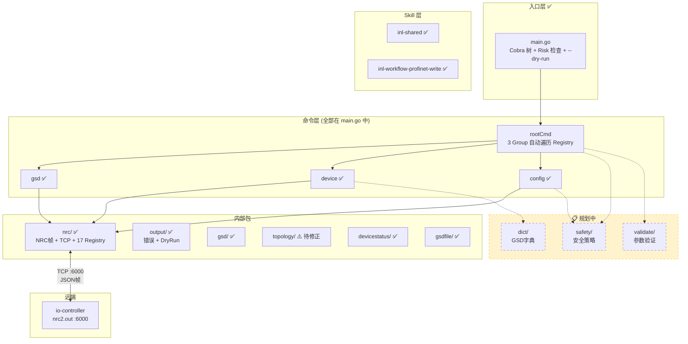
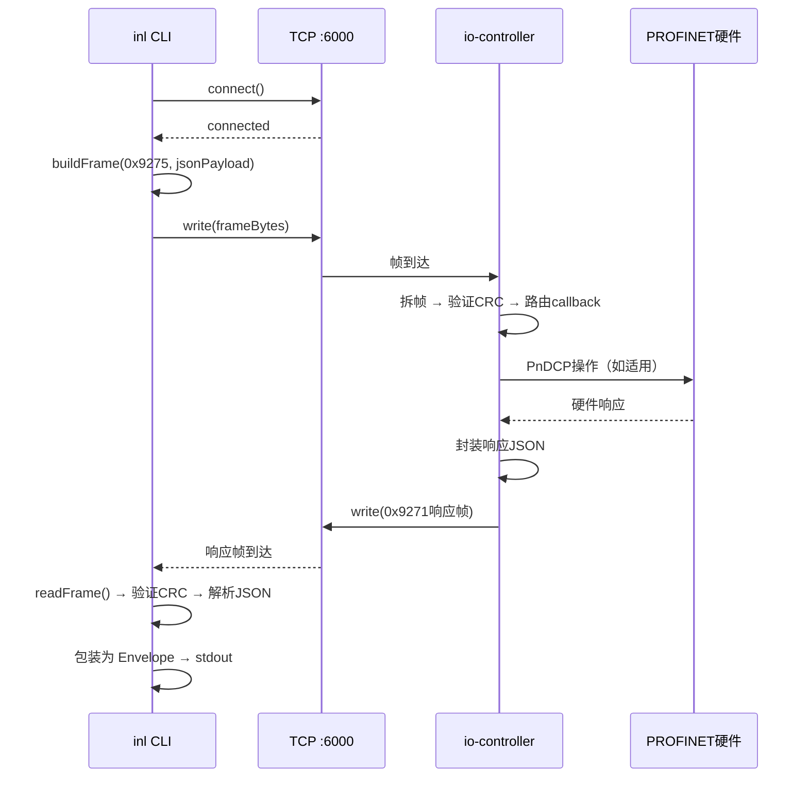
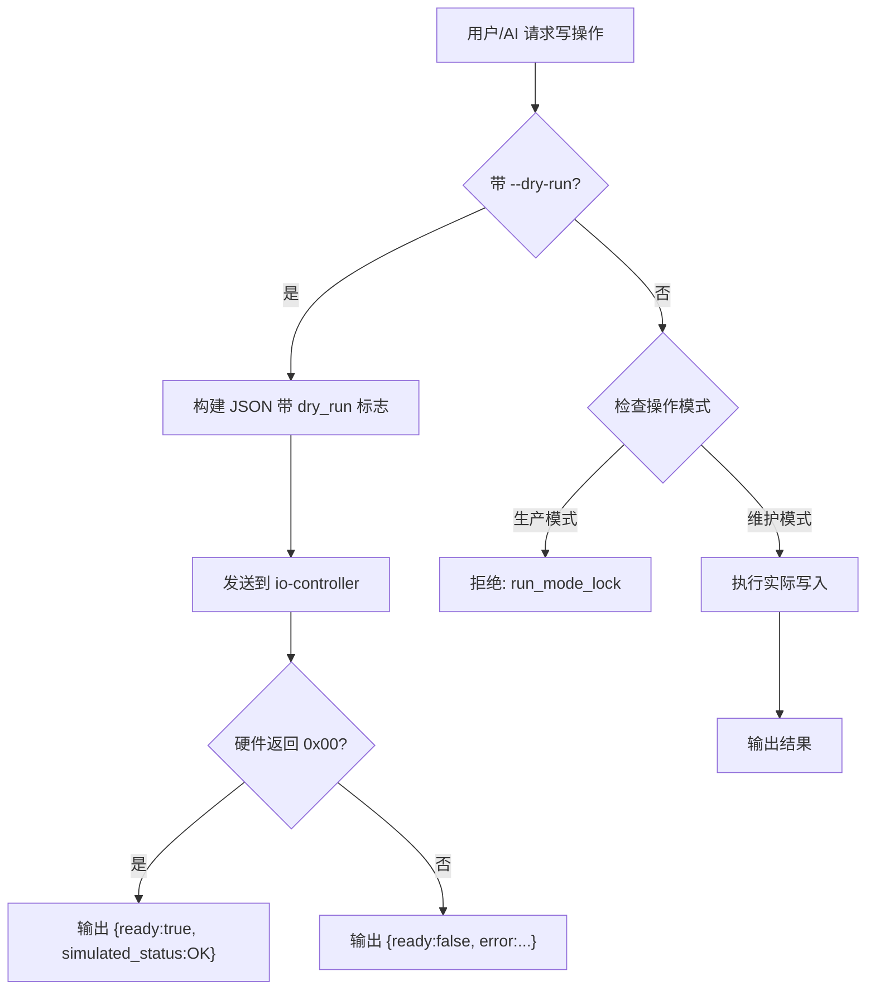
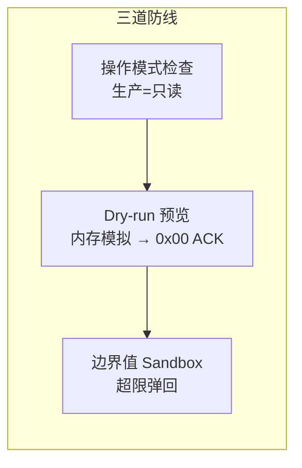

# inl — 架构设计文档

## 1. 概述

inl 借鉴 [[cli-architecture-overview|lark-cli 架构]]，采用 Go 语言实现。核心技术栈与 lark-cli 对齐：

| 组件 | 选型 | 说明 | 状态 |
|------|------|------|:---:|
| CLI 框架 | `spf13/cobra` | 命令树 + 参数解析 | ✅ |
| 输出系统 | `encoding/json` | JSON 输出（NDJSON/Table/CSV 规划中） | ⚠️ 仅 JSON |
| TCP 通信 | `net`（标准库） | NRC Socket 协议客户端 | ✅ |
| 分发 | npm + GoReleaser | 完全复用 lark-cli 的 `scripts/install.js` | 📋 |
| 打包 | `go build` 静态编译 | 单文件 ~5MB | ✅ |

## 2. 项目目录结构

> **图例**：✅ 已实现 | 📋 规划中 | 🔮 未来扩展方向

### 2.1 当前实现（Step 4 完成后）

```
inl/
├── main.go                          ✅ Cobra 命令树入口 + Root/Build/Bootstrap + Risk 检查 + --dry-run
├── main_test.go                     ✅
├── go.mod / go.sum                  ✅ github.com/your-org/inl (依赖仅 cobra)
├── AGENTS.md                        ✅ 协议契约 + 17 命令表 + 已知偏差 + Skills 体系
│
├── internal/                        # === 内部包 ===
│   ├── nrc/                         # NRC Socket 协议客户端
│   │   ├── frame.go                 ✅ 帧封包/拆包 + CRC32
│   │   ├── frame_test.go            ✅
│   │   ├── client.go                ✅ TCP 连接 + 收发 (5s/10s 超时)
│   │   ├── commands.go              ✅ 17 命令 Registry + BodyBuilder + Lookup
│   │   ├── commands_test.go         ✅
│   │   ├── annotation.go            ✅ Cobra Annotations 常量
│   │   └── annotation_test.go       ✅
│   │
│   ├── output/                      # 输出格式化
│   │   ├── errors.go                ✅ 结构化错误 (Error struct + YesRequired/ConfirmationRequired)
│   │   ├── errors_test.go           ✅
│   │   ├── dryrun.go                ✅ DryRunFrame + PrintDryRunFrame
│   │   └── dryrun_test.go           ✅
│   │
│   ├── gsd/                         # GSD 领域模型 (DataType=13)
│   │   ├── types.go                 ✅ 8 structs 完整覆盖 GSD 响应
│   │   └── types_test.go            ✅
│   │
│   ├── topology/                    # 拓扑领域模型 (DataType=12 Activated)
│   │   ├── types.go                 ⚠️ ActivatedTopologyResponse (CallBackJson 待修正)
│   │   └── types_test.go            ✅
│   │
│   ├── devicestatus/                # GetActRun 领域模型
│   │   ├── types.go                 ✅ Response/Function/Device
│   │   └── types_test.go            ✅
│   │
│   └── gsdfile/                     # GSDML 文件响应领域模型
│       ├── types.go                 ✅ Response + Error + GSDFile
│       └── types_test.go            ✅
│
├── skills/                          # === AI Agent Skills ===
│   ├── inl-shared/
│   │   └── SKILL.md                 ✅ 共享规则 (Risk/--yes/--dry-run/错误码)
│   └── inl-workflow-profinet-write/
│       └── SKILL.md                 ✅ 写操作 4 层安全流程
│
├── docs/
│   └── protocol/
│       └── field-verification.md    ✅ 实机响应反向核对记录
│
└── testdata/                        ✅ 实机响应样本 JSON (~30 个文件)
```

### 2.2 未来扩展方向

> 当前 `main.go` (~240 行) 通过 `buildGroupCmd`/`buildSubCmd` 两个工厂函数自动遍历 Registry 构建 Cobra 树。当命令数 >30 或 Group >5 时，可考虑拆分到以下结构：

```
inl/
├── cmd/                             🔮 未来拆分方向
│   ├── root.go                      🔮 根命令 + 错误分发
│   ├── build.go                     🔮 命令树组装
│   └── <group>/<command>.go         🔮 每命令独立文件
│
├── internal/
│   ├── safety/                      📋 安全策略层 (guard/sandbox/risk)
│   ├── config/                      📋 本地配置管理
│   ├── dict/                        📋 GSDML JSON 字典加载
│   ├── validate/                    📋 IP/MAC/名称验证
│   └── build/                       📋 编译时版本注入
│
├── scripts/                         📋 npm + GoReleaser 分发
│   ├── install.js
│   └── run.js
│
└── package.json / .goreleaser.yml   📋
```

## 3. 架构分层



## 4. NRC 协议通信

### 4.1 帧格式

```
┌──────────┬──────────┬──────────┬───────────────┬──────────┐
│ SyncByte │  Length  │ Command  │  Data (JSON)  │   CRC32  │
│  2 Byte  │  2 Byte  │  2 Byte  │   Length−2字节  │  4 Byte  │
│  0x4E66  │          │          │               │          │
└──────────┴──────────┴──────────┴───────────────┴──────────┘
```

- **SyncByte**: 固定 `0x4E66`（网络字节序）
- **Length**: Command + Data 的总长度，不含 SyncByte 和 CRC
- **Command**: 协议号（如 `0x9275` 发送，`0x9271` 接收响应）
- **Data**: JSON 字符串（UTF-8）
- **CRC32**: 对 SyncByte 之外的所有字节做 IEEE 802.3 CRC32

### 4.2 连接参数

| 参数 | 值 | 状态 |
|------|-----|:---:|
| 传输层 | TCP | ✅ |
| 端口 | 6000 | ✅ |
| 心跳间隔 | 建议 30 秒 | 📋 |
| 心跳命令 | `0x7266` (请求) / `0x7267` (回复)，带 `{"time": timestamp}` | 📋 |

### 4.3 收发流程



### 4.4 命令 ↔ DataType 映射

| inl 命令 | NRC 命令字 | JSON DataType | io-controller 函数 | 状态 |
|----------|-----------|---------------|-------------------|:---:|
| `gsd list` | 0x9275 | 13 | `CallBackGsdFileList` | ✅ |
| `device list` | 0x9275 | 12, Func=CallBackJson | `NetWorkTopologyFunction` | ✅ |
| `device list-active` | 0x9275 | 12, Func=CallBackActivatedJson | `NetWorkTopologyFunction` | ✅ |
| `device run` | 0x9275 | 12, Func=GetActRun | `NetWorkTopologyFunction` | ✅ |
| `device gsd-config` | 0x9275 | 12, Func=GetGSDFileNetwork | `NetWorkTopologyFunction` | ✅ |
| `device gsd-active` | 0x9275 | 12, Func=GetGSDFileActivated | `NetWorkTopologyFunction` | ⚠️ |
| `config set-driver` ~ `config compile` (11 个) | 0x9275 | 12, Func=对应值 | `NetWorkTopologyFunction` | ✅ |
| `topology scan` | 0x9275 | 14 Func=1 | `PerformOnlineAccess` (DCP发现) | 📋 |
| `topology active` | 0x9275 | 17 | `CallBackActivatedNetworkTopology` | 📋 |
| `gsd match` | 0x9275 | 16 | `FilterGSDCompatibleDevices` | 📋 |
| `device discover` | 0x9275 | 14 Func=1 | `PerformOnlineAccess` | 📋 |
| `device setup` | 0x9275 | 14 Func=2+3 | `PerformOnlineAccess` | 📋 |
| `raw send` | 0x9275 | 任意 | `switchsendmapvarvalue` | 📋 |
| —（响应） | 0x9271 | — | `NRC_SendSocketCustomProtocal` | ✅ |

## 5. 输出系统

完全复用 [[cli-module-client-output|lark-cli 输出系统]] 的设计。

### 5.1 JSON Envelope

```go
type Envelope struct {
    OK       bool                   `json:"ok"`
    Identity string                 `json:"identity,omitempty"`
    Data     interface{}            `json:"data,omitempty"`
    Error    *ErrorDetail           `json:"error,omitempty"`
    Notice   map[string]interface{} `json:"_notice,omitempty"`
}

type ErrorDetail struct {
    Type    string `json:"type"`     // permission_denied | run_mode_lock | ...
    Message string `json:"message"`
    Hint    string `json:"_hint,omitempty"`  // AI 可执行的修复命令
}
```

### 5.2 格式选项

| 格式 | 标志 | 适用场景 | 状态 |
|------|------|---------|:---:|
| JSON | `--format json`（默认） | AI Agent 消费 | ✅ |
| Table | `--format table` | 人类阅读（`topology scan` 输出设备表） | 📋 |
| NDJSON | `--format ndjson` | 流水线管道 | 📋 |
| CSV | `--format csv` | FAE 导出自检报告 | 📋 |

### 5.3 Dry-run 机制



## 6. 安全策略



### 6.1 退出码

| 退出码 | Category | 说明 |
|--------|----------|------|
| 0 | — | 成功 |
| 1 | `internal` | 内部错误 |
| 2 | `validation` | 参数验证错误 |
| 3 | `config` | 配置错误 |
| 4 | `authorization` | 操作模式不允许（运行态写入） |
| 5 | `network` | 工业 PC 不可达 |
| 6 | `api` | io-controller 返回错误 |
| 7 | `safety` | 安全策略拒绝（硬件锁） |
| 10 | `confirmation` | 需要用户确认（高危操作） |

## 7. 构建与分发 📋

> 当前构建方式：`go build -o inl.exe .`。以下为规划中的 npm + GoReleaser 分发流程。

复用 [[cli-architecture-overview|lark-cli 分发模式]]：


## 8. 与 io-controller 的边界

| 职责 | inl CLI（上位机） | io-controller（下位机） | 状态 |
|------|-----------------|---------------------|:---:|
| GSD 解析 | ❌ 不解析 — 消费预处理好的 JSON 字典 | ✅ GSD XML → JSON（DataType 13） | ⚠️ 字典未实现 |
| DCP 发现/命名/IP | ❌ | ✅ PnDCP 协议栈（DataType 14） | 📋 |
| 拓扑管理 | ❌ | ✅ PNConfig 引擎（DataType 12） | ✅ 17 Function 已实现 |
| 设备匹配 | ❌ | ✅ GSD 兼容性筛选（DataType 16） | 📋 |
| JSON 封装 | ✅ 拼 JSON 帧 | ✅ 解析 JSON → 执行 | ✅ |
| 输出格式化 | ✅ JSON（Table/NDJSON/CSV 规划中） | ❌ | ⚠️ |
| 安全策略 | ✅ 前置 dry-run + Risk 检查 | ✅ 硬件级运行态隔离 | ✅ |
| 参数验证 | ✅ IP 格式（MAC/名称规划中） | ✅ 编译器层面结构校验 | ⚠️ |
| 分发 | 📋 npm + GoReleaser | ❌ | 📋 |
| Schema 发现 | 📋 `inl schema list` | ❌ | 📋 |

## 9. Skill 文件约定

> [!NOTE]
> 当前已实现 2 个 Skill（位于 `inl/skills/`），3 个规划中。约定参考 lark-cli 示例（如 `lark-shared/SKILL.md`）

### YAML Frontmatter

```yaml
---
name: inl-shared
version: 1.0.0
description: "inl CLI 的安全铁律与通信约定"
metadata:
  requires:
    bins: ["inl"]
---
```

### 已实现的 Skills

| Skill | 路径 | 说明 |
|-------|------|------|
| inl-shared | [inl/skills/inl-shared/SKILL.md](file:///c:/Users/BYD/Documents/trae_projects/feishu_cli/inl/skills/inl-shared/SKILL.md) | 共享规则 (--target / Risk / --yes / --dry-run / 错误码) |
| inl-workflow-profinet-write | [inl/skills/inl-workflow-profinet-write/SKILL.md](file:///c:/Users/BYD/Documents/trae_projects/feishu_cli/inl/skills/inl-workflow-profinet-write/SKILL.md) | 写操作 4 层安全流程 (预检/备份/确认/回滚) |

### YAML Frontmatter

```yaml
---
name: inl-shared
version: 1.0.0
description: "inl CLI 的安全铁律与通信约定"
metadata:
  requires:
    bins: ["inl"]
---
```

### 内容结构

1. **适用场景** — 何时触发此 Skill
2. **前置条件** — `inl config check` 等
3. **安全铁律**（仅 inl-shared）— 不可违背的规则
4. **命令参考** — 此 Skill 涉及的 inl 命令及参数
5. **工作流**（仅 workflow Skill）— 分步流程 + session context 状态管理
6. **数据处理规则** — 时间转换、状态映射、排序规则
7. **错误处理指南** — 每种错误 type 的修复路径

## 10. 相关文档

- [[inl-prd]] — 产品需求文档
- [inl/AGENTS.md](file:///c:/Users/BYD/Documents/trae_projects/feishu_cli/inl/AGENTS.md) — 当前开发状态与协议契约（建议优先阅读）
- [inl/skills/inl-shared/SKILL.md](file:///c:/Users/BYD/Documents/trae_projects/feishu_cli/inl/skills/inl-shared/SKILL.md) — 共享 Skill ✅
- [inl/skills/inl-workflow-profinet-write/SKILL.md](file:///c:/Users/BYD/Documents/trae_projects/feishu_cli/inl/skills/inl-workflow-profinet-write/SKILL.md) — 写操作工作流 ✅
- [[cli-architecture-overview]] — lark-cli 架构（参考源）
- [[cli-module-cmd]] — lark-cli 命令层（参考源）
- [[cli-module-client-output]] — lark-cli 输出系统（参考源）
- [[cli-data-flows]] — lark-cli 数据流（参考源）
