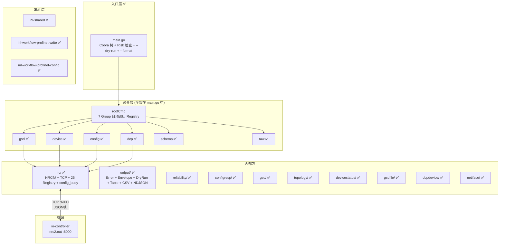
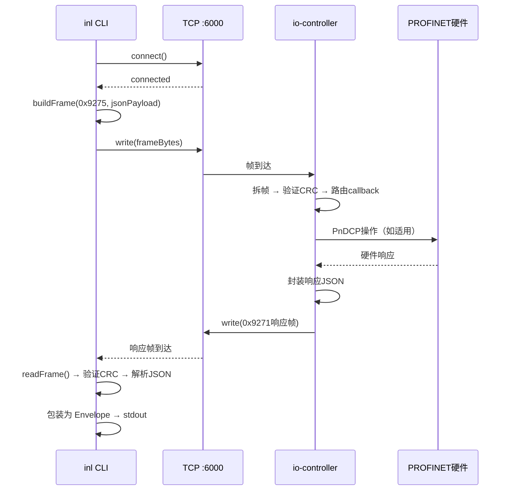
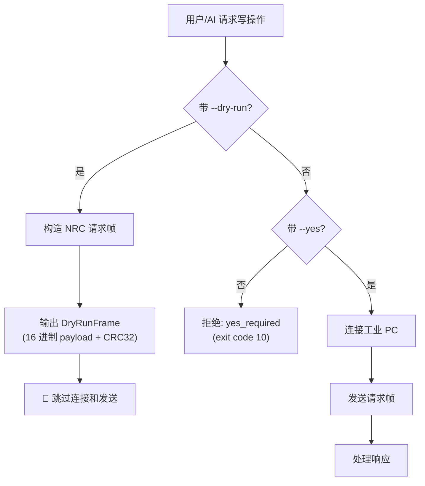

# inl — 架构设计文档

## 1. 概述

inl 借鉴 [[cli-architecture-overview|lark-cli 架构]]，采用 Go 语言实现。核心技术栈与 lark-cli 对齐：

| 组件 | 选型 | 说明 | 状态 |
|------|------|------|:---:|
| CLI 框架 | `spf13/cobra` | 命令树 + 参数解析 | ✅ |
| 输出系统 | `encoding/json` | JSON Envelope + Table + CSV + NDJSON | ✅ |
| TCP 通信 | `net`（标准库） | NRC Socket 协议客户端 + `reliability` 重试 | ✅ |
| 分发 | npm + GoReleaser | GitHub Release + npm 7 包，6 平台 | ✅ |
| 打包 | `go build` 静态编译 | 单文件 ~5MB | ✅ |

## 2. 项目目录结构

> **图例**：✅ 已实现 | 🔮 未来扩展方向

### 2.1 当前实现（Step 10 完成后）

```
inl/
├── main.go                          ✅ Cobra 命令树入口 + 7 Group + Risk 检查 + 多格式输出 + device setup 组合命令
├── main_test.go                     ✅
├── go.mod / go.sum                  ✅ github.com/your-org/inl (依赖仅 cobra)
├── AGENTS.md                        ✅ 项目导览 + 源码布局 + 开发规范
├── README.md                        ✅ 项目说明
├── .goreleaser.yaml                 ✅ 跨平台构建配置
├── .gitignore                       ✅
│
├── .github/workflows/               ✅
│   ├── release.yml                  ✅ GoReleaser 自动发布
│   └── npm-publish.yml              ✅ npm 7 包发布
│
├── internal/                        # === 内部包 (13 个) ===
│   ├── nrc/                         # NRC Socket 协议客户端 + 命令元数据中心
│   │   ├── frame.go / client.go    ✅ 帧编解码 + TCP 连接 + reliability 注入
│   │   ├── commands.go              ✅ 25 条 Registry + 7 Group + 17 BodyBuilder
│   │   ├── config_body.go           ✅ 11 个 config 写命令 BodyBuilder + fetch 拓扑
│   │   ├── annotation.go            ✅ Cobra Annotations 常量
│   │   ├── fetch_topology_*.go      ✅ 拓扑预取 (集成测试)
│   │   └── *_test.go                ✅
│   │
│   ├── output/                      # 输出格式化
│   │   ├── errors.go                ✅ 结构化错误 (Error + YesRequired/ConfirmationRequired)
│   │   ├── envelope.go              ✅ 统一 stdout JSON 信封 {ok, data, _notice}
│   │   ├── dryrun.go                ✅ DryRunFrame + PrintDryRunFrame
│   │   ├── table.go                 ✅ --format table 表格渲染
│   │   ├── csv.go                   ✅ --format csv (RFC 4180)
│   │   ├── ndjson.go                ✅ --format ndjson
│   │   └── *_test.go                ✅
│   │
│   ├── reliability/                 ✅ 重试策略子包 (Policy + Default + ShouldRetryNetwork)
│   ├── configresp/                  ✅ DataType=12 写命令响应模型 (WriteResponse + ShieldDeviceResponse)
│   ├── gsd/                         ✅ DataType=13/16 响应模型
│   ├── topology/                    ✅ DataType=12/14 拓扑模型 (CallbackJson/Activated/Scan)
│   ├── devicestatus/                ✅ GetActRun 焊机状态模型
│   ├── gsdfile/                     ✅ GSDML 文件响应模型
│   ├── dcpdevice/                   ✅ DCP 发现设备模型 (9 字段 + Block 映射)
│   └── netiface/                    ✅ 网络端口列表模型 + Flatten()
│
├── skills/                          # === AI Agent Skills (3 个) ===
│   ├── inl-shared/SKILL.md          ✅ 共享规则 (Risk/--yes/--dry-run/错误码)
│   ├── inl-workflow-profinet-write/SKILL.md  ✅ 写操作 4 层安全流程
│   └── inl-workflow-profinet-config/SKILL.md ✅ 端到端 8 阶段配网编排
│
├── npm/                             # === npm 薄壳包 (7 个) ===
│   ├── inl-cli/                     ✅ 入口包
│   ├── inl-cli-linux-x64/           ✅
│   ├── inl-cli-linux-arm64/         ✅
│   ├── inl-cli-darwin-x64/          ✅
│   ├── inl-cli-darwin-arm64/        ✅
│   ├── inl-cli-win32-x64/           ✅
│   └── inl-cli-win32-arm64/         ✅
│
├── docs/                            # === 文档 (19 份) ===
│   ├── inl-prd.md                   ✅ 产品需求文档
│   ├── inl-architecture.md          ✅ 架构设计文档
│   ├── inl-workflow-design.md       ✅ 配网工作流设计
│   ├── inl-development-status.md    ✅ 开发现状报告
│   ├── inl-config-field-reference.md ✅ config 写命令字段参照
│   ├── inl-step*.md                 ✅ 开发计划 (1-10)
│   └── protocol/
│       └── field-verification.md    ✅ 实机响应反向核对记录
│
└── testdata/                        ✅ 实机响应样本 + config fixture
```

## 3. 架构分层



## 4. NRC 协议通信

### 4.1 帧格式

```
┌──────────┬──────────┬──────────┬───────────────┬──────────┐
│ SyncByte │  Length  │ Command  │  Data (JSON)  │   CRC32  │
│  2 Byte  │  2 Byte  │  2 Byte  │   Length−2字节  │  4 Byte  │
│  0x4E66  │          │          │               │          │
└──────────┴──────────┴──────────┴───────────────┴──────────┘
```

- **SyncByte**: 固定 `0x4E66`（网络字节序）
- **Length**: Command + Data 的总长度，不含 SyncByte 和 CRC
- **Command**: 协议号（如 `0x9275` 发送，`0x9271` 接收响应）
- **Data**: JSON 字符串（UTF-8）
- **CRC32**: 对 SyncByte 之外的所有字节做 IEEE 802.3 CRC32

### 4.2 连接参数

| 参数 | 值 | 状态 |
|------|-----|:---:|
| 传输层 | TCP | ✅ |
| 端口 | 6000 | ✅ |
| 心跳间隔 | 建议 30 秒 | 📋 |
| 心跳命令 | `0x7266` (请求) / `0x7267` (回复)，带 `{"time": timestamp}` | 📋 |

### 4.3 收发流程



### 4.4 命令 ↔ DataType 映射

| inl 命令 | NRC 命令字 | JSON DataType | io-controller 函数 | 状态 |
|----------|-----------|---------------|-------------------|:---:|
| `gsd list` | 0x9275 | 13 | `CallBackGsdFileList` | ✅ |
| `gsd match` | 0x9275 | 16 | `FilterGSDCompatibleDevices` | ✅ |
| `device list` | 0x9275 | 12, Func=CallBackJson | `NetWorkTopologyFunction` | ✅ |
| `device list-active` | 0x9275 | 12, Func=CallBackActivatedJson | `NetWorkTopologyFunction` | ✅ |
| `device run` | 0x9275 | 12, Func=GetActRun | `NetWorkTopologyFunction` | ✅ |
| `device gsd-config` | 0x9275 | 12, Func=GetGSDFileNetwork | `NetWorkTopologyFunction` | ✅ |
| `device gsd-active` | 0x9275 | 12, Func=GetGSDFileActivated | `NetWorkTopologyFunction` | ⚠️ |
| `config set-driver` ~ `config set-idevice` (11 个) | 0x9275 | 12, Func=对应值 | `NetWorkTopologyFunction` | ✅ |
| `config compile` | 0x9275 | 12, Func=Compile | `NetWorkTopologyFunction` | ✅ |
| `dcp scan` | 0x9275 | 14, Func=1 | `PerformOnlineAccess` (DCP发现) | ✅ |
| `dcp setup-name` | 0x9275 | 14, Func=2 | `PerformOnlineAccess` | ✅ |
| `dcp setup-ip` | 0x9275 | 14, Func=3 | `PerformOnlineAccess` | ✅ |
| `dcp interface` | 0x9275 | 14, Func=4 | `PerformOnlineAccess` | ✅ |
| `schema list` | — | 0 (纯客户端) | `registry traversal` | ✅ |
| `raw send` | 0x9275 | 0 (透传) | 兜底覆盖 | ✅ |
| —（响应） | 0x9271 | — | `NRC_SendSocketCustomProtocal` | ✅ |

## 5. 输出系统

完全复用 [[cli-module-client-output|lark-cli 输出系统]] 的设计。

### 5.1 JSON Envelope

```go
type Envelope struct {
    OK       bool                   `json:"ok"`
    Identity string                 `json:"identity,omitempty"`
    Data     interface{}            `json:"data,omitempty"`
    Error    *ErrorDetail           `json:"error,omitempty"`
    Notice   map[string]interface{} `json:"_notice,omitempty"`
}

type ErrorDetail struct {
    Type    string `json:"type"`     // permission_denied | run_mode_lock | ...
    Message string `json:"message"`
    Hint    string `json:"_hint,omitempty"`  // AI 可执行的修复命令
}
```

### 5.2 格式选项

| 格式 | 标志 | 适用场景 | 状态 |
|------|------|---------|:---:|
| JSON | `--format json`（默认） | AI Agent 消费，pipe 链 | ✅ |
| Table | `--format table` | FAE 现场肉眼读 | ✅ |
| CSV | `--format csv` | Excel / awk 处理 | ✅ |
| NDJSON | `--format ndjson` | jq / 管道处理 | ✅ |

### 5.3 Dry-run 机制



## 6. 安全策略

基于 Risk 三级分级的确认门禁：

| Risk | 行为 | `--yes` 要求 |
|------|------|:---:|
| `read` | 直接执行，无副作用 | 不需要 |
| `write` | 需 `--yes` 确认 | 必需，否则 exit code 10 |
| `high-risk-write` | 需 `--yes` + stderr 警告 | 必需，否则 exit code 10 |

所有写命令支持 `--dry-run` 帧预览（构造帧不发送），可在确认前验证请求内容。

### 6.1 退出码

| 退出码 | Category | 说明 |
|--------|----------|------|
| 0 | — | 成功 |
| 1 | `internal` | 内部错误 / 通信失败 |
| 2 | `validation` | 参数验证错误 |
| 5 | `network` | 工业 PC 不可达 |
| 6 | `api` | io-controller 返回错误 |
| 10 | `confirmation` | 需要用户确认（`--yes` 未提供） |

## 7. 构建与分发 ✅

复用 [[cli-architecture-overview|lark-cli 分发模式]]：


## 8. 与 io-controller 的边界

| 职责 | inl CLI（上位机） | io-controller（下位机） | 状态 |
|------|-----------------|---------------------|:---:|
| GSD 解析 | ❌ 不解析 — 消费预处理好的 JSON 字典 | ✅ GSD XML → JSON（DataType 13） | ⚠️ 字典未实现 |
| DCP 发现/命名/IP | ❌ | ✅ PnDCP 协议栈（DataType 14） | ✅ Func=1/2/3/4 已实现 |
| 拓扑管理 | ❌ | ✅ PNConfig 引擎（DataType 12） | ✅ 18 Function 已实现 |
| 设备匹配 | ❌ | ✅ GSD 兼容性筛选（DataType 16） | ✅ |
| JSON 封装 | ✅ 拼 JSON 帧 | ✅ 解析 JSON → 执行 | ✅ |
| 输出格式化 | ✅ JSON / Table / CSV / NDJSON | ❌ | ✅ |
| 安全策略 | ✅ 前置 Risk 分级 + `--dry-run` + `--yes` 门禁 | ✅ 硬件级运行态隔离 | ✅ |
| 参数验证 | ✅ IP / MAC / 名称 / JSON 结构 | ✅ 编译器层面结构校验 | ✅ |
| 分发 | ✅ npm + GoReleaser + GitHub Actions | ❌ | ✅ |
| Schema 发现 | ✅ `inl schema list` | ❌ | ✅ |

## 9. Skill 文件约定

> [!NOTE]
> 当前已实现 3 个 Skill（位于 `inl/skills/`），形成三级依赖链：`inl-shared` ← `inl-workflow-profinet-write` ← `inl-workflow-profinet-config`。

### 已实现的 Skills

| Skill | 路径 | 说明 |
|-------|------|------|
| inl-shared | [inl/skills/inl-shared/SKILL.md](file:///c:/Users/BYD/Documents/trae_projects/feishu_cli/inl/skills/inl-shared/SKILL.md) | 共享规则 (--target / Risk / --yes / --dry-run / 错误码) |
| inl-workflow-profinet-write | [inl/skills/inl-workflow-profinet-write/SKILL.md](file:///c:/Users/BYD/Documents/trae_projects/feishu_cli/inl/skills/inl-workflow-profinet-write/SKILL.md) | 写操作 4 层安全流程 (预检/备份/确认/回滚) |
| inl-workflow-profinet-config | [inl/skills/inl-workflow-profinet-config/SKILL.md](file:///c:/Users/BYD/Documents/trae_projects/feishu_cli/inl/skills/inl-workflow-profinet-config/SKILL.md) | 端到端 8 阶段配网编排 (评估→发现→规划→委托write→验证) |

### 内容结构

1. **适用场景** — 何时触发此 Skill
2. **前置条件** — 所需环境与权限
3. **安全铁律**（仅 inl-shared）— 不可违背的规则
4. **命令参考** — 此 Skill 涉及的 inl 命令及参数
5. **工作流**（仅 workflow Skill）— 分步流程 + session context 状态管理
6. **数据处理规则** — 时间转换、状态映射、排序规则
7. **错误处理指南** — 每种错误 type 的修复路径

## 10. 相关文档

- [[inl-prd]] — 产品需求文档
- [inl/AGENTS.md](file:///c:/Users/BYD/Documents/trae_projects/feishu_cli/inl/AGENTS.md) — 当前开发状态与协议契约（建议优先阅读）
- [inl/skills/inl-shared/SKILL.md](file:///c:/Users/BYD/Documents/trae_projects/feishu_cli/inl/skills/inl-shared/SKILL.md) — 共享 Skill ✅
- [inl/skills/inl-workflow-profinet-write/SKILL.md](file:///c:/Users/BYD/Documents/trae_projects/feishu_cli/inl/skills/inl-workflow-profinet-write/SKILL.md) — 写操作工作流 ✅
- [inl/skills/inl-workflow-profinet-config/SKILL.md](file:///c:/Users/BYD/Documents/trae_projects/feishu_cli/inl/skills/inl-workflow-profinet-config/SKILL.md) — 配网编排工作流 ✅
- [[cli-architecture-overview]] — lark-cli 架构（参考源）
- [[cli-module-cmd]] — lark-cli 命令层（参考源）
- [[cli-module-client-output]] — lark-cli 输出系统（参考源）
- [[cli-data-flows]] — lark-cli 数据流（参考源）
