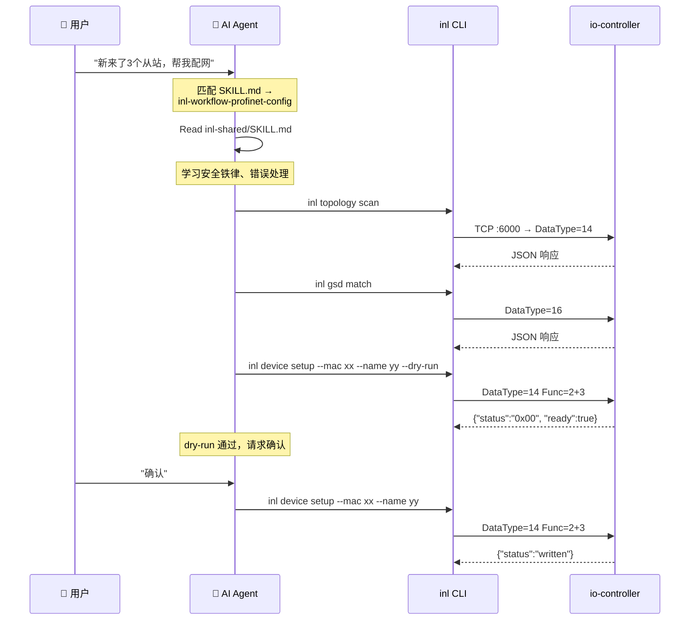

# inl — Industrial Netline CLI

## 产品定位

**inl** 是一款面向 AI Agent 设计的无头（Headless）工业以太网配置与诊断命令行工具链。

它不替代传统示教器的安全电路与物理控制，也不重写工业 PC 的硬实时内核，而是作为一扇"AI 专用的侧门"——将 AI 丰富的语义化意图，转化为工控主站能够理解的高确定性 JSON 数据。

> [!NOTE]
> 核心洞察：工业配网的痛点不是"技术做不到"，而是"太繁琐"。查阅几千行 GSDML、手动对齐插槽、排查 DCP 命名冲突——这些恰好是 AI 擅长的结构化文本处理。

## 系统架构

采用**双机解耦**的分布式架构：

```mermaid
flowchart LR
    subgraph 上位机["🖥️ 上位机：调试 PC（AI 舞台）"]
        AI[AI Agent<br/>Claude Code / Trae]
        INL[inl CLI<br/>Go + Cobra]
        SKILLS[Skills 知识库<br/>SKILL.md × 2 (3 规划中)]
        DICT[GSDML JSON 字典<br/>📋 规划中]
    end

    subgraph 下位机["⚙️ 下位机：工业 PC（实时小脑）"]
        NRC[nrc2.out<br/>io-controller]
        PNDCP[PnDCP 协议栈]
        PNCFG[PNConfig XML引擎]
        GSDDB[GSD 设备数据库]
    end

    AI --> INL
    INL --> SKILLS
    INL --> DICT
    INL <-->|"TCP :6000<br/>NRC Socket<br/>JSON帧"| NRC
    NRC --> PNDCP
    NRC --> PNCFG
    NRC --> GSDDB
```

- **上位机**：部署 AI Agent + inl CLI + GSDML JSON 字典，承担语义推理和结构化处理
- **下位机**：运行 `nrc2.out`（io-controller），承担硬实时总线主站和物理 DCP 帧收发
- **通信**：TCP 端口 6000，NRC Socket 协议，载荷为 JSON

## 设计原则

### 1. Agent-Native

`stdout` = 结构化 JSON 数据，`stderr` = 诊断信息。所有输出带统一信封：

```json
{
  "ok": true,
  "data": { ... },
  "_notice": { ... }
}
```

错误消息自带可执行的修复指令（`_hint` 字段），AI 可以直接解析并采取下一步行动。

### 2. 安全铁律（一票否决）

| # | 规则 | 实现 |
|---|------|------|
| 1 | **生产模式 = 严格只读** | 下位机硬件锁，仅放行 read 级操作 |
| 2 | **Dry-run 是必经之路** | 写入前必须内存模拟，硬件返回 `0x00` 才放行 |
| 3 | **物理急停 > 一切** | 不在 CLI 层面实现，由示教器硬件保证 |
| 4 | **exit code 10 = 确认门禁** | 高危操作必须先向人类确认，禁止 AI 静默加 `--yes` |

### 3. 三层命令粒度

借鉴 [[cli-architecture-overview|lark-cli 架构]] 的三层设计：

| 层 | 粒度 | 示例 | 使用者 |
|----|------|------|--------|
| **Shortcut（语义层）** | 一个业务意图 | `inl network +auto-fix` | AI Agent 首选 |
| **协议原语层** | 一个 DCP 操作 | `inl device setup --mac xx --name yy` | AI 分步执行 |
| **Raw 透传层** | 原始 JSON 帧 | `inl raw send '{"DataType":14}'` | 兜底兼容 |

## 命令矩阵

### 全局标志

| 标志 | 类型 | 默认值 | 说明 | 状态 |
|------|------|--------|------|:---:|
| `--target` | string | 必填 | 工业 PC 的 IP 地址 | ✅ |
| `--port` | int | 6000 | NRC Socket 端口 | 📋 |
| `--format` | enum | json | 输出格式：json / table / ndjson | ⚠️ flag 存在，仅 json 可用 |
| `--dry-run` | bool | false | 仅模拟，不执行真实操作 | ⚠️ 仅写命令，非全局 |
| `--yes` | bool | false | 跳过确认门禁（写命令必需） | ✅ |
| `--as` | enum | auto | 身份：user / bot / auto | 📋 |
| `--profile` | string | default | 配置文件（多车间切换） | 📋 |
| `-o, --output` | string | — | 导出到文件 | ✅ |

### 命令树

> **图例**：✅ 已实现 | ⚠️ 部分实现/有已知限制 | 📋 规划中

```
inl
├── gsd
│   ├── list              ✅ 列出 GSD 设备库                  [DataType=13]
│   ├── match             📋 匹配在线设备 ↔ GSD 驱动           [DataType=16]
│   └── info              📋 查看 GSD 设备详情                 [客户端查 JSON 字典]
│
├── device
│   ├── list              ✅ 查看配置中的网络拓扑               [DataType=12, CallBackJson]
│   ├── list-active       ✅ 查看激活中的网络拓扑               [DataType=12, CallBackActivatedJson]
│   ├── run               ✅ 查看活动运行设备(焊机)             [DataType=12, GetActRun]
│   ├── gsd-config        ✅ 查看配置中拓扑的 GSD 文件          [DataType=12, GetGSDFileNetwork]
│   ├── gsd-active        ⚠️ 查看激活中拓扑的 GSD 文件          [DataType=12, nrc2.out 版本不支持]
│   ├── discover          📋 DCP 发现网络设备                  [DataType=14, Func=1]
│   ├── setup             📋 设置设备名称 + IP                 [DataType=14, Func=2+3]
│   ├── rename            📋 重命名设备                        [DataType=14, Func=2]
│   └── info              📋 查询设备详细信息                   [DataType=14, Func=1]
│
├── config
│   ├── set-driver        ✅ 设置主站参数                      [DataType=12, SetPNDriver]
│   ├── add-device        ✅ 添加分散设备                      [DataType=12, AddPNDevice]
│   ├── remove-device     ✅ 卸载分散设备                      [DataType=12, UninstallPNDevice]
│   ├── set-device        ✅ 设置设备参数                      [DataType=12, SetPNDevice]
│   ├── add-module        ✅ 添加模块                          [DataType=12, AddModule]
│   ├── remove-module     ✅ 卸载模块                          [DataType=12, UninstallModule]
│   ├── add-submodule     ✅ 添加子模块                        [DataType=12, AddSubmodule]
│   ├── remove-submodule  ✅ 删除子模块                        [DataType=12, UninstallSubmodule]
│   ├── shield            ✅ 屏蔽设备                          [DataType=12, ShieldDevice]
│   ├── unshield          ✅ 取消屏蔽                          [DataType=12, UNShieldDevice]
│   ├── compile           ✅ 编译并应用配置 (高危)              [DataType=12, Compile, high-risk-write]
│   ├── init              📋 初始化 inl 配置                   [本地文件]
│   └── show              📋 显示当前配置                      [本地文件]
│
├── topology              📋 全组规划中
│   ├── scan              📋 DCP 发现所有从站设备               [DataType=14, Func=1]
│   ├── active            📋 查看当前激活的拓扑                 [DataType=17]
│   ├── verify            📋 对照期望拓扑进行校验                [客户端比对]
│   └── compile           📋 编译为 PNConfig XML               [DataType=12, Func=Compile]
│
├── network (+shortcuts)  📋 全组规划中
│   ├── +diagnose         📋 AI 语义：扫描 → 匹配 → 诊断报告
│   ├── +auto-fix         📋 AI 语义：自动修复拓扑问题
│   ├── +batch-setup      📋 AI 语义：批量配置多设备
│   └── +generate         📋 AI 语义：端到端配网
│
├── schema                📋 规划中
│   └── list              📋 AI Agent 发现所有可用命令
│
└── raw                   📋 规划中
    └── send              📋 直接发送自定义 JSON 帧
```

## Skill 体系

借鉴 lark-cli 的分层 Skill 设计，inl 配套 Skill 位于 `inl/skills/` 目录：

| Skill | 文件 | 类型 | 角色 | 状态 |
|-------|------|------|------|:---:|
| inl-shared | [inl/skills/inl-shared/SKILL.md](file:///c:/Users/BYD/Documents/trae_projects/feishu_cli/inl/skills/inl-shared/SKILL.md) | 🔒 共享约定 | 安全铁律、输出约定、错误处理、环境前置 | ✅ |
| inl-workflow-profinet-write | [inl/skills/inl-workflow-profinet-write/SKILL.md](file:///c:/Users/BYD/Documents/trae_projects/feishu_cli/inl/skills/inl-workflow-profinet-write/SKILL.md) | 🔄 工作流 | 写操作 4 层安全流程（预检/备份/确认/回滚） | ✅ |
| inl-topology | — | 📦 领域 | 拓扑扫描/校验/编译的操作规范 | 📋 |
| inl-device-config | — | 📦 领域 | DCP 命名/IP设置的详细规则 | 📋 |
| inl-workflow-profinet-config | — | 🔄 工作流 | 端到端 10 步配网编排 | 📋 |

### Skill 使用流程



## 商业与工程价值

- **解放 FAE**：将换线配网时查阅 GSDML、对齐插槽的痛苦工作转交给 AI 终端
- **极低资源开销**：工业 PC 无需联网、无需部署 AI 模型。AI 在调试笔记本上运行，"调完即走，拔线即隔离"
- **零炸机风险**：dry-run → 硬件 ACK 0x00 → 边界值 Sandbox 三道防线

## 相关文档

- [[inl-architecture]] — 架构设计文档
- [inl/AGENTS.md](file:///c:/Users/BYD/Documents/trae_projects/feishu_cli/inl/AGENTS.md) — 当前开发状态与协议契约（建议优先阅读）
- [inl/skills/inl-shared/SKILL.md](file:///c:/Users/BYD/Documents/trae_projects/feishu_cli/inl/skills/inl-shared/SKILL.md) — 共享 Skill 约定 ✅
- [inl/skills/inl-workflow-profinet-write/SKILL.md](file:///c:/Users/BYD/Documents/trae_projects/feishu_cli/inl/skills/inl-workflow-profinet-write/SKILL.md) — 写操作安全工作流 ✅
- [[cli-architecture-overview]] — lark-cli 架构（参考源）
- [[cli-data-flows]] — lark-cli 数据流（参考源）
