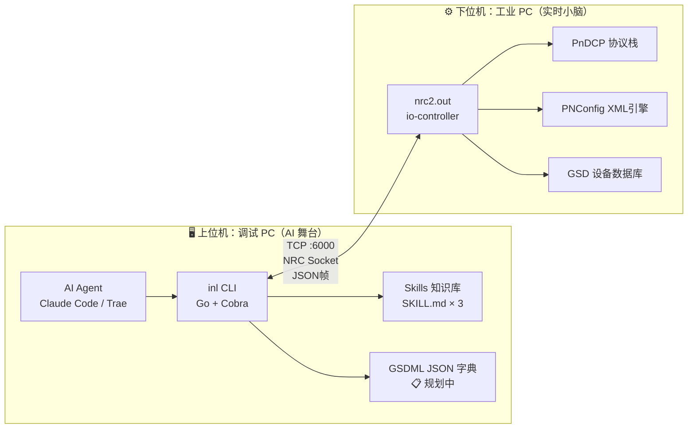
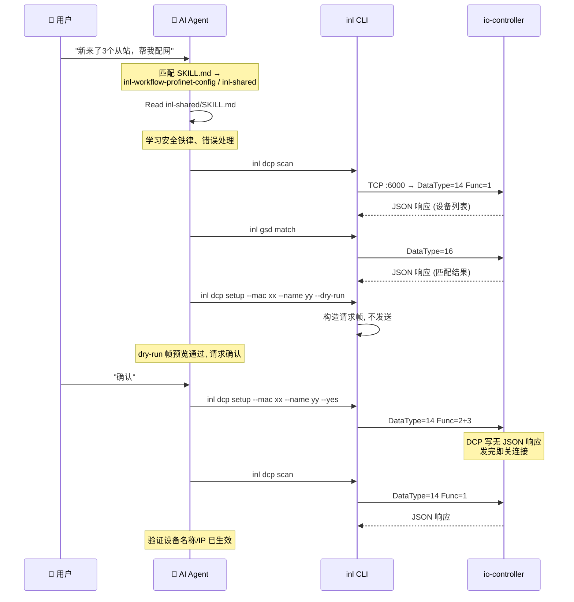

# inl — Industrial Netline CLI

## 产品定位

**inl** 是一款面向 AI Agent 设计的无头（Headless）工业以太网配置与诊断命令行工具链。

它不替代传统示教器的安全电路与物理控制，也不重写工业 PC 的硬实时内核，而是作为一扇"AI 专用的侧门"——将 AI 丰富的语义化意图，转化为工控主站能够理解的高确定性 JSON 数据。

> [!NOTE]
> 核心洞察：工业配网的痛点不是"技术做不到"，而是"太繁琐"。查阅几千行 GSDML、手动对齐插槽、排查 DCP 命名冲突——这些恰好是 AI 擅长的结构化文本处理。

## 系统架构

采用**双机解耦**的分布式架构：



- **上位机**：部署 AI Agent + inl CLI + GSDML JSON 字典，承担语义推理和结构化处理
- **下位机**：运行 `nrc2.out`（io-controller），承担硬实时总线主站和物理 DCP 帧收发
- **通信**：TCP 端口 6000，NRC Socket 协议，载荷为 JSON

## 设计原则

### 1. Agent-Native

`stdout` = 结构化 JSON 数据，`stderr` = 诊断信息。所有输出带统一信封：

```json
{
  "ok": true,
  "data": { ... },
  "_notice": { ... }
}
```

错误消息自带可执行的修复指令（`_hint` 字段），AI 可以直接解析并采取下一步行动。

### 2. 安全铁律

所有命令按副作用分为三级 Risk，写操作必须通过 `--yes` 门禁：

| # | 规则 | 实现 |
|---|------|------|
| 1 | **Risk 三级分级** | read / write / high-risk-write，每级对应不同确认策略 |
| 2 | **`--yes` 强制确认** | write 和 high-risk-write 命令不加 `--yes` 直接拒绝（exit code 10） |
| 3 | **`--dry-run` 帧预览** | 写命令可先 `--dry-run` 查看请求帧，不连接工业 PC、不发送数据 |
| 4 | **物理急停 > 一切** | 不在 CLI 层面实现，由示教器硬件保证 |

### 3. 命令粒度

| 层 | 粒度 | 示例 | 使用者 |
|----|------|------|--------|
| **协议原语层** | 一个业务操作 | `inl dcp setup --mac xx --name yy` | AI 分步执行 |
| **Raw 透传层** | 原始 JSON 帧 | `inl raw send '{"DataType":14}'` | 兜底兼容 |

## 命令矩阵

### 全局标志

| 标志 | 类型 | 默认值 | 说明 | 状态 |
|------|------|--------|------|:---:|
| `--target` | string | 必填 | 工业 PC 的 IP 地址（支持 `IP:PORT` 指定端口，默认 :6000） | ✅ |
| `--format` | enum | json | 输出格式：json / table / csv / ndjson | ✅ |
| `--dry-run` | bool | false | 仅模拟，不执行真实操作（所有写命令含 DCP 写） | ✅ |
| `--yes` | bool | false | 跳过确认门禁（写命令必需） | ✅ |
| `--retry` | int | 0 | DCP 命令重试次数（0=默认1次；网络抖动建议 3-5） | ✅ |
| `-o, --output` | string | — | 导出到文件 | ✅ |

### 命令树

> **图例**：✅ 已实现 | ⚠️ 部分实现/有已知限制

```
inl
├── gsd
│   ├── list              ✅ 列出 GSD 设备库                  [DataType=13]
│   └── match             ✅ 匹配在线设备 ↔ GSD 驱动           [DataType=16]
│
├── device
│   ├── list              ✅ 查看配置中的网络拓扑               [DataType=12, CallBackJson]
│   ├── list-active       ✅ 查看激活中的网络拓扑               [DataType=12, CallBackActivatedJson]
│   ├── run               ✅ 查看活动运行设备(焊机)             [DataType=12, GetActRun]
│   ├── gsd-config        ✅ 查看配置中拓扑的 GSD 文件          [DataType=12, GetGSDFileNetwork]
│   └── gsd-active        ⚠️ 查看激活中拓扑的 GSD 文件          [DataType=12, nrc2.out 版本不支持]
│
├── config
│   ├── set-driver        ✅ 设置主站参数                      [DataType=12, SetPNDriver]
│   ├── add-device        ✅ 添加分散设备                      [DataType=12, AddPNDevice]
│   ├── remove-device     ✅ 卸载分散设备                      [DataType=12, UninstallPNDevice]
│   ├── set-device        ✅ 设置设备参数                      [DataType=12, SetPNDevice]
│   ├── add-module        ✅ 添加模块                          [DataType=12, AddModule]
│   ├── remove-module     ✅ 卸载模块                          [DataType=12, UninstallModule]
│   ├── add-submodule     ✅ 添加子模块                        [DataType=12, AddSubmodule]
│   ├── remove-submodule  ✅ 删除子模块                        [DataType=12, UninstallSubmodule]
│   ├── shield            ✅ 屏蔽设备                          [DataType=12, ShieldDevice]
│   ├── unshield          ✅ 取消屏蔽                          [DataType=12, UNShieldDevice]
│   ├── set-idevice       ✅ 设置 IDevice 参数 (Activate/InputLength/OutputLength) [DataType=12, SetIDevice]
│   └── compile           ✅ 编译并应用配置 (高危)              [DataType=12, Compile, high-risk-write]
│
├── dcp
│   ├── scan              ✅ DCP 发现所有从站设备               [DataType=14, Func=1]
│   ├── interface         ✅ 列出工业 PC 网络端口               [DataType=14, Func=4]
│   ├── setup             ✅ 一键设置设备(名称+IP+验证)          [组合命令]
│   ├── setup-name        ✅ DCP 设置设备名称                  [DataType=14, Func=2]
│   └── setup-ip          ✅ DCP 设置设备 IP                   [DataType=14, Func=3]
│
├── schema
│   └── list              ✅ AI Agent 自发现所有可用命令         [纯客户端, 不连工业 PC]
│
└── raw
    └── send              ✅ 透传原始 JSON 帧                   [DataType=0, 兜底]
```

## Skill 体系

借鉴 lark-cli 的分层 Skill 设计，inl 配套 Skill 位于 `inl/skills/` 目录：

| Skill | 文件 | 类型 | 角色 | 状态 |
|-------|------|------|------|:---:|
| inl-shared | [inl/skills/inl-shared/SKILL.md](file:///c:/Users/BYD/Documents/trae_projects/feishu_cli/inl/skills/inl-shared/SKILL.md) | 🔒 共享约定 | 安全铁律、输出约定、错误处理 | ✅ |
| inl-workflow-profinet-config | [inl/skills/inl-workflow-profinet-config/SKILL.md](file:///c:/Users/BYD/Documents/trae_projects/feishu_cli/inl/skills/inl-workflow-profinet-config/SKILL.md) | 🔄 工作流 | 端到端 8 阶段配网编排（评估→发现→规划→写入→编译→验证） | ✅ |
| inl-workflow-profinet-dcp | [inl/skills/inl-workflow-profinet-dcp/SKILL.md](file:///c:/Users/BYD/Documents/trae_projects/feishu_cli/inl/skills/inl-workflow-profinet-dcp/SKILL.md) | 🔄 工作流 | DCP 写操作独立工作流（setup-name / setup-ip） | ✅ |

### Skill 使用流程



## 商业与工程价值

- **解放 FAE**：将换线配网时查阅 GSDML、对齐插槽的痛苦工作转交给 AI 终端
- **极低资源开销**：工业 PC 无需联网、无需部署 AI 模型。AI 在调试笔记本上运行，"调完即走，拔线即隔离"
- **零炸机风险**：`--dry-run` 帧预览 → `--yes` 确认门禁 → exit code 10 拦截，写操作三重保险

## 相关文档

- [[inl-architecture]] — 架构设计文档
- [inl/AGENTS.md](file:///c:/Users/BYD/Documents/trae_projects/feishu_cli/inl/AGENTS.md) — 当前开发状态与协议契约（建议优先阅读）
- [inl/skills/inl-shared/SKILL.md](file:///c:/Users/BYD/Documents/trae_projects/feishu_cli/inl/skills/inl-shared/SKILL.md) — 共享 Skill 约定 ✅
- [inl/skills/inl-workflow-profinet-config/SKILL.md](file:///c:/Users/BYD/Documents/trae_projects/feishu_cli/inl/skills/inl-workflow-profinet-config/SKILL.md) — 端到端配网编排 ✅
- [inl/skills/inl-workflow-profinet-dcp/SKILL.md](file:///c:/Users/BYD/Documents/trae_projects/feishu_cli/inl/skills/inl-workflow-profinet-dcp/SKILL.md) — DCP 写操作独立工作流 ✅
- [[cli-architecture-overview]] — lark-cli 架构（参考源）
- [[cli-data-flows]] — lark-cli 数据流（参考源）
