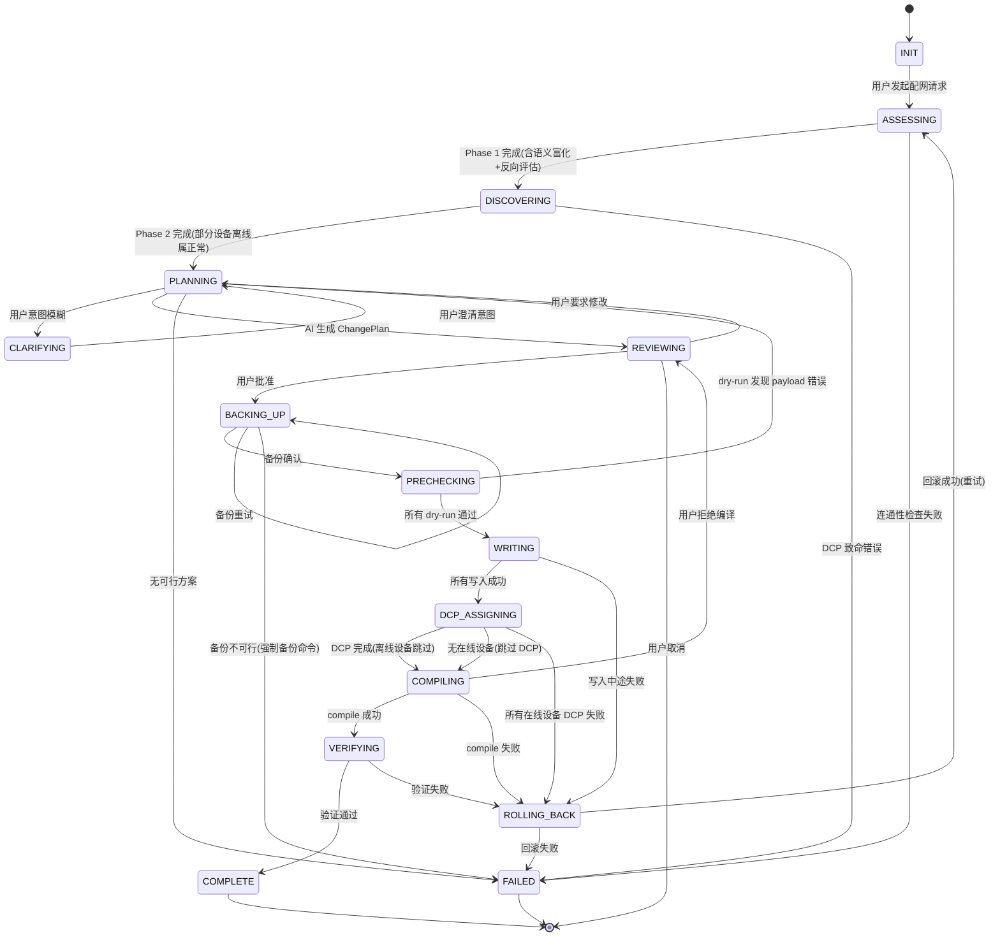

# inl — PROFINET AI原生端到端配网工作流设计

## 文档说明

本文档定义了使用 inl CLI 完成 PROFINET 网络配置的**端到端工作流规范**。它是连接 inl 原子命令（`gsd list`、`device list`、`config set-driver` 等 17 个命令）与 AI Agent 语义理解的桥梁，也是后续实现 `network +shortcuts` 语义层和 `inl-workflow-profinet-config` Skill 的**唯一权威设计依据**。

> **设计原则**：工作流定义命令的"排列组合方式"，不引入新的底层协议。所有工作流步骤最终都映射到现有的（或规划中的）`inl <group> <subcommand>` 原子命令。

---

## 1. 工作流全景

### 1.1 八阶段模型

```
┌──────────┐    ┌──────────┐    ┌──────────┐    ┌──────────┐
│ Phase 1  │───▶│ Phase 2  │───▶│ Phase 3  │───▶│ Phase 4  │
│ 环境评估 │    │ 网络发现 │    │ 方案规划 │    │ 安全备份 │
│ (Read)   │    │ (Read)   │    │ (AI)     │    │ (Manual) │
└──────────┘    └──────────┘    └──────────┘    └──────────┘
                                                       │
                                                       ▼
┌──────────┐    ┌──────────┐    ┌──────────┐    ┌──────────┐
│ Phase 8  │◀───│ Phase 7  │◀───│ Phase 6  │◀───│ Phase 5  │
│ 验证交付 │    │ 编译激活 │    │ 配置写入 │    │ 预检确认 │
│ (Read)   │    │(HiRisk)  │    │ (Write)  │    │ (DryRun) │
└──────────┘    └──────────┘    └──────────┘    └──────────┘
```

| Phase | 名称 | 操作类型 | inl 命令（已实现/规划中） | 预计耗时 |
|:-----:|------|:------:|--------------------------|:------:|
| 1 | 环境评估 | Read + AI | `gsd list` ✅ `device list` ✅ `device list-active` ✅ `device run` ✅ + 语义富化 | < 30s |
| 2 | 网络发现 | Read | `interface list` 📋 `topology scan` 📋 `gsd match` 📋（无 DCP 时盲配正常继续） | < 30s |
| 3 | 方案规划 | AI 推理 | 意图确认 + 冲突检测 + ChangePlan 生成 | < 1min |
| 4 | 安全备份 | Manual | SCP / SMB（用户操作） | < 30s |
| 5 | 预检确认 | DryRun | `config * --dry-run` ✅ | < 10s |
| 6 | 配置写入 | Write | `config * --yes` ✅（11 个写命令） | < 1min |
| 7 | 编译激活 | DCP + HighRisk | `device setup` 📋 `config compile --yes` ✅ | 视设备数量 |
| 8 | 验证交付 | Read | `device list-active` ✅ `device list` ✅（在线 DCP 级 / 离线配置文件级） | < 10s |

### 1.2 设计目标

| 目标 | 度量标准 |
|------|---------|
| **安全优先** | 零误操作——每次写入前必经 dry-run + 备份确认 |
| **AI 可执行** | AI Agent 能独立完成 Phase 1-8，仅在 Phase 3（意图确认）、Phase 4（备份）、Phase 7（高危确认）需要人类交互 |
| **可恢复** | 任何 Phase 失败后都有明确的回滚路径 |
| **可观测** | 每个 Phase 有明确的 in/out 数据和验证标准 |

---

## 2. 标准步骤定义

### Phase 1：环境评估

**目标**：获取工业 PC 当前 PROFINET 配置的完整快照。

**前置条件**：已知 `--target` 工业 PC IP。

**执行步骤**：

| Step | 命令 | 输出 | 作用 |
|:----:|------|------|------|
| 1.1 | `inl --target <IP> gsd list` | GSD 设备驱动列表 | 了解可用的设备驱动模板 |
| 1.2 | `inl --target <IP> device list` | 配置中的网络拓扑 | 获取 PNDriver + IDevice 参数 |
| 1.3 | `inl --target <IP> device list-active` | 激活中的网络拓扑 | 获取 DecentralDevice 列表及 Module/SubModule 详情 |
| 1.4 | `inl --target <IP> device run` | 活动设备状态 | 确认当前焊机等设备运行状态 |
| 1.5 | AI 联网搜索（非 NRC） | GSD 语义富化结果 | 为后续自然语言匹配做准备 |

#### Step 1.5：GSD 语义富化

**目标**：将 `gsd list` 返回的原始元数据转化为人类可理解的设备画像，使用户在后续 Phase 中用自然语言（"小原焊机""SMC 阀岛"）就能精准定位目标设备。

> ⚠️ **可靠性声明**：语义富化是**补充信息**，不是权威结论。大量 PROFINET 设备的 GSD 元数据是通用的（MainFamily=General/I/O，ProductFamily 为型号名），无法从中推断实际物理功能。例如：一个焊机可能在 GSD 中仅显示为"I/O 模块"，而一个真正的 I/O 模块可能被用于特殊场景。**用户明确说出的意图始终优先于 AI 推断。**

**执行方法**（AI 自主完成，无需额外命令）：

```
for each driver in gsd_templates.drivers:
    1. 提取关键字段: VendorName, ProductFamily, DAP_Name, GSDName, Module 名称
    2. 从 IOData 名称推断物理功能 (如 "Inlet Flow Rate" → 流量传感器)
    3. 联网搜索 VendorName + ProductFamily + (可选) GSDName 关键词
    4. 生成中文/英文语义标签
    5. 标注置信度 (confidence: high | medium | low | unknown)
```

**输出物**：每个 GSD 条目增加 `semantic_profile` 字段，嵌入到 `gsd_templates.drivers[]` 中。

```json
{
  "VendorID": "0x038A",
  "VendorName": "OBARA",
  "ProductFamily": "Welding Controller",
  "GSDName": "GSDML-V2.31-OBARA-SIV31-40-20190707.xml",
  "semantic_profile": {
    "confidence": "high",
    "device_type_cn": "中频逆变点焊控制器",
    "device_type_en": "MFDC Inverter Welding Controller",
    "brand_aliases": ["小原", "OBARA", "Obara"],
    "product_series": "SIV31-40",
    "search_summary": "OBARA SIV31 系列中频逆变点焊控制器，用于汽车产线电阻焊，支持 400A/600A/1200A 规格",
    "inferred_use": "焊接工序核心控制器，控制焊枪电流/电压/加压力/时序",
    "match_keywords": ["焊机", "焊接控制器", "点焊", "焊钳", "小原焊机", "逆变焊机"]
  }
}
```

**置信度定义**：

| 置信度 | 条件 | 示例 |
|:---:|------|------|
| `high` | VendorName/ProductFamily + IOData 名称均明确指向特定设备类型 | OBARA + Welding Controller + "64 Digital Input" → 焊控 |
| `medium` | VendorName 可识别，但 ProductFamily 或 IOData 过于通用 | TMGTE SUNKE + I/O Device + "Input Integer 8" → 不确定具体用途 |
| `low` | 仅 VendorName 可识别，其余均为通用描述 | iutek.com + I/O + "Outputs"/"Inputs" → 未知具体功能 |
| `unknown` | 连 VendorName 都搜索不到有意义的信息 | 测试/实验用 VendorID (0xefff 等) |

**富化程度分级**：

| 级别 | 条件 | 数据来源 |
|:---:|------|---------|
| L1 — 基础 | VendorName + ProductFamily 已足够识别 | 纯本地提取 |
| L2 — 精确 | 通过 IOData 名称/Module 结构推断物理功能 | GSD 字段 + AI 推理 |
| L3 — 完善 | 联网搜索验证 + 补充厂商/产品信息 | 网络搜索 |

> 对于知名厂商/设备（Siemens、OBARA、SMC、HMS），通常在 L1 就能达到 `high` 置信度。`confidence=low | unknown` 的设备在 Phase 3 匹配时应**降级为仅依赖用户显式输入**。

**语义匹配规则**（用于 Phase 3 自然语言解析）：

匹配优先级（从最可靠到最不可靠）：

| 优先级 | 匹配方式 | 可靠性 | 适用场景 |
|:---:|---------|:---:|------|
| P1 | 用户直接给出 **GSD 文件名** | 🟢 100% 精确 | 现场工程师从设备光盘/U盘中找到的 `.xml` 文件 |
| P2 | 高置信度语义匹配 | 🟡 仅 `confidence=high` | 知名设备（OBARA焊机、SMC阀岛等） |
| P3 | 用户显式说出 VendorName | 🟡 需 GSD 列表中确实存在该厂商 | 用户知道品牌但不知道具体型号 |

```
现场场景: 用户手上有 GSDML-V2.31-OBARA-SIV31-40-20190707.xml
           ↓ P1: GSD 文件名精确匹配
gsd_templates:
  GSDML-V2.31-OBARA-SIV31-40-20190707.xml → Welding Controller ✅ "OBARA SIV31-40"
  其他 6 个 GSD                            → ✗ 跳过

自然语言场景: "我要配小原焊机和 Proteus 水单元"
           ↓ P2: 高置信度语义匹配（关键词 + 品牌别名）
gsd_templates:
  OBARA (confidence: high, brand_aliases: ["小原"])  → Welding Controller ✅
  Proteus (confidence: high, search: "Weldsaver")    → Sensors            ✅
  TMGTE (confidence: low)                              → I/O Module        ⚠️ 跳过
  iutek (confidence: unknown)                          → I/O Module        ⚠️ 跳过

用户显式场景: "配 TMGTE 那个设备"
           ↓ P3: VendorName 包含 "TMGTE" → 直接命中
gsd_templates:
  TMGTE SUNKE (VendorName 含 "TMGTE") → I/O Device ✅ "TMGTE SK335x"
```

> **规则**：
> - **P1（GSD 文件名）是最可靠的匹配方式**——这是现场工程师真实的工作流：从设备附带的光盘或 U 盘中拿到 GSDML 文件，直接告诉 AI 文件名
> - `confidence != high` 的设备**不参与 P2 自动语义匹配**，只能通过 P1（GSD 文件名）或 P3（VendorName）来定位
> - 低置信度设备在匹配结果中列出 GSD 文件名供用户选择，而不是静默隐藏

**输出物**：完整的 `CurrentState` 数据结构。借鉴旧版 Skill 的"模板-实例分离"思想，显式区分 `gsd_templates`（驱动模板库）与 `device_instances`（设备实例）：

```json
{
  "target_ip": "192.168.3.15",
  "gsd_templates": {
    "count": 7,
    "drivers": [
      {"VendorID": "0x038A", "VendorName": "OBARA", "DeviceID": "0x0030", "GSDName": "GSDML-...-OBARA-...xml", "ReductionRatio": ["8ms","16ms","32ms"],
       "semantic_profile": {"device_type_cn": "中频逆变焊控", "match_keywords": ["焊机","小原焊机"]}}
    ]
  },
  "device_instances": {
    "source": "configured",
    "PNDriver": {"DeviceName": "pndriver", "IPAddress": "192.168.2.14", "SubnetMask": "255.255.255.0"},
    "IDevice": {"Activate": false, "InputLength": 0, "OutputLength": 0},
    "DecentralDevice": []
  },
  "active_topology": {
    "source": "activated",
    "PNDriver": {...},
    "DecentralDevice": [
      {"DeviceName": "heron-weld", "VendorID": "0x038A", "IPAddress": "192.168.2.10", "Module": [...]}
    ]
  },
  "running_devices": [
    {"DeviceName": "heron-weld", "Status": "运行中"}
  ]
}
```

**验证标准**：4 个命令全部返回非 Error 响应。

**失败处理**：
- 任一命令失败 → 检查工业 PC 连通性 → 重试 1 次 → 仍失败则中止，提示用户排查网络/服务
- `gsd-active` 不可用 → 标记为 `⚠️`，不阻断后续流程

**🚫 AI 禁止行为**：
- ❌ 跳过 `gsd list` 直接用硬编码的 VendorID/DeviceID
- ❌ 在 `device list-active` 失败时假设激活拓扑为空——必须标记为 `null` 以区别于"真的为空"
- ❌ 用 `device run` 的状态来推断设备是否应该配置（"连接断开"的设备仍可能需要 re-config）
- ❌ 跳过 Step 1.5 语义富化——即使用户给出了精确的 VendorID/DeviceID，富化结果在 Phase 8 验证报告中仍有价值

#### Phase 1 完成检查点：反向评估用户初始意图

Phase 1 收集了工业 PC 的完整快照并完成了 GSD 语义富化。在进入 Phase 2 之前，AI **必须**回到用户的初始输入，用富化后的设备知识重新解读。

```
工作流启动时用户输入: "我要配小原焊机的网，再加一台 SMC 阀岛"
                      ↓ (此时 AI 还不了解具体设备)
Phase 1 执行: gsd list → 7 个 GSD → Step 1.5 语义富化
                      ↓ (现在 AI 知道了)
富化后的 GSD 画像:
  OBARA (confidence: high) → SIV31-40 中频焊控, GSDName: GSDML-...-OBARA-...xml
  SMC  (confidence: high) → EX245-SPN 阀岛,  GSDName: GSDML-...-SMC-EX245-...xml
                      ↓ (反向匹配用户原始输入)
反向评估结果:
  "小原焊机" → 命中 OBARA SIV31-40 (P2 语义匹配) ✅
  "SMC 阀岛" → 命中 SMC EX245-SPN  (P2 语义匹配) ✅
  剩余 5 个 GSD → 不需要操作
```

这个反向评估确保了即使用户在一开始用了模糊的自然语言，经过 Phase 1 的富化后 AI 也能精确锁定目标设备。评估结果存入 `session_context.resolved_intent` 供 Phase 3 直接使用。

---

### Phase 2：网络发现

**目标**：通过 DCP 发现在线设备，获取物理世界真相作为后续配置的对照依据。Phase 2 是为 Phase 3 提供"对账"数据，不是配置的准入条件——设备未到场时跳过 Phase 2 直接盲配是正常流程。

**前置条件**：Phase 1 完成。工业 PC 的 nrc2.out 支持 DCP 回调。

> 混合场景（部分在线 + 部分离线）是现场常态，Phase 2 按**每设备粒度**标记 `online_status`，不因部分设备离线而跳过整个 Phase。

**执行步骤**：

| Step | 命令 | 输出 | 作用 |
|:----:|------|------|------|
| 2.0 | `inl --target <IP> interface list` 📋 | 工业 PC 可用网络端口列表 | 确定 DCP 发现的物理端口 |
| 2.1 | `inl --target <IP> topology scan` 📋 | 在线设备列表 | DCP 发现所有从站（MAC、Name、IP、VendorID、DeviceID） |
| 2.2 | `inl --target <IP> gsd match` 📋 | 设备-GSD 匹配结果 | 将在线设备与 GSD 驱动库关联 |

#### Step 2.0：网络端口选择

**背景**：PROFINET DCP 发现需要在指定的物理网络端口上发送广播帧。工业 PC 通常有多个网口（`enp4s0` 接 PROFINET 总线、`eth0` 接管理网等），必须先行确定使用哪个端口进行 DCP 扫描。

**执行逻辑**：

```
1. inl --target <IP> interface list → 获取工业 PC 上的网络端口列表
   [
     {"name": "enp4s0", "status": "up", "description": "Intel I210 PRO/1000"},
     {"name": "eth0",   "status": "up", "description": "Realtek RTL8111"},
     {"name": "lo",     "status": "up", "description": "Loopback"}
   ]

2. 自动选择规则:
   if 存在 enp4s0 (PROFINET 常用端口名):
       → 默认选中 enp4s0，直接进入 Step 2.1
   elif 只有一个非 loopback 端口:
       → 默认选中该端口
   else:
       → 列出所有可用端口，提示用户选择:
       AI: "工业 PC 上有以下网络端口，请选择 PROFINET 总线所在的端口：
            [1] enp4s0 — Intel I210 (已连接)
            [2] eth0   — Realtek RTL8111 (已连接)
            默认使用 [1] enp4s0，是否确认？"
       User: yes / 选 [2]

3. 选中端口后，Step 2.1 的 topology scan 带上 --interface 参数:
   inl --target <IP> topology scan --interface enp4s0
```

> `interface list` 命令与 `topology scan` 一样属于 Phase 2 的 📋 规划中命令。在当前阶段，AI 应在进入 Phase 2 时主动询问用户 PROFINET 总线所在的端口名称。

**输出物**：`DiscoveredDevices` 数据结构：

```json
{
  "online_devices": [
    {
      "mac": "00:11:22:33:44:55",
      "current_name": "heron-weld",
      "current_ip": "192.168.2.10",
      "vendor_id": "0x038A",
      "device_id": "0x0030",
      "matched_gsd": "GSDML-V2.31-OBARA-SIV31-40-20190707.xml",
      "matched_vendor": "OBARA",
      "online_status": "online"
    }
  ],
  "offline_devices": [
    {
      "device_name": "smc-valve-01",
      "matched_gsd": "GSDML-V2.34-SMC-EX245-SPN-20181102.xml",
      "online_status": "offline",
      "reason": "设备未到场（DCP 未发现）"
    }
  ],
  "unmatched_devices": [ /* 在线但找不到对应 GSD 的设备 */ ]
}
```

**验证标准**：
- `topology scan` 返回设备数 ≥ 0（空网络也是合法结果）
- `gsd match` 对每个在线设备返回其最佳匹配 GSD 驱动

**失败处理**：
- DCP 超时 → 标记为 `⚠️`，Phase 3 必须在"仅离线/仅已知设备"模式下运行
- GSD 匹配失败（无驱动） → 列出缺失驱动清单，询问用户是否上传 GSDML 文件

#### 设备匹配逻辑（`gsd match` 不可用时的 AI 手动匹配算法）

当 `gsd match` 命令不可用（📋 规划中），AI 须在 Phase 2.2 执行客户端匹配。借鉴旧版 Skill 的算法：

```
在线设备:  { vendor_id: "0x038A", device_id: "0x0030" }
              ↓ 遍历 gsd_templates.drivers[] 对比
GSD 模板库: [
  { VendorID: "0x038A", DeviceID: "0x0030" },  ✓ 完全匹配
  { VendorID: "0x002A", DeviceID: "0x0050" },  ✗ 不匹配
  { VendorID: "0x038A", DeviceID: "0x0030",
    GSDName: "OBARA-Welder-2025" }             ⚠ 多版本匹配 → 用户选择
]
              ↓ 结果
匹配成功: ✓ 或 多版本: ⚠ 或 无匹配: ✗
```

**Multi-GSD 多版本处理**：同一 VendorID+DeviceID 匹配到多个 GSD 文件时（如 2017 版 vs 2025 版），AI 必须：

```
AI: "设备 heron-weld 匹配到多个 GSD 驱动版本：
  [1] GSDML-V2.31-OBARA-SIV31-40-20190707.xml
  [2] GSDML-V2.35-OBARA-SIV31-40-20250115.xml
  请选择使用哪个版本的 GSD 驱动？"

User: "2"

AI: "✓ 已选择 GSDML-V2.35 版本"
```

**🚫 AI 禁止行为**：
- ❌ 在未做 VendorID+DeviceID 匹配的情况下猜测设备-GSD 关联
- ❌ 多版本匹配时自行选择而不询问用户
- ❌ DCP 超时时阻塞等待超过 30s

---

### Phase 3：方案规划

**目标**：AI Agent 对比"当前状态"与"用户期望"，生成变更方案。

**输入**：Phase 1 的 `CurrentState` + `session_context.resolved_intent` + Phase 2 的 `DiscoveredDevices`。

#### 3.0 意图确认（必须）

在生成任何 ChangePlan 之前，AI **必须**评估用户意图的明确程度。意图模糊时禁止猜测，必须进入澄清循环直到所有关键信息明确。

**明确性判定标准**：

| 维度 | 明确 | 模糊 | 必须澄清的问题 |
|------|------|------|-------------|
| **目标设备** | "小原焊机" → 命中 OBARA SIV31-40 | "那个设备" / "焊机"（多个焊机 GSD 时） | "GSD 库中有多个焊机驱动，请确认是哪一个？" |
| **操作类型** | "添加" / "删除" / "修改 IP" | "配一下" / "搞一下" | "您是要添加新设备、修改已有设备、还是删除？" |
| **目标参数** | "IP 改成 192.168.2.20" | "改一下 IP"（未给出具体值） | "请问新 IP 是多少？" |
| **设备名称** | "叫 heron-weld-2" | 未指定（需自动生成） | "未指定设备名称，将自动生成为 obara-siv31-02，是否确认？" |
| **作用范围** | "只配这台" | "全部配好"（当前拓扑有 7 个设备） | "当前拓扑有 7 个设备。是否全部操作，还是只操作指定的 2 个？" |

**澄清循环流程**：

```
Phase 3 入口
    ↓
评估用户意图明确性
    ↓
┌─ 全部明确 → 直接生成 ChangePlan
│
└─ 存在模糊点 → 逐条提问
       ↓
   用户回答
       ↓
   重新评估 → 仍有模糊 → 继续提问
       ↓
   全部明确 → 生成 ChangePlan
```

> **核心原则**：宁可多问一轮，不可错配一个设备。Phase 5-8 的安全机制（dry-run、备份、回滚）保护的是"执行错误"，但保护不了"理解错误"——如果 AI 把要屏蔽的设备和要修改 IP 的设备搞反了，dry-run 只会验证 payload 格式正确，不会发现设备搞错了。

**AI 禁止行为**：
- ❌ 用户说"配焊机"而 GSD 库中有多个焊机时，AI 自行从中选一个
- ❌ 用户说"改下 IP"而不给出具体值时，AI 自动分配一个
- ❌ 为减少交互次数而合并提问（一次问 5 个问题）导致用户混乱——每次最多问 2 个问题

**AI 推理逻辑**：

```
1. 解析用户意图（利用 Phase 1.5 的语义画像进行自然语言匹配）
   - "加一台小原焊机"          → 匹配 OBARA (brand_aliases: ["小原"]), Welding Controller → `config add-device`
   - "把 Proteus 水单元加上"    → 匹配 Proteus Industries (match_keywords: ["水单元"]) → `config add-device`
   - "改主站 IP 为 X"          → 需要 set-driver
   - "把焊机 A 屏蔽掉"         → 需要 shield
   - "新产线配网"              → 可能需要完整 Phase 1-8

2. 生成变更集 (ChangeSet)
   对每个变更项：
   - 识别目标 inl config 命令
   - 构造请求体 payload
   - 标记 Risk 等级
   - 标记是否需要强制备份（remove-* / compile）
   - 标记回滚路径

3. 冲突检测
   - IP 冲突：new_ip 是否在 active_topology 中已存在
   - Name 冲突：new_name 是否在 configured_topology 中已存在
   - 同子网检查：新 IP 是否与 PNDriver.IPAddress 在同一子网
   - GSD 可用性：要添加的设备是否有对应 GSD 驱动

4. 参数自动分配（当用户未指定时）
   - IP 起始: 192.168.2.1，逐设备递增
   - ⚠️ 跳过 192.168.2.14（主站默认 IP 保留）
   - 子网掩码: 继承 PNDriver.SubnetMask（默认 255.255.255.0）
   - 设备名称: 基于设备类型自动生成（如 "obara-siv31-01"）
   - 更新周期: 取 GSD ReductionRatio 中 ≥ 16ms 的最小值
```

#### 3.1 验证规则表（10 条完整校验）

借鉴旧版 Skill 的验证规则体系，Phase 3 的冲突检测必须覆盖以下全部规则。标记为 🖥️ 的规则在 inl 中为纯客户端校验（不依赖 DCP）。

| # | 规则 | 触发条件 | 错误消息模板 | 修复动作 | 依赖 |
|:--:|------|---------|-------------|---------|:--:|
| 1 | IP 格式 | 非合法 IPv4 | `"IP {ip} 格式无效，请用点分十进制 (如 192.168.2.10)"` | 提示修正 | 🖥️ |
| 2 | IP 冲突 | 新 IP 在验证域内已存在 | `"IP {ip} 已被 {device1} 和 {device2} 使用"` | 自动递增或提示修正 | 🖥️ |
| 3 | 主站 IP 保留 | 分配了 192.168.2.14 | `"192.168.2.14 预留给主站，已跳过"` | 自动跳到下一可用 IP | 🖥️ |
| 4 | Name 长度 | > 63 字符 | `"设备名称不能超过 63 字符"` | 截断或提示修正 | 🖥️ |
| 5 | Name 格式 | 含非法字符 | `"设备名称只能含字母、数字、连字符、下划线"` | 提示修正 | 🖥️ |
| 6 | Name 重复 | 名称在验证域内已存在 | `"名称 {name} 已被 {device1} 使用。校验范围含主站+所有从站（在线+离线）"` | 提示修正 | 🖥️ |
| 7 | 子网掩码匹配 | 从站掩码 ≠ 主站掩码 | `"从站 {name} 的子网掩码必须与主站一致 ({master_mask})"` | 自动修正为主站掩码 | 🖥️ |
| 8 | 同子网检查 | 从站 IP 不在主站子网内 | `"从站 {name} 的 IP 必须与主站在同一子网"` | 提示修正 | 🖥️ |
| 9 | MAC 格式 | 非合法 MAC | `"MAC 地址格式无效，请用 XX:XX:XX:XX:XX:XX"` | 提示修正 | 🔗 Phase 2 |
| 10 | GSD 缺失 | 目标设备无匹配 GSD 驱动 | `"未找到 GSD 驱动文件。请导入 GSDML 文件"` | 请求上传 GSDML → 触发重新 Phase 1 | 🖥️ |

> 🖥️ = 纯客户端校验，不依赖 DCP/NRC | 🔗 = 依赖 Phase 2 数据

**输出物**：`ChangePlan` 数据结构：

```json
{
  "target_ip": "192.168.3.15",
  "summary": "添加 1 个 OBARA SIV31-40 焊机，IP 192.168.2.20，名称 heron-weld-2",
  "changes": [
    {
      "command": "config-add-device",
      "risk": "write",
      "payload": {"DeviceName": "heron-weld-2", "IPAddress": "192.168.2.20", ...},
      "requires_backup": false,
      "rollback": "config-remove-device --data '{\"DeviceName\":\"heron-weld-2\"}'"
    }
  ],
  "conflicts_detected": [],
  "requires_compile": true
}
```

**验证标准**：
- 所有变更都映射到已实现的 inl config 命令
- IP/Name 无冲突（在 `CurrentState` 的验证域内唯一）
- 所有设备都有匹配的 GSD 驱动

**失败处理**：
- 冲突检测失败 → 返回冲突详情 → AI 请求用户澄清
- 无匹配 GSD → 提示用户导入 GSDML 文件 → 重新 Phase 1

**🚫 AI 禁止行为**：
- ❌ 将 `192.168.2.14` 分配给任何从站设备
- ❌ 在未完成 10 条验证规则检查的情况下进入 Phase 4
- ❌ 自动修正规则 #5（Name 格式）而不提示用户——名称是用户可读标识，AI 不应擅自修改
- ❌ 在 IP 自动分配时覆盖已在线设备的现有 IP——优先保留现有配置，仅对新设备自动分配

---

### Phase 4：安全备份

**目标**：在修改配置前建立可恢复点。

**原则**：
- `config remove-device` / `config remove-module` / `config remove-submodule` / `config compile` → **强制备份**
- 其他写命令 → **强烈建议备份**

**用户操作**（AI 输出指导，用户执行）：

```bash
# AI 提示用户执行：
scp 192.168.3.15:./communication/Profinet/networktopology.json \
    ./backups/topology_$(date +%Y%m%d_%H%M%S).json
```

**AI 确认流程**：
1. AI 列出备份命令
2. 用户执行 → 确认文件已保存
3. AI 询问 "备份确认？(yes/no)"
4. 用户回复 yes → 进入 Phase 5

**验证标准**：
- 备份文件存在且大小 > 0
- 用户明确确认

**失败处理**：
- SCP 不可达 → 提示手动复制（U 盘、SMB 等替代方式）
- 用户跳过备份 → 对强制备份命令 → AI **拒绝**继续；对非强制命令 → AI 记录 `⚠️ 未备份` 并继续

**🚫 AI 禁止行为**：
- ❌ 在 remove-* 或 compile 的 ChangePlan 存在时允许跳过备份
- ❌ 假设用户"已经备份过了"而不验证

---

### Phase 5：预检确认

**目标**：在真正写入前，通过 dry-run 验证所有请求体结构的正确性。

**执行步骤**：

对 `ChangePlan.changes` 中的每一条变更，执行：

```bash
inl --target <IP> config <subcommand> --dry-run
```

**AI 校验清单**：

| 校验项 | 方法 | 失败后果 |
|--------|------|---------|
| `Function.Value` 是否正确 | 对比 `DryRunFrame.function` 与预期 | 拒绝，修正后重试 |
| `DataType` 是否正确 | 对比 `DryRunFrame.datatype` 与预期 | 拒绝，修正后重试 |
| `Payload` 字段名拼写 | 检查 `DryRunFrame.payload` JSON 键名 | 拒绝，修正后重试 |
| 整帧字节数合理 | `DryRunFrame.total_bytes` 在合理范围 | 警告，继续 |
| CRC32 已计算 | `DryRunFrame.crc32` 非空 | 警告，继续 |

**输出物**：每个变更项的 `DryRunFrame` JSON 记录。

**验证标准**：所有变更项 dry-run 通过（`function` / `datatype` / `payload` 全部匹配预期）。

**失败处理**：
- payload 字段名拼写错误 → AI 修正 → 重新 dry-run
- Function.Value 错误 → 检查 Registry 中的 Function 字段 → 修正后重试
- 连续 3 次失败 → 中止，报告异常

**🚫 AI 禁止行为**：
- ❌ 跳过 dry-run 直接写（即使"看起来很简单"的 set-driver）
- ❌ dry-run 发现 CRC32 异常但忽略警告继续
- ❌ 对所有变更做一次批量 dry-run 而不逐条验证

---

### Phase 6：配置写入

**目标**：依次执行配置变更。

**执行规则**：

| 命令类型 | 执行方式 | 确认要求 |
|---------|---------|---------|
| `config set-driver` / `set-device` / `shield` / `unshield` / `add-*` | AI 自动追加 `--yes` | 无（`yes_required` 错误 → AI 自动重试） |
| `config remove-device` / `remove-module` / `remove-submodule` | AI 追加 `--yes` | 需 Phase 4 备份确认通过 |
| `config compile` | 不在此 Phase 执行 | 留到 Phase 7 |

**执行流程**：

```
for each change in ChangePlan.changes (ordered by dependency):
    1. inl --target <IP> <change.command> --yes --data '<change.payload>'
    2. 检查 exit code = 0
    3. 保存响应
    4. 若失败 → 检查错误码 → 执行回滚路径 → 中止
```

**输出物**：每个变更的执行结果 JSON。

**验证标准**：所有变更 exit code = 0，无 `api` 或 `protocol` 错误。

**失败处理**：

| 错误场景 | 策略 |
|---------|------|
| `api` 错误（工业 PC 返回 error） | 读取错误详情 → 检查是否数据问题 → 修正数据 → 重试 1 次 → 仍失败则回滚 |
| `protocol` 错误（帧/通信） | 检查 TCP 连接 → 重连 → 重试 1 次 → 仍失败则回滚 |
| 中间失败 | 执行反向命令回滚已写入的变更（按 LIFO 顺序） |

---

### Phase 7：编译激活

**目标**：将 DCP 参数推送到在线设备，然后编译并激活新配置。

**⚠️ 高危操作**——将 Phase 6 写入的配置 (CallBackJson) 编译为运行态配置 (CallBackActivatedJson)。编译后 `device list-active` 将反映新配置。

> inl 不控制控制器重启。虽然拓扑在实际硬件上可能需要重启后才完全生效，但从 inl 的角度，编译成功 = `device list-active` 的 JSON 结构与 `device list` 一致。

**执行步骤**：

| Step | 操作 | 说明 |
|:----:|------|------|
| 7.1 | `inl --target <IP> config compile --dry-run` | 预览编译请求帧 |
| 7.2 | AI 展示："即将编译并激活新配置。⚠️ 这是高危操作，会将当前写入的配置设为运行态。是否继续？" | 人类确认 |
| 7.3 | DCP 参数分配（仅在线设备） | 将配置中的 Name/IP 推送到物理设备 |
| 7.4 | 用户确认 → `inl --target <IP> config compile --yes` | 执行编译 |
| 7.5 | 进入 Phase 8 验证 | — |

#### Step 7.3：DCP 参数分配

**背景**：Phase 6 将配置写入了工业 PC 端的 `networktopology.json`，但对于在线的物理设备，还需要通过 DCP 协议将配置中的设备名称和 IP 地址推送到设备本身。这一步只在有在线设备时执行，盲配设备跳过。

**执行逻辑**：

```
for each device in ChangePlan.changes:
    if device.online_status == "online":
        调用 DCP 参数分配:
          inl --target <IP> device setup --interface <iface> \
              --mac <mac> --name <new_name> --ip <new_ip> --mask <subnet_mask> 📋
        → 将 DCP Name 和 IP 推送到物理设备
        → 记录分配结果 (success / failed / skipped)
    else:
        → 跳过 (离线设备，DCP 不可达)
        → 标记 "⚪ DCP 跳过 — 设备未到场，参数将在设备连接后通过 PROFINET 自动协商"
```

> `device setup` 命令属于 📋 规划中命令。在当前阶段，AI 应提示用户："以下在线设备已写入配置，需要通过 DCP 推送参数。请在工业 PC 上执行 DCP 分配。" 并列出每个在线设备的目标名称和 IP。

**在线设备的 DCP 分配清单示例**：

```
⚡ DCP 参数分配（仅在线设备）:
  [1] heron-weld    MAC: 00:11:22:33:44:55 → Name: welder-01, IP: 192.168.2.20 ✅ 已分配
  [2] smc-valve-01  MAC: AA:BB:CC:DD:EE:FF → Name: valve-01,  IP: 192.168.2.21 ✅ 已分配

⚪ 离线设备跳过 DCP:
  [3] heron-weld-2  (盲配) → 设备到场后自动协商 PROFINET 参数
```

**DCP 分配失败处理**：
- 单设备分配失败 → 询问用户是否重试 / 跳过该设备继续编译 / 中止
- 所有在线设备分配失败 → 可能是 DCP 协议栈问题 → 中止，建议检查工业 PC 网络端口
- 跳过 DCP 的后果 → 设备可能以旧名称/IP 响应，编译后控制器可能无法与设备建立通信

---

### Phase 8：验证交付

**目标**：验证编译后的激活中拓扑与预期配置一致。

**核心逻辑**：编译成功的标志是 `device list-active`（CallBackActivatedJson）的 JSON 结构与 `device list`（CallBackJson）一致——即激活中拓扑 = 配置中拓扑。这与设备是否在线无关。

**执行步骤**：

| Step | 命令 | 验证点 |
|:----:|------|--------|
| 8.1 | `inl --target <IP> device list-active` | 回调激活中拓扑，逐字段对比 |
| 8.2 | `inl --target <IP> device list` | 回调配置中拓扑，作为对比基准 |

**对比校验项**：

> `device list` (CallBackJson) 与 `device list-active` (CallBackActivatedJson) 的顶层结构一致：都是 `IDevice + PNDriver + DecentralDevice[]`。直接逐字段对比即可。

| 校验项 | 配置源 (`device list`) | 激活源 (`device list-active`) | 通过条件 |
|--------|----------------------|---------------------------|---------|
| DecentralDevice 数量 | `DecentralDevice[]` 长度 | `DecentralDevice[]` 长度 | 一致 |
| PNDriver IP | `PNDriver.IPAddress` | `PNDriver.IPAddress` | 完全一致 |
| 设备名称 | `DecentralDevice[].DeviceName` | `DecentralDevice[].DeviceName` | 完全一致 |
| 设备 IP | `DecentralDevice[].IPAddress` | `DecentralDevice[].IPAddress` | 完全一致 |
| IDevice | `IDevice.InputLength/OutputLength` | `IDevice.InputLength/OutputLength` | 完全一致 |

**输出物**：验证报告：

```json
{
  "verified": true,
  "diff": {
    "added": [],
    "removed": [],
    "changed": []
  },
  "new_active_topology": { /* Phase 8.1 获取的激活中拓扑 */ },
  "backup_path": "./backups/topology_20260602_143000.json"
}
```

**失败处理**：
- 激活中拓扑与配置不一致 → 检查具体差异 → 可能是编译未完全生效或有写操作被遗漏 → 回滚 Phase 6 + Phase 7 → 从备份恢复
- `device list-active` 失败（nrc2.out 版本不支持）→ 标记为 `⚠️ 无法验证激活中拓扑` → 仅能通过 `device list` 确认配置已写入

---

## 3. 状态转换机制

### 3.1 状态机定义



### 3.2 状态说明

| 状态 | 含义 | 允许的操作 | 退出条件 |
|------|------|-----------|---------|
| `INIT` | 就绪，等待触发 | 接收配网请求 | 用户发起请求 |
| `ASSESSING` | 读取当前配置 + GSD 语义富化 + 反向评估用户意图 | `gsd list`, `device list`, `device list-active`, `device run`, AI 联网搜索 | 4 命令返回 + 语义富化完成 |
| `DISCOVERING` | 扫描在线设备（含端口选择）。部分设备离线属正常 | `interface list`, `topology scan`, `gsd match` | 扫描完成或超时（离线设备标记为 blind） |
| `CLARIFYING` | AI 发现用户意图模糊，正在逐条确认 | 向用户提问（每次 ≤2 个问题） | 用户澄清所有模糊点 |
| `PLANNING` | AI 分析差距，生成方案 | 冲突检测（10 条规则）、变更规划 | ChangePlan 生成 |
| `REVIEWING` | 等待用户审批方案 | 展示 diff、回答用户疑问 | 用户 approve/reject |
| `BACKING_UP` | 等待用户完成备份 | 提示 SCP 命令 | 用户确认 |
| `PRECHECKING` | 逐条 dry-run 验证 | `config * --dry-run` | 全部通过 |
| `WRITING` | 正在写入配置 | `config * --yes` | 全部写入成功或失败 |
| `DCP_ASSIGNING` | 推送 DCP 参数到在线设备（离线设备跳过） | `device setup` (仅在线设备) | DCP 完成或全部在线设备失败 |
| `COMPILING` | 编译激活配置 | `config compile --yes` | compile 返回 |
| `VERIFYING` | 验证激活结果。在线设备做 DCP 级比对，离线设备做配置文件级比对 | `device list-active`, `device list` | 验证通过或失败 |
| `COMPLETE` | 配网成功 | — | 终端状态 |
| `ROLLING_BACK` | 正在回滚 | 反向命令或 SCP 恢复 | 回滚完成 |
| `FAILED` | 不可恢复的失败 | 人工介入 | 终端状态 |

### 3.3 状态持久化（Session Context）

AI Agent 在整个工作流中维护一个 `session_context` 对象：

```json
{
  "workflow_id": "wf_20260602_143000",
  "current_state": "ASSESSING",
  "state_history": ["INIT"],
  "target_ip": "192.168.3.15",
  "resolved_intent": {
    "original_user_input": "我要配小原焊机的网，再加一台 SMC 阀岛",
    "resolved_devices": [
      {"gsd_name": "GSDML-V2.31-OBARA-SIV31-40-20190707.xml", "matched_by": "P2_semantic", "confidence": "high"},
      {"gsd_name": "GSDML-V2.34-SMC-EX245-SPN-20181102.xml", "matched_by": "P2_semantic", "confidence": "high"}
    ],
    "unresolved": []
  },
  "current_topology": { /* Phase 1 快照 */ },
  "discovered_devices": { /* Phase 2 快照 */ },
  "change_plan": { /* Phase 3 输出 */ },
  "backup_path": "",
  "dryrun_results": [ /* Phase 5 输出 */ ],
  "write_results": [ /* Phase 6 输出 */ ],
  "compile_result": null,
  "verification_report": null,
  "errors": []
}
```

---

## 4. 异常错误处理策略

### 4.1 错误分类与恢复矩阵

| 类别 | 示例 | 可恢复? | 恢复策略 | 最大重试 |
|------|------|:---:|---------|:---:|
| **瞬时网络** | TCP 超时、连接被拒 | ✅ | 等待 5s → 重连 → 重试 | 3 |
| **服务端拒绝** | 工业 PC 返回 error JSON | ⚠️ | 分析 error 内容 → 修正 payload → 重试 | 2 |
| **协议错误** | CRC 不匹配、SyncByte 异常 | ❌ | 检查物理连接 → 报告用户 | 0 |
| **业务冲突** | IP/Name 重复 | ✅ | Phase 3 应已检测。若到 Phase 6 才发现 → 回滚 → 修正计划 | 1 |
| **DCP 不可用** | topology scan 无响应 | ⚠️ | 设备标记为 offline，盲配继续（Phase 2 正常完成） | 0 |
| **DCP 分配失败** | device setup 推送 Name/IP 失败 | ⚠️ | 单设备 → 提示跳过/重试；全部在线失败 → 中止回滚 | 1 |
| **编译失败** | compile 返回 error | ✅ | 检查错误 → 恢复备份 → 重新 compile | 1 |
| **激活拓扑不匹配** | Phase 8 `list-active` 与 `list` 不一致 | ✅ | 检查差异 → 可能是编译未生效或有写操作遗漏 → 回滚 Phase 6+7 | 0 |
| **备份不可用** | SCP 失败 | ⚠️ | 对强制备份命令 → FAILED；对建议备份 → 记录 ⚠️ 继续 | 0 |

### 4.2 逐 Phase 错误处理详解

#### Phase 1-2（读操作）

读操作原则上**不产生副作用**，错误处理以"标记并继续"为主：

```
if gsd list 成功 and device list 成功 and device run 成功:
    → 正常进入 Phase 2

if device list-active 失败 (nrc2.out 版本不支持):
    → 标记 active_topology = null
    → ⚠️ 警告用户，但不阻断流程

if topology scan 失败 (DCP 不可用):
    → 标记所有需 DCP 发现的设备为 online_status = offline
    → 盲配继续——设备未到场时这是正常流程

if gsd match 失败:
    → 列出在线但无驱动的设备
    → 询问用户是否提供 GSDML 文件
```

#### Phase 5-6（写操作）

遵循 [inl-workflow-profinet-write](file:///c:/Users/BYD/Documents/trae_projects/feishu_cli/inl/skills/inl-workflow-profinet-write/SKILL.md) 的 4 层安全流程：

1. **Layer 1 预检**：dry-run → 校验 payload（本 Phase 已覆盖）
2. **Layer 2 备份**：SCP 备份（Phase 4 已覆盖）
3. **Layer 3 确认**：write 自动 --yes / high-risk 人工确认
4. **Layer 4 回滚**：失败时的反向命令或备份恢复

#### Phase 7（DCP 分配 + 高危编译）

```
Phase 7.3 DCP 分配:
  if 无在线设备:
      → 跳过 DCP，直接进入 7.4 compile
  if 单设备 DCP 分配失败:
      → 提示 "heron-weld DCP 推送失败。跳过继续？重试？中止？"
      → 用户选择
  if 所有在线设备 DCP 分配失败:
      → 可能是 DCP 协议栈问题
      → 中止，建议检查工业 PC 网络端口

Phase 7.4 compile:
  if user 拒绝 compile:
      → 保留已写入配置 + DCP 分配结果
      → 状态 = REVIEWING
  if compile 返回 error:
      → 回滚 Phase 6 + Phase 7.3 → 从备份恢复 → 重新 compile → 仍失败则 FAILED
```

### 4.3 回滚策略

| 场景 | 策略 | 具体操作 |
|------|------|---------|
| 单条 config 写入失败（可逆命令） | **路径 A：反向命令** | `inl config remove-device --yes --data '{...原值...}'` 或 `inl config set-driver --yes --data '{...旧值...}'` |
| remove-* 命令失败 | **路径 B：备份恢复** | `scp ./backups/topology_<ts>.json <IP>:./communication/Profinet/networktopology.json` → `inl config compile --yes` |
| compile 失败 | **路径 B** | 同上 |
| Phase 8 验证失败 | **路径 A + B 组合** | 先 Path A 回滚 Phase 6 的写入，再 Path B 恢复配置 |

**回滚原子性要求**：
- 同一 Phase 内的多个写入 → LIFO 顺序逐条回滚
- 跨 Phase 回滚 → 先回滚 Phase 6（写入），再回滚 Phase 7（编译）

---

## 5. 用户交互规范

### 5.1 AI Agent 交互协议

| 交互点 | 触发条件 | AI 行为 | 用户响应要求 |
|--------|---------|--------|------------|
| **请求 `--target`** | 工作流启动时，`--target` 未提供 | "请提供工业 PC 的 IP 地址" | IP 地址 |
| **请求 GSDML** | `gsd match` 发现无驱动设备 | "设备 X (VendorID=Y) 无匹配 GSD 驱动，请提供 GSDML 文件路径" | 文件路径 |
| **展示变更方案** | Phase 3 完成 | 展示 `ChangePlan.summary` + 变更清单 + diff | "yes" / "修改 X" / "取消" |
| **请求备份** | Phase 4 进入（强制或建议） | 列出 `scp` 命令 | "done" / "skip" |
| **高危确认** | Phase 7 编译前 | "⚠️ 即将编译并激活新配置。这是高危操作。确定？" | "yes" / "no" |

### 5.2 AI 输出格式规范

**进度报告**（stderr）：
```
🔍 Phase 1/8: 环境评估
  ✅ gsd list — 7 个 GSD 驱动
  ✅ device list — PNDriver 192.168.2.14, 0 个设备
  ✅ device list-active — 2 个设备在线
  ✅ device run — heron-weld(连接断开), smc-weldsaver(连接断开)

📡 Phase 2/8: 网络发现
  ⚠️ topology scan 不可用 — DCP 功能未启用，使用已知设备列表
  ⏭ gsd match 跳过（无在线设备需匹配）
```

**变更方案展示**（stdout + stderr）：
```json
{
  "phase": 3,
  "plan": {
    "changes": [...],
    "requires_compile": true
  }
}
```

**最终报告**（stdout）：
```json
{
  "workflow": "profinet-config",
  "status": "complete",
  "target": "192.168.3.15",
  "changes_applied": 3,
  "compile_status": "success",
  "verification": "all_devices_online",
  "backup": "./backups/topology_20260602_143000.json",
  "duration_seconds": 45
}
```

---

## 6. 命令兼容性矩阵

### 6.1 工作流步骤 ↔ inl 命令映射

| 工作流步骤 | 所需 inl 命令 | 实现状态 | 缺失影响 |
|-----------|-------------|:---:|------|
| Phase 1.1 | `gsd list` | ✅ | — |
| Phase 1.2 | `device list` | ✅ | — |
| Phase 1.3 | `device list-active` | ✅ | — |
| Phase 1.4 | `device run` | ✅ | — |
| Phase 2.0 | `interface list` | 📋 | **高** — 无法自动选择端口，需用户手动指定 |
| Phase 2.1 | `topology scan` | 📋 | **高** — 无法 DCP 发现，只能依赖已知设备列表 |
| Phase 2.2 | `gsd match` | 📋 | **中** — AI 需手动根据 VendorID/DeviceID 匹配 GSD |
| Phase 3 | —（AI 推理） | ✅ | — |
| Phase 4 | —（用户操作） | ✅ | — |
| Phase 5 | `config * --dry-run` | ✅ | — |
| Phase 6 | `config set-driver` | ✅ | — |
| Phase 6 | `config add-device` | ✅ | — |
| Phase 6 | `config remove-device` | ✅ | — |
| Phase 6 | `config set-device` | ✅ | — |
| Phase 6 | `config add-module` | ✅ | — |
| Phase 6 | `config remove-module` | ✅ | — |
| Phase 6 | `config add-submodule` | ✅ | — |
| Phase 6 | `config remove-submodule` | ✅ | — |
| Phase 6 | `config shield` | ✅ | — |
| Phase 6 | `config unshield` | ✅ | — |
| Phase 7.3 | `device setup` | 📋 | **高** — 仅跳过离线设备；在线设备需 DCP 推送 Name/IP，否则编译后可能无法通信 |
| Phase 7.4 | `config compile` | ✅ | — |
| Phase 8.1 | `device list-active` | ✅ | — |
| Phase 8.2 | `device run` | ✅ | — |

**汇总**：18/22（82%）工作流所需命令已实现。4 个缺失命令（`interface list`、`topology scan`、`gsd match`、`device setup`）影响 Phase 2 的 DCP 发现和 Phase 7 的 DCP 参数推送。

### 6.2 在线设备与配置策略

> **核心认知**：DCP 发现（Phase 2）是"对账"能力，不是"准入"条件。现场配网中"盲配"是常态——设备未到场就要提前完成配置。Phase 2 提供的是**每设备粒度的额外验证**，而非全局模式切换。

#### 配置场景与 DCP 角色

| 场景 | DCP 能做什么 | 不能做什么 | 现场频率 |
|------|------------|-----------|:---:|
| **提前配网**（设备未到场） | — | 无法验证设备是否真实存在 | 最常见 |
| **在线配网**（设备在线） | 读取真实 MAC/当前名称/当前 IP | — | 常见 |
| **混合配网**（部分在线部分不在线） | 在线设备可对账，离线设备盲配 | 不能因为部分不在线就拒绝配置 | 常见 |

#### 每设备粒度判断（Phase 2 输出）

Phase 2 完成后，`DiscoveredDevices` 中的每个设备带 `online_status` 标记，Phase 8 验证时据此选择不同的验证策略：

```
DiscoveredDevices:
  heron-weld     (online_status: online)  → Phase 8 可做 DCP 级比对
  heron-weld-2   (online_status: offline) → Phase 8 仅做配置文件级比对
  smc-valve-01   (online_status: offline) → Phase 8 仅做配置文件级比对
```

| 属性 | 在线设备 | 离线设备（盲配） |
|------|---------|----------------|
| Phase 3 ChangePlan 生成 | 正常 | 正常 |
| Phase 5 dry-run 校验 | 正常 | 正常 |
| Phase 6 写入 | 正常 | 正常 |
| Phase 7.3 DCP 分配 | ✅ 推送 Name/IP 到物理设备 | ⚪ 跳过（设备不在线） |
| Phase 7.4 compile | 正常 | 正常 |
| Phase 8 验证 | 🟢 DCP 级：对比在线 MAC/Name/IP + 配置文件 | 🟡 配置文件级：仅对比 `device list` vs `device list-active` |
| Phase 8 通过标准 | 配置与物理设备一致 | 配置文件内部一致（两个 CallBack JSON 匹配） |
| 完成后状态 | ✅ 已验证 | ⚠️ 配置已写入但设备未实际验证 |

### 6.3 验证标准

工作流与命令体系的兼容性在以下条件下视为"通过"：

1. **基础条件**：Phase 1/5/6/7/8 的全部命令可正常执行 ✅（已满足）
2. **完整条件**：Phase 2 的两个命令也可正常执行 📋（规划中）
3. **回归条件**：新增 Phase 2 命令不改变已有命令的行为（`go test ./...` 全部通过）
4. **错误一致性**：所有 Phase 的错误输出符合 `inl-shared/SKILL.md` 中定义的错误码规范

---

## 7. 与现有体系的关系

### 7.1 与 `inl-shared` / `inl-workflow-profinet-write` 的关系

```
inl-shared (共享规则)
    ├── Risk 等级 + --yes / --dry-run  ← 本工作流 Phase 5/6/7 的基础
    ├── 结构化错误码                    ← 本工作流错误处理的基础
    └── stdout/stderr 约定             ← 本工作流输出格式的基础

inl-workflow-profinet-write (写操作安全)
    ├── 4 层安全流程                   ← 本工作流 Phase 4/5/6/7 的安全框架
    ├── 11 命令安全矩阵                ← 本工作流 ChangePlan 的风险依据
    └── 回滚路径                       ← 本工作流 §4.3 的回滚策略

inl-workflow-profinet-config (本工作流，规划中)
    ├── 8 阶段端到端编排               ← 将其它两个 Skill 串联为完整业务流
    ├── 状态机 + Session Context       ← 新增能力
    └── 冲突检测 + 验证域              ← 新增能力
```

### 7.2 与 `profinet-network-engineer` 的差异

| 维度 | profinet-network-engineer | 本工作流 |
|------|--------------------------|---------|
| **工具链** | 依赖外部工具 (gsd-parser, pndcp, config-generator, compiler) | 直接使用 inl 原子命令 |
| **GSD 解析** | 离线 CLI 工具解析 XML | 工业 PC 端已解析好，通过 `gsd list` 获取 JSON |
| **设备发现** | pndcp CLI 工具 | `topology scan` (NRC → DCP) |
| **配置生成** | XML 模板生成工具 | `config add-device` 等直接修改工业 PC 端 JSON |
| **编译** | profinet-compiler | `config compile` (NRC → PNConfig 引擎) |
| **架构范式** | 工具链编排 (orchestrate external tools) | 协议命令编排 (orchestrate NRC commands) |

本工作流是 `profinet-network-engineer` 的 **inl-native 实现**，两者高层抽象一致（9/10 步 → 8 阶段），但底层实现从"外部工具链"替换为"inl CLI 协议原语"。

---

## 8. 附录

### A. 术语表

| 术语 | 定义 |
|------|------|
| **验证域** | 主站 (PNDriver) + 所有从站 (DecentralDevice) 组成的参数校验范围。IP 和 Name 在验证域内必须唯一 |
| **盲配** | 设备未到场时直接基于 GSD 驱动信息进行配置写入。Phase 8 仅做配置文件级验证。现场最常见的工作方式 |
| **ChangePlan** | Phase 3 生成的变更方案，包含每个变更的目标命令、payload、风险、回滚路径 |
| **Session Context** | 工作流的持久化状态对象，记录当前状态、历史、所有中间数据 |

### B. 参考文档

- [inl-prd.md](file:///c:/Users/BYD/Documents/trae_projects/feishu_cli/docs/inl/inl-prd.md) — 产品需求文档
- [inl-architecture.md](file:///c:/Users/BYD/Documents/trae_projects/feishu_cli/docs/inl/inl-architecture.md) — 架构设计文档
- [inl/AGENTS.md](file:///c:/Users/BYD/Documents/trae_projects/feishu_cli/inl/AGENTS.md) — 协议契约与开发规范
- [inl/skills/inl-shared/SKILL.md](file:///c:/Users/BYD/Documents/trae_projects/feishu_cli/inl/skills/inl-shared/SKILL.md) — 共享规则
- [inl/skills/inl-workflow-profinet-write/SKILL.md](file:///c:/Users/BYD/Documents/trae_projects/feishu_cli/inl/skills/inl-workflow-profinet-write/SKILL.md) — 写操作安全流程
- [skills/profinet-network-engineer/SKILL.md](file:///c:/Users/BYD/Documents/trae_projects/feishu_cli/skills/profinet-network-engineer/SKILL.md) — 参考源（工具链编排范式）

### C. 评审检查清单

- [ ] 8 阶段模型是否覆盖所有配网场景（新建、修改、删除、批量）？
- [ ] 状态机的转换路径是否完整（每个状态都有明确的进入/退出条件）？
- [ ] 每个 Phase 的错误处理策略是否充分（1 次重试合理？回滚路径完整？）？
- [ ] 用户交互节点是否恰当（是否过于频繁/过于稀疏）？
- [ ] 混合配网（部分在线+部分离线）的每设备验证策略是否清晰？
- [ ] 与现有 17 命令的兼容性（是否有工作流步骤调用了不存在的命令）？
- [ ] 10 条验证规则是否完整（每条都有明确的触发条件、错误消息、修复动作）？
- [ ] Session Context 是否需要持久化到文件（跨 AI session 恢复）？
- [ ] `device list` 响应中 CallBackJson 的已知偏差是否影响工作流数据提取？

### D. 场景演练（inl 命令版）

#### 场景 1：在线配网 — 添加新焊机（所有设备在线）

```
用户: "给产线加一台 OBARA 焊机，叫 heron-weld-2"

Phase 1 环境评估:
  $ inl --target 192.168.3.15 gsd list          → 7 个 GSD，含 OBARA SIV31-40
  $ inl --target 192.168.3.15 device list        → PNDriver 192.168.2.14
  $ inl --target 192.168.3.15 device list-active → 1 台 heron-weld 在线
  $ inl --target 192.168.3.15 device run         → heron-weld: 运行中

Phase 2 网络发现:
  $ inl --target 192.168.3.15 topology scan      → 发现 heron-weld (00:11:22:...)
  $ inl --target 192.168.3.15 gsd match          → heron-weld 匹配 OBARA-SIV31-40 ✅

Phase 3 方案规划 (AI):
  → 新增 heron-weld-2, IP 自动分配: 192.168.2.11
  → 10 条验证规则全部通过
  → ChangePlan: 1 条 config-add-device (write) + config compile (high-risk-write)

Phase 4 备份:
  AI: "请执行: scp 192.168.3.15:./communication/Profinet/networktopology.json ./backups/"
  User: done
  AI: "备份确认？" User: yes

Phase 5 预检:
  $ inl config add-device --target 192.168.3.15 --dry-run
  → DryRunFrame {function: "AddPNDevice", datatype: 12, ...} ✅
  $ inl config compile --target 192.168.3.15 --dry-run
  → DryRunFrame {function: "Compile", ...} ✅

Phase 6 写入:
  $ inl config add-device --target 192.168.3.15 --yes --data '{"DeviceName":"heron-weld-2",...}'
  → exit 0 ✅

Phase 7 编译:
  AI: "⚠️ 即将编译并激活配置。确定？"
  User: yes
  $ inl config compile --target 192.168.3.15 --yes
  → exit 0 ✅

Phase 8 验证:
  $ inl device list-active → DecentralDevice 变为 2 台 ✅
  $ inl device run → heron-weld: 运行中, heron-weld-2: 运行中 ✅

✅ 配网完成。备份: ./backups/topology_20260602_143000.json
```

#### 场景 2：提前配网（设备未到场）——盲配

```
用户: "提前为下周到的 3 台 SMC 阀岛和 1 台焊机做预配置，焊机已经在线了"

Phase 1:
  $ inl gsd list   → 含 SMC EX245, OBARA SIV31-40
  $ inl device list → PNDriver 192.168.2.14

Phase 2:
  $ inl topology scan → 发现 heron-weld (在线), 未发现 SMC 阀岛
  → DiscoveredDevices:
      heron-weld:    online_status: online  ← 在线可做 DCP 对账
      smc-valve-01~03: online_status: offline ← 盲配
  → 不因部分离线而跳过配置——混合配网是正常流程

Phase 3 (AI):
  → heron-weld:    在线, Phase 8 做 DCP 级验证
  → smc-valve-01~03: 离线, Phase 8 仅做配置文件级验证

Phase 8 验证:
  在线设备: heron-weld  → 🟢 DCP 级: MAC/Name/IP 与 DCP 发现一致
  离线设备: smc-valve-01~03 → 🟡 配置文件级: device list == device list-active
  → AI 输出: "✅ 配置完成。焊机 heron-weld 已在线验证。⚠️ 3 台 SMC 阀岛配置已写入但设备未到场，到场连接后配置自动生效。"
```

#### 场景 3：设备重命名

```
用户: "把 heron-weld 改名为 welder-01"

Phase 1:
  $ inl device list-active → heron-weld / IP 192.168.2.10 / MAC 00:11:22:33:44:55

Phase 3:
  → ChangePlan: 1 条 config-set-device (修改 DeviceName: heron-weld → welder-01)
  → 验证规则 #6: welder-01 无冲突 ✅

Phase 5-8: 标准流程

Phase 8 验证:
  $ inl device run → welder-01: 运行中 ✅
```

### E. Common Pitfalls（AI 防呆清单）

> 借鉴旧版 Skill 的 `Common Pitfalls` 和 `Best Practices` 章节。

| # | ❌ 禁止 | ✅ 正确做法 |
|:--:|--------|-----------|
| 1 | 跳过 `gsd list`，用硬编码的 VendorID | 始终从 `gsd list` 获取当前 GSD 库 |
| 2 | `192.168.2.14` 分配给从站 | 自动跳过 192.168.2.14（主站保留） |
| 3 | 盲配完成后报告"设备已验证通过" | 明确标注 "⚠️ 设备未实际验证——配置已写入但设备未到场" |
| 4 | remove-* 命令不备份 | remove-* 强制备份，AI 必须拒绝未备份的删除 |
| 5 | `config compile` 不加 --yes 被 AI 误解 | confirmation_required → AI 暂停，人工决策 |
| 6 | 批量 dry-run 一次完成 | 必须逐条 dry-run，每条独立验证 payload |
| 7 | 用 `device run` 的 Status 判断是否应该配置 | "连接断开"的设备仍可能需要配置 |
| 8 | 假设 `device list` 与 `device list-active` 结构不同 | 两者顶层结构一致（均为 IDevice+PNDriver+DecentralDevice[]），直接逐字段对比即可 |
