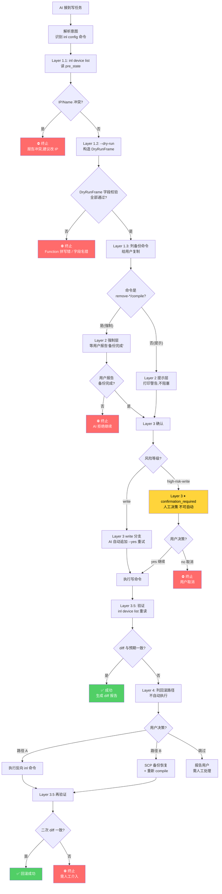

# inl PROFINET 写操作 4 层安全工作流

**CRITICAL — 开始前 MUST 先用 Read 工具读取 [`../inl-shared/SKILL.md`](../inl-shared/SKILL.md)**，其中包含 `--target` / `--yes` / `--dry-run` / Risk 等级 / 结构化错误等共享约定。本 skill 是其"写操作"专题扩展。

---

## 适用场景

AI Agent 收到下列任务时,应**强制**触发本 skill,并严格按 4 层流程执行(不可跳步):

- "把工业 PC 上 PROFINET 主站 IP 改成 192.168.2.20" → `inl config set-driver`
- "添加一个 OBARA 焊机到配置" → `inl config add-device`
- "把焊机 X 屏蔽掉" → `inl config shield`
- "重新编译 PROFINET 配置并应用" → `inl config compile`(高危)
- "把 Device `<name>` 的 IP 从 192.168.2.10 改成 192.168.2.11" → `inl config set-device`
- "删除设备 `<name>`" → `inl config remove-device`(强制备份)
- "给焊机 X 加/删一个模块" → `inl config add-module` / `remove-module`(强制备份)
- "修改 iDevice 主从通信长度" → `inl config set-idevice`

## 不适用场景

下列场景**禁止**走本 skill,直接使用 [`../inl-shared/SKILL.md`](../inl-shared/SKILL.md) 的读命令:

- ❌ "看一下现在 PROFINET 主站 IP 是多少" → 用 `inl device list`(读,无需工作流)
- ❌ "列出所有焊机" / "焊机 X 现在跑得怎样" → 用 `inl device list` / `device list-active` / `device run`(读)
- ❌ "解析 GSDML 文件看焊机支持哪些模块" → 用 `inl gsd list`(读)
- ❌ "把配置从工业 PC 拉下来当备份" / "升级 nrc2.out 版本" → 走工业 PC 系统层,严禁用 inl 写命令替代

---

## 前置条件

执行任意 4 层流程前,确认以下 4 条全部满足:

1. ✅ **已读 [`../inl-shared/SKILL.md`](../inl-shared/SKILL.md)** — 理解 `--target` / `--yes` / `--dry-run` / Risk / 结构化错误码
2. ✅ **已知 `--target` 工业 PC IP** — 例 `192.168.3.15`,自动加 `:6000`
3. ✅ **已知要执行的 `inl config *` 命令及参数** — 命令名、Function.Value、Payload 字段已就绪
4. ⚠️ **现场操作前必须备份 `networktopology.json`(Layer 2)** — 由用户在工业 PC 系统层完成,AI Agent 仅做"提示 + 拒绝继续"约束

---

## 4 层安全原则

- **Layer 1 预检(DryRun)**:所有写命令先 `inl device list` 读 pre_state,再跑 `--dry-run --format json` 校验 DryRunFrame 字段(sync_byte / command / data_type / function / payload / crc32 / risk)。字段拼写错 → 立即停止,重新查 [`../../inl/AGENTS.md`](../../inl/AGENTS.md) 17 命令表。
- **Layer 1.3 冲突预检**:`set-driver` / `add-device` / `set-device` 命令必须额外检查目标 IP/Name 是否已被占用;冲突 → 在 Layer 1 阶段就阻止,不进入 Layer 2/3。
- **Layer 2 备份**:**本 skill 不实现自动备份**。4 命令(`remove-device` / `remove-module` / `remove-submodule` / `compile`)→ **AI 拒绝继续**,等用户报告"备份完成";其他 7 命令 → 提示但不强阻塞。
- **Layer 3 确认**:write 类(11 命令中 11 个) → 缺 `--yes` AI **自动追加** 重试(`yes_required` 可重试);high-risk-write 类(`compile`) → AI **暂停**,等用户决策(`confirmation_required` 不可重试)。
- **Layer 3.5 验证**:写后 5s `sleep` + `inl device list` 重读,与 pre_state 做 diff;diff 一致 → 成功报告;diff 不一致 → Layer 4。
- **Layer 4 显式回滚**:**AI 列路径不执行**。路径 A = 反向 inl 命令(对称操作);路径 B = SCP 备份恢复 + 重新 `compile`(remove-*/compile)。等用户明确说"执行路径 X"再执行,执行后再走一次 Layer 3.5。

---

## 12 命令安全矩阵

| # | 命令 | 改什么 | Risk | 预检读 | 备份 | AI 自动 `--yes`? | 回滚 |
|---|------|--------|------|--------|------|-------------------|------|
| 1 | `config set-driver` | PNDriver.{Name,IP,Mask} | `write` | device list | 提示 | ✅ | A: set-driver 旧值 |
| 2 | `config add-device` | DecentralDevice[] 追加 | `write` | device list | 提示 | ✅ | A: remove-device(会丢 Module) |
| 3 | **`config remove-device`** | DecentralDevice[] 删除 | `write` | device list + --dry-run | **强制** | ✅ | **B: 备份恢复** |
| 4 | `config set-device` | Device.{IP,Name,...} | `write` | device list | 提示 | ✅ | A: set-device 旧值 |
| 5 | `config add-module` | Device.Module[] 追加 | `write` | device list-active | 提示 | ✅ | A: remove-module(会丢 SubModule) |
| 6 | **`config remove-module`** | Device.Module[] 删除 | `write` | device list-active + --dry-run | **强制** | ✅ | **B: 备份恢复** |
| 7 | `config add-submodule` | Module.SubModule[] 追加 | `write` | device list-active | 提示 | ✅ | A: remove-submodule |
| 8 | **`config remove-submodule`** | Module.SubModule[] 删除 | `write` | device list-active + --dry-run | **强制** | ✅ | **B: 备份恢复** |
| 9 | `config set-idevice` | IDevice.{Input,Output,Activate} | `write` | device list | 提示 | ✅ | A: set-idevice 旧值 |
| 10 | `config shield` | Device.IsShielded=true | `write` | device list-active | 提示 | ✅ | A: unshield(对称) |
| 11 | `config unshield` | Device.IsShielded=false | `write` | device list-active | 提示 | ✅ | A: shield(对称) |
| 12 | **`config compile`** | **激活配置(重启控制器)** | **`high-risk-write`** | device list + list-active + --dry-run | **强制** | **❌ 禁止** | **B: 备份恢复 + 重新 compile** |

> **强制备份 4 命令**占全部写命令的 33%。这些命令有**不可逆丢失**(remove-*)或**全局态激活**(compile)风险。

---

## 5 个高危场景处理

### 场景 1:改主站 IP 导致失联

`inl config set-driver --ip 192.168.2.20`。主站 IP 是 SSH / 工业 PC 网卡唯一标识,改错后 AI 失去 TCP:6000。

1. Layer 1 先读 `device list` 确认主站当前 IP。
2. Layer 3.5 验证要**额外** `ping <新 IP>` 确认主站能 ping 通。
3. ping 不通 → Layer 4 路径 A 反向 `set-driver --ip <旧值> --yes`。
4. 反向 `set-driver` 也失败 → 工业 PC **物理重连**(用户在场手动切换网络),AI 无能为力。

### 场景 2:删错设备(配置不可逆丢失)

`inl config remove-device --device-id <wrong-id>`。DecentralDevice[] 整条删掉,Module/SubModule 全部丢失。**add-device 反向补不回原 Module 配置**(补回的是空壳)。

1. **优先路径 B**:SCP 拉取 `networktopology.json` 备份 → 恢复 → 重新 `compile`。
2. **不推荐路径 A**:`add-device` 反向(Module/SubModule 配置会丢)→ 仅在用户明确说"宁可空壳也要快速恢复"时使用。
3. 路径 A 失败 → 强切路径 B。

### 场景 3:Compile 失败导致产线停机

`inl config compile`(`high-risk-write`)。compile 失败 → 控制器可能用旧配置继续运行,也可能直接挂掉。

1. Layer 3 `compile` **必须**人工确认(`confirmation_required`),AI 不可自动 `--yes`。
2. 人工确认后 AI 才执行 `compile --yes`。
3. compile 失败 → **不**自行重试(失败原因可能是配置语义错误,重试无意义)。
4. 报告错误,等用户决策:选择 1 = 修正配置后重 compile;选择 2 = 放弃新配置,Layer 4 路径 B 备份恢复。

### 场景 4:Shield 错设备

`inl config shield --device-id <wrong-id>`。把"正常设备"标记为屏蔽,生产数据丢失;但 shield 本身是**对称**操作(unshield 反向),无配置数据丢失。

1. Layer 1 必读 `device list-active` 确认要 shield 的设备名。
2. Layer 3.5 验证 `device list-active` 看到 `IsShielded: true`。
3. 不一致 → Layer 4 路径 A `unshield --device-id <wrong-id> --yes`(对称反转,极简)。

### 场景 5:IP/Name 冲突

`inl config set-driver --ip 192.168.2.10`(已被某焊机占用)。IP 冲突导致主站和焊机无法通信;C++ 端可能在 Layer 1 阶段就拒绝。

1. Layer 1 必须先 `inl device list`,检查目标 IP/Name 是否已被占用。
2. 若被占用 → **Layer 1 阶段就阻止**,不进入 Layer 2/3。
3. 报告冲突详情:`"192.168.2.10 已被设备 <焊机名> 占用,是否改用 192.168.2.X?"`
4. 用户改用未占用 IP 后再走 Layer 2/3。回滚路径: N/A(Layer 1 已阻止)。

---

## 标准执行流程(伪代码)

```python
def execute_write(target, cmd, args):
    # Layer 1 预检
    pre = run(f"inl --target {target} device list --format json")
    dry = parse_dry_run(run(f"inl --target {target} config {cmd} {args} --dry-run --format json"))
    assert dry["sync_byte"] == "0x4E66" and dry["command"] == "0x9275"
    assert dry["function"] in EXPECTED_FUNCTIONS[cmd]
    assert dry["crc32"] is not None and dry["risk"] in ("write", "high-risk-write")
    if cmd in ("set-driver", "add-device", "set-device"):
        check_ip_name_conflict(pre, args)  # 冲突 → 终止

    # Layer 2 备份
    print_backup_cmd(target)
    if cmd in ("remove-device", "remove-module", "remove-submodule", "compile"):
        if not wait_user("备份完成了吗?"): return error("拒绝继续:强制层备份未完成")

    # Layer 3 确认
    if EXPECTED_RISK[cmd] == "write":
        result = run(f"inl --target {target} config {cmd} {args} --yes")
    else:  # high-risk-write
        if wait_user("此命令是 high-risk-write,确认继续?") != "yes":
            return error("用户取消")
        result = run(f"inl --target {target} config {cmd} {args} --yes")

    # Layer 3.5 验证
    sleep(5)
    post = run(f"inl --target {target} device list --format json")
    diff = compare(pre, post, expected_from(args))
    return success(diff) if diff.is_consistent else trigger_rollback(target, cmd, args, pre, post, diff)

def trigger_rollback(target, cmd, args, pre, post, diff):
    print_paths(["A: 反向 inl 命令", "B: scp 备份恢复 + compile"])  # 不自动执行
    choice = wait_user("请选择路径(A/B/跳过)")
    if choice == "A": return run(f"inl --target {target} config {inverse(cmd)} {inverse_args(args)} --yes")
    if choice == "B": return run(scp_restore_backup()) or run(f"inl --target {target} config compile --yes")
    return report("用户选择不自动回滚,需人工处理")
```

---

## 完整工作流(Mermaid)



---

## 备份机制说明

- `inl` 17 条命令中**无** `inl config backup` / `inl config restore`,AI **无 C++ 端 API 触发自动备份**。
- 备份由用户在工业 PC **系统层**完成(SCP / SMB),备份介质是 `/opt/nrc2/networktopology.json`。
- **AI 必做 3 步**:(1) Layer 1.3 列 `scp` 备份命令给用户复制;(2) 强制层命令必须等用户报告"备份完成"才进入 Layer 3;(3) 强制层备份未完成 → 拒绝继续,不进入 Layer 3。

---

## 参考

- [`../inl-shared/SKILL.md`](../inl-shared/SKILL.md) — 必读入口(`--target` / `--yes` / `--dry-run` / Risk / 结构化错误码)
- [`../../inl/AGENTS.md`](../../inl/AGENTS.md) — 17 命令表 + 协议契约
- [`../../inl/docs/protocol/field-verification.md`](../../inl/docs/protocol/field-verification.md) — 实机响应反向核对记录
- [`../../docs/inl/inl-step3-plan.md`](../../docs/inl/inl-step3-plan.md) — 17 命令 + Risk 上游
- lark-cli 模式来源: `cli/skills/lark-workflow-meeting-summary/SKILL.md`(5 步工作流)+ `cli/internal/cmdutil/confirm.go:29-41`(`RequireConfirmation` 工厂)
